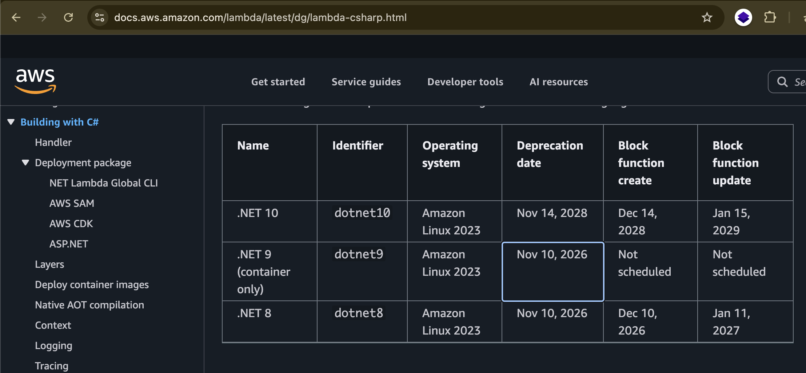

- Use the dotnet cli to create a scaffold app. After which, use Claude to build up the app.

# .NET Development Setup Guide

This guide provides comprehensive instructions for setting up a .NET development environment and creating API projects using different approaches.

## Prerequisites



### .NET SDK Installation

1. Download the .NET SDK:
   - For .NET 8 (recommended): https://dotnet.microsoft.com/en-us/download/dotnet/8.0
   - For .NET 6 (alternative): https://dotnet.microsoft.com/en-us/download/dotnet/6.0

2. Verify your installation by running:
   ```
   dotnet --version
   ```

3. You use a global.json file to "pin" a project folder to a specific .NET SDK version.
    ```
    dotnet --list-sdks
    ```

    You'll get a list like this:

    ```
    6.0.408 [/usr/local/share/dotnet/sdk]
    7.0.306 [/usr/local/share/dotnet/sdk]
    8.0.100 [/usr/local/share/dotnet/sdk]
    ```

    Create a global.json File: Navigate to the root directory of your project in the Terminal. Run the following command, replacing <version_number> with the version you want to use from your list (e.g., 7.0.306).

    ```
    dotnet new globaljson --sdk-version <version_number>
    ```

    For example:

    ```
    dotnet new globaljson --sdk-version 7.0.306
    ```

    This creates a global.json file in the project folder. Now, any dotnet command you run in this directory (or any sub-directory) will automatically use the exact SDK version you specified.

4. For a complete reference of dotnet commands, visit:
   https://learn.microsoft.com/en-us/dotnet/core/tools/dotnet

### Development Environment Setup

1. Install Visual Studio Code (VSCode)
2. Install the C# extension in VSCode


## .NET AWS Lambda

Follow this https://docs.aws.amazon.com/lambda/latest/dg/lambda-csharp.html 

To install the project templates, run the following command:

```bash
dotnet new install Amazon.Lambda.Templates
```

To install the command line tools:

```bash
dotnet tool install -g Amazon.Lambda.Tools

# or

dotnet tool update -g Amazon.Lambda.Tools
```

After installing this package, run the following command to see a list of the available templates.

```bash
dotnet new list
```

### Many types new lambda project that I can initialise with dotnet cli tool - choose one of these:
1. Initialise a native AOT compiled Lambda function
`dotnet new lambda.NativeAOT -n JekNativeAotSample` reference: https://docs.aws.amazon.com/lambda/latest/dg/dotnet-native-aot.html

2. Initialise an ASP.NET Web API Lambda function
`dotnet new serverless.AspNetCoreWebAPI -n JekAspNetOnLambda` reference: https://docs.aws.amazon.com/lambda/latest/dg/csharp-package-asp.html#csharp-package-asp-deploy-api

3. Initialise an ASP.NET minimal APIs Lambda function `dotnet new serverless.AspNetCoreMinimalAPI -n JekMinimalApiOnLambda` reference: https://docs.aws.amazon.com/lambda/latest/dg/csharp-package-asp.html#csharp-package-asp-deploy-minimal

4. Initialise an empty .NET project Lambda function
`dotnet new lambda.EmptyFunction --name JekMyDotnetFunction` reference: https://docs.aws.amazon.com/lambda/latest/dg/csharp-package-cli.html and https://docs.aws.amazon.com/lambda/latest/dg/csharp-handler.html#csharp-handler-setup

5. Initialise an AWS SAM application Lambda function
`sam init --app-template hello-world --name sam-app \
--package-type Zip --runtime dotnet8` reference:  https://docs.aws.amazon.com/lambda/latest/dg/csharp-package-sam.html#csharp-package-sam-deploy

6. Initialise an AWS CDK application Lambda function `cdk init app --language csharp` reference: https://docs.aws.amazon.com/lambda/latest/dg/csharp-package-cdk.html#csharp-package-cdk-deploy


#### Initialise a native AOT compiled Lambda function
```bash
dotnet new lambda.NativeAOT -n dotnet10__al2023__lambda__native__aot
```

```bash
cd dotnet10__al2023__lambda__native__aot
```

add `"function-architecture": "arm64"` to aws-lambda-tools-defaults.json since I'm using Mac M4 chip.

```bash
dotnet lambda deploy-function
```

and indicate the lambda function name as `jek_dotnet10_al2023_native_aot`

Test it
```bash
dotnet lambda invoke-function jek_dotnet10_al2023_native_aot --payload "hello world"
```

Clean up
```bash
dotnet lambda delete-function jek_dotnet10_al2023_native_aot
```

---

#### Initialise an empty .NET project Lambda function using DOTNET Lambda Global CLI:

```bash
dotnet new lambda.EmptyFunction --name lambda__globalcli__net8dot0__processmeterreading --region ap-southeast-1 --profile default
```

To deploy your code to Lambda as a .zip deployment package, run the following command. Choose your own function name.

```bash
cd lambda__globalcli__net8dot0__processmeterreading/src/lambda__globalcli__net8dot0__processmeterreading

dotnet lambda deploy-function lambda__globalcli__net8dot0__processmeterreading
```

Test

```bash
dotnet lambda invoke-function lambda__globalcli__net8dot0__processmeterreading --payload "Just checking if everything is OK"
```


### The popular .NET Logging Frameworks

The main logging frameworks we'll encounter in the .NET world:

* **Serilog:** The modern go-to for many developers.
    * **Why it's popular:** Its "structured logging first" design is its biggest feature. It has a rich ecosystem of "sinks" (plugins that send logs to different destinations like files, databases, or cloud services) and "enrichers" (which add context like a Request ID to your logs).

* **NLog:** Another very popular, flexible, and high-performance framework.
    * **Why it's popular:** It's known for its flexibility, high performance, and extensive configuration options. It has been a solid choice for a long time and is still actively developed.

* **Microsoft.Extensions.Logging (MEL):** The built-in logging library.
    * **Why it's popular:** This is the logging *abstraction* provided by Microsoft in .NET Core and newer. It's not a full logging framework on its own but provides the `ILogger` interface. The key benefit is that you can write your code against this common interface, and then "plug in" a framework like Serilog or NLog to handle the actual log processing and output.

* **log4net:** The "classic" logging framework.
    * **Why it's popular:** It's one of the oldest and most established frameworks (a port of the famous Java log4j). Many older, large enterprise applications use it. While still functional, most new projects tend to choose Serilog or NLog.

* **OpenTelemetry Logs:** A growing option if you want vendor-neutral pipelines; often used with MEL and exported to your backend.
