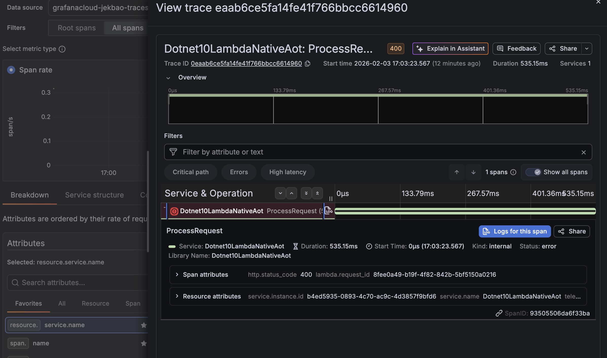

# Native AOT

Native AOT is a feature that compiles .NET assemblies into a single native executable. By using the native executable the .NET runtime 
is not required to be installed on the target platform. Native AOT can significantly improve Lambda cold starts for .NET Lambda functions. 
This project enables Native AOT by setting the .NET `PublishAot` property in the .NET project file to `true`. The `StripSymbols` property is also
set to `true` to strip debugging symbols from the deployed executable to reduce the executable's size.

## Basic: Building Native AOT

When publishing with Native AOT the build OS and Architecture must match the target platform that the application will run. For AWS Lambda that target
platform is Amazon Linux 2023. The AWS tooling for Lambda like the AWS Toolkit for Visual Studio, .NET Global Tool Amazon.Lambda.Tools and SAM CLI will 
perform a container build using a .NET 10 Amazon Linux 2023 build image when `PublishAot` is set to `true`. This means **docker is a requirement**
when packaging .NET Native AOT Lambda functions on non-Amazon Linux 2023 build environments.

## Basic: Deploy
```bash
dotnet lambda deploy-function
```

and indicate the lambda function name as `jek_dotnet10_al2023_native_aot`

Test it
```bash
dotnet lambda invoke-function jek_dotnet10_al2023_native_aot --payload "hello world"
```

Clean up
```bash
dotnet lambda delete-function jek_dotnet10_al2023_native_aot
```

---

# .NET 10 Lambda with OpenTelemetry Tracing

This Lambda function demonstrates OpenTelemetry distributed tracing to a OTLP Endpoint. **Note:** Native AOT is disabled to support OpenTelemetry's runtime requirements.



## Quick Start

### Prerequisites
- .NET 10 SDK
- AWS CLI configured
- Docker (for Lambda deployment tools)

### Deploy
```bash
dotnet lambda deploy-function
```

and indicate the lambda function name as `jek_dotnet10_al2023_native_aot`

Test it
```bash
dotnet lambda invoke-function jek_dotnet10_al2023_native_aot --payload "hello world"
```

Clean up
```bash
dotnet lambda delete-function jek_dotnet10_al2023_native_aot
```

---

## Task 1: HTTP GET Endpoint 

### What Was Implemented
Added HTTP GET endpoint that returns random responses:
- 34% chance: 200 OK with random number (1-1000)
- 33% chance: 400 Bad Request (client error)
- 33% chance: 500 Internal Server Error

### Changes Made
1. Added `Amazon.Lambda.APIGatewayEvents` package (v2.7.3)
2. Created response models: `SuccessResponse` and `ErrorResponse`
3. Updated handler to use `APIGatewayProxyRequest` and `APIGatewayProxyResponse`
4. Implemented random number generation with error logic

### Response Examples

**Success (200 OK):**
```json
{
  "randomNumber": 456
}
```

**Client Error (400 Bad Request):**
```json
{
  "error": "Client Error",
  "message": "Bad Request - Invalid input parameters"
}
```

**Server Error (500 Internal Server Error):**
```json
{
  "error": "Server Error",
  "message": "Internal Server Error - Service temporarily unavailable"
}
```

### Testing
Deploy and invoke the function multiple times to verify the ~34/33/33 distribution:
```bash
# Deploy
dotnet lambda deploy-function

# Invoke multiple times to see different responses
dotnet lambda invoke-function jek_dotnet10_al2023_native_aot --payload '{}'
```

---

## Task 2: Amazon Linux 2023 Runtime 

### Configuration Status
The Lambda function is configured to deploy as Amazon Linux 2023 custom runtime with Native AOT compilation.

### How It Works
- **Native AOT:** `<PublishAot>true</PublishAot>` compiles C# to native ARM64 machine code
- **Runtime:** `provided.al2023` uses custom runtime on Amazon Linux 2023
- **Architecture:** `arm64` targets AWS Graviton processors
- **Result:** Standalone executable with faster cold starts, no .NET runtime needed

### Build Process
```bash
dotnet publish -c Release -r linux-x64 --self-contained
```
Creates a self-contained .NET application (Native AOT disabled for OpenTelemetry support).

---

## Task 3: OpenTelemetry Distributed Tracing to OTLP Endpoint

### Overview
Implemented OpenTelemetry instrumentation to send distributed traces to OTLP Endpoint via OTLP (OpenTelemetry Protocol).

### Prerequisites
- OTLP Endpoint account with OTLP endpoint
- OTLP Endpoint API token (Basic auth)

### Build & Deploy

1. **Set environment variables** (replace with an OTLP Endpoint credentials):
```bash
export OTLP_ENDPOINT="https://otlp-gateway-prod-<region>.grafana.net/otlp/v1/traces"
export OTLP_AUTH_HEADER="Basic <your-base64-encoded-token>"
```

2. **Update Lambda configuration**:
```bash
aws lambda update-function-configuration \
  --function-name jek_dotnet10_al2023_native_aot \
  --region ap-southeast-1 \
  --environment "Variables={OTLP_ENDPOINT=$OTLP_ENDPOINT,OTLP_AUTH_HEADER=$OTLP_AUTH_HEADER}"
```

3. **Build and deploy**:
```bash
dotnet lambda deploy-function jek_dotnet10_al2023_native_aot --region ap-southeast-1
```

### Testing & Viewing Traces

**Invoke the function:**
```bash
aws lambda invoke \
  --function-name jek_dotnet10_al2023_native_aot \
  --region ap-southeast-1 \
  --payload '{}' \
  --log-type Tail \
  response.json 2>&1 | grep LogResult | cut -d'"' -f4 | base64 -d | grep "Activity.TraceId:"
```

**Output example:**
```
Activity.TraceId: b6d176e013aa6a98a50a37aae14d5ffd
```

**Find trace in OTLP Endpoint:**
1. Go to OTLP Endpoint → Explore → Traces
2. Search by Trace ID: `b6d176e013aa6a98a50a37aae14d5ffd`
3. Or filter by service name: `Dotnet10LambdaNativeAot`
4. View span attributes: `http.status_code`, `lambda.request_id`

### Changes Required to Add OpenTelemetry

#### 1. **Disable Native AOT** (dotnet10__al2023__lambda__native__aot.csproj)
```xml
<!-- Changed from true to false -->
<PublishAot>false</PublishAot>
```
**Why:** OpenTelemetry requires ICU globalization libraries that Native AOT trims away.

#### 2. **Add OpenTelemetry Packages** (dotnet10__al2023__lambda__native__aot.csproj)
```xml
<PackageReference Include="OpenTelemetry" Version="1.15.0" />
<PackageReference Include="OpenTelemetry.Exporter.OpenTelemetryProtocol" Version="1.15.0" />
<PackageReference Include="OpenTelemetry.Instrumentation.AWSLambda" Version="1.15.0" />
<PackageReference Include="OpenTelemetry.Exporter.Console" Version="1.15.0" /> <!-- Optional: for CloudWatch logs -->
```
**Why:** Core OpenTelemetry SDK and OTLP exporter for sending traces to an OTLP Endpoint.

#### 3. **Add Bootstrap Script** (dotnet10__al2023__lambda__native__aot.csproj)
```xml
<ItemGroup>
  <None Include="bootstrap" CopyToOutputDirectory="PreserveNewest" CopyToPublishDirectory="Always" />
</ItemGroup>
```

**Create `bootstrap` file** (executable shell script):
```sh
#!/bin/sh
cd "$LAMBDA_TASK_ROOT"
exec ./dotnet10__al2023__lambda__native__aot "$@"
```
**Why:** Custom runtime (provided.al2023) requires bootstrap entrypoint since we're not using Native AOT.

#### 4. **Add Runtime Configuration** (runtimeconfig.template.json)
```json
{
  "configProperties": {
    "System.Globalization.Invariant": true
  }
}
```
**Why:** Enables invariant globalization mode to avoid ICU library dependencies in Lambda environment.

#### 5. **Update Handler Configuration** (aws-lambda-tools-defaults.json)
```json
{
  "function-handler": "bootstrap"
}
```
**Why:** Points Lambda to the bootstrap script as entrypoint instead of the Native AOT executable.

#### 6. **Instrument Function.cs**

**Add usings:**
```csharp
using OpenTelemetry;
using OpenTelemetry.Resources;
using OpenTelemetry.Trace;
using System.Diagnostics;
```

**Add static fields:**
```csharp
private static readonly ActivitySource ActivitySource = new("Dotnet10LambdaNativeAot");
private static TracerProvider? _tracerProvider;
```
**Why:** ActivitySource creates spans; TracerProvider manages trace lifecycle.

**Configure OpenTelemetry in Main():**
```csharp
// Read the OTLP endpoint credentials from environment
var otlpEndpoint = Environment.GetEnvironmentVariable("OTLP_ENDPOINT")
    ?? throw new InvalidOperationException("OTLP_ENDPOINT required");
var otlpAuthHeader = Environment.GetEnvironmentVariable("OTLP_AUTH_HEADER")
    ?? throw new InvalidOperationException("OTLP_AUTH_HEADER required");

// Initialize OpenTelemetry
_tracerProvider = Sdk.CreateTracerProviderBuilder()
    .SetResourceBuilder(ResourceBuilder.CreateDefault().AddService("Dotnet10LambdaNativeAot"))
    .AddSource("Dotnet10LambdaNativeAot")
    .AddConsoleExporter()  // Optional: logs traces to CloudWatch
    .AddOtlpExporter(options => {
        options.Endpoint = new Uri(otlpEndpoint);
        options.Protocol = OpenTelemetry.Exporter.OtlpExportProtocol.HttpProtobuf;
        options.Headers = $"Authorization={otlpAuthHeader}";
    })
    .Build();
```
**Why:** Configures OTLP exporter to send traces to OTLP Endpoint with authentication.

**Instrument FunctionHandler:**
```csharp
public static APIGatewayProxyResponse FunctionHandler(...)
{
    // Create span for this request
    using var activity = ActivitySource.StartActivity("ProcessRequest");
    activity?.SetTag("lambda.request_id", context.AwsRequestId);

    // ... existing code ...

    // Tag span with status
    activity?.SetTag("http.status_code", statusCode);
    activity?.SetStatus(statusCode == 200 ? ActivityStatusCode.Ok : ActivityStatusCode.Error);

    // ... build response ...

    // Flush traces before Lambda exits (critical!)
    _tracerProvider?.ForceFlush();
    return response;
}
```
**Why:** Creates spans with tags for observability; ForceFlush ensures traces export before Lambda terminates.

### Key Architectural Decision

**Why disable Native AOT?**
OpenTelemetry SDK requires runtime features (reflection, dynamic code generation) that Native AOT compilation removes. Trade-off: slightly longer cold starts for full observability capabilities.

### Span Attributes Sent to an OTLP endpoint
- `service.name`: `Dotnet10LambdaNativeAot`
- `lambda.request_id`: AWS Lambda request ID
- `http.status_code`: Response status (200/400/500)
- `span.name`: `ProcessRequest`
- `span.status`: OK or Error

