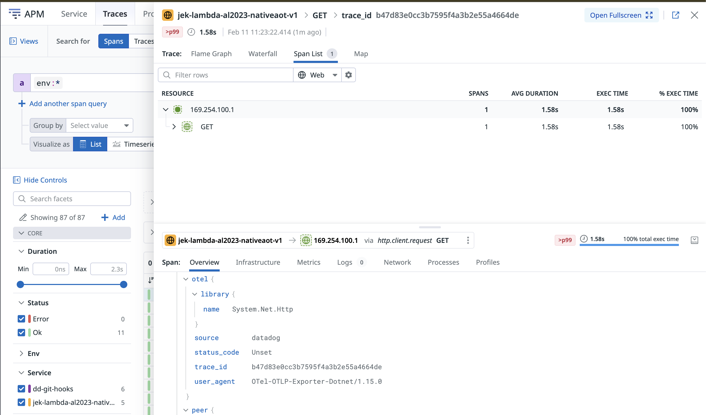
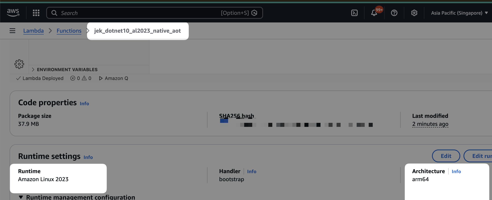
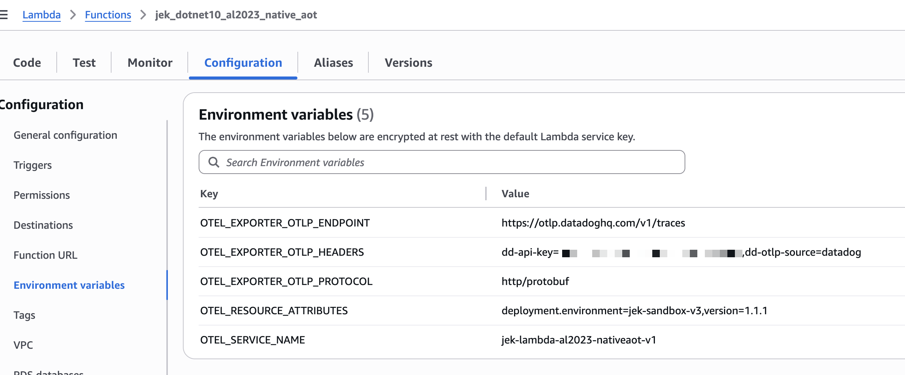
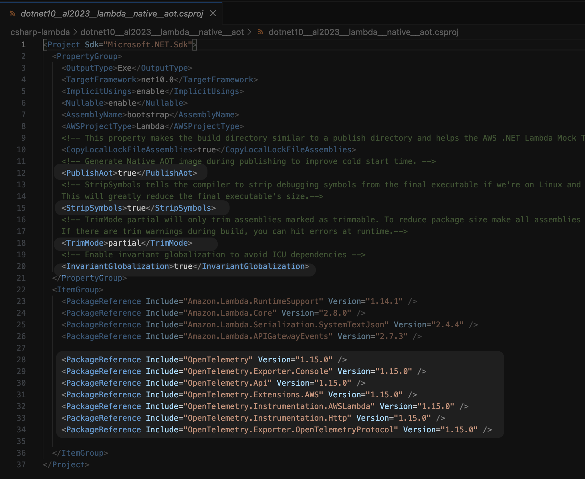
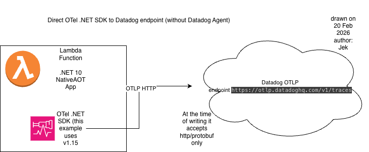
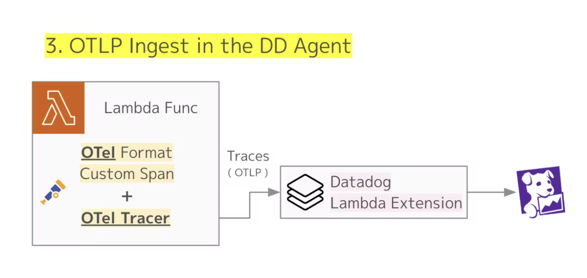
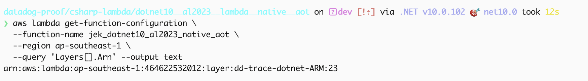

# Native AOT







## Tech Stack & Versions

| Category | Technology | Version |
|---|---|---|
| **Language** | C# | .NET 10 |
| **Framework** | .NET Target Framework | `net10.0` |
| **Runtime** | AWS Lambda Custom Runtime | `provided.al2023` (Amazon Linux 2023) |
| **Architecture** | ARM64 (Graviton) | `arm64` |
| **Compilation** | Native AOT | `PublishAot=true` |
| **AWS SDK** | Amazon.Lambda.RuntimeSupport | 1.14.1 |
| **AWS SDK** | Amazon.Lambda.Core | 2.8.0 |
| **AWS SDK** | Amazon.Lambda.Serialization.SystemTextJson | 2.4.4 |
| **AWS SDK** | Amazon.Lambda.APIGatewayEvents | 2.7.3 |
| **Telemetry** | OpenTelemetry | 1.15.0 |
| **Telemetry** | OpenTelemetry.Api | 1.15.0 |
| **Telemetry** | OpenTelemetry.Extensions.AWS | 1.15.0 |
| **Telemetry** | OpenTelemetry.Instrumentation.AWSLambda | 1.15.0 |
| **Telemetry** | OpenTelemetry.Instrumentation.Http | 1.15.0 |
| **Telemetry** | OpenTelemetry.Exporter.OpenTelemetryProtocol | 1.15.0 |
| **Telemetry** | OpenTelemetry.Exporter.Console | 1.15.0 |
| **Observability** | Datadog (via OTLP) | — |

## Why OpenTelemetry .NET Instead of dd-trace-dotnet

This project uses **OpenTelemetry .NET** (manual instrumentation with code changes) instead of Datadog's own **dd-trace-dotnet** library. This was recommended by the **Datadog Support Team** as a compatible approach for sending traces from a Lambda Native AOT .NET application to Datadog via OTLP.

> **Disclaimer:** I have tested `dd-trace-dotnet` using **layer-based automatic instrumentation** on a Lambda Native AOT .NET 10 app (which didn't work OOTB late Dec 2025 / Jan 2026), but I have **not** tested `dd-trace-dotnet` using **manual instrumentation** (i.e., adding `dd-trace-dotnet` as a NuGet package with code changes to `Function.cs`, similar to how OpenTelemetry .NET is used here). It is possible that manual instrumentation with `dd-trace-dotnet` also works, but that has not been verified in this project.

Native AOT is a feature that compiles .NET assemblies into a single native executable. By using the native executable the .NET runtime 
is not required to be installed on the target platform. Native AOT can significantly improve Lambda cold starts for .NET Lambda functions. 
This project enables Native AOT by setting the .NET `PublishAot` property in the .NET project file to `true`. The `StripSymbols` property is also
set to `true` to strip debugging symbols from the deployed executable to reduce the executable's size.

## Basic: Building Native AOT

When publishing with Native AOT the build OS and Architecture must match the target platform that the application will run. For AWS Lambda that target
platform is Amazon Linux 2023. The AWS tooling for Lambda like the AWS Toolkit for Visual Studio, .NET Global Tool Amazon.Lambda.Tools and SAM CLI will 
perform a container build using a .NET 10 Amazon Linux 2023 build image when `PublishAot` is set to `true`. This means **docker is a requirement**
when packaging .NET Native AOT Lambda functions on non-Amazon Linux 2023 build environments.

## Deploy
```bash
dotnet lambda deploy-function

# OR with function runtime
dotnet lambda deploy-function jek_dotnet10_al2023_native_aot --function-runtime provided.al2023 --function-architecture arm64 --function-handler bootstrap

# OR  with environment variables
dotnet lambda deploy-function jek_dotnet10_al2023_native_aot --region ap-southeast-1 --environment-variables "OTEL_SERVICE_NAME=jek-lambda-al2023-nativeaot-v1;OTEL_RESOURCE_ATTRIBUTES=deployment.environment=jek-sandbox-v3,version=1.1.1;OTEL_EXPORTER_OTLP_ENDPOINT=https://otlp.datadoghq.com/v1/traces;OTEL_EXPORTER_OTLP_PROTOCOL=http/protobuf;OTEL_EXPORTER_OTLP_HEADERS=dd-api-key=<REPLACE_WITH_DATADOG_API_KEY>,dd-otlp-source=datadog"

# OR simply indicate the lambda function name as
dotnet lambda deploy-function jek_dotnet10_al2023_native_aot --region ap-southeast-1
```

## Send OTLP via Datadog Lambda Extension (Alternative)

Instead of sending OTLP directly to `https://otlp.datadoghq.com`, you can route traces through the **Datadog Lambda Extension** running locally inside the Lambda environment. No code changes needed — `.AddOtlpExporter()` reads from environment variables.

| Setting | Direct to Datadog | Via Lambda Extension |
|---|---|---|
| `OTEL_EXPORTER_OTLP_ENDPOINT` | `https://otlp.datadoghq.com/v1/traces` | `http://localhost:4318/v1/traces` |
| `OTEL_EXPORTER_OTLP_HEADERS` | `dd-api-key=<KEY>,dd-otlp-source=datadog` | not needed |
| `DD_API_KEY` | not needed | `<KEY>` (read by the extension) |
| `DD_OTLP_CONFIG_RECEIVER_PROTOCOLS_HTTP_ENDPOINT` | not needed | `localhost:4318` (tells the extension to listen for OTLP over HTTP) |
| Lambda Layer | none | Datadog Extension layer required |

See [Datadog docs](https://docs.datadoghq.com/serverless/aws_lambda/opentelemetry/?tab=python#sdk) for reference.

### Direct to Datadog



### Via Lambda Extension

[image courtesy](https://www.datadoghq.com/architecture/enhancing-observability-in-aws-lambda-with-otel/)

### Add Lambda Layer (via CLI)
```bash
# 1. Check existing layers
aws lambda get-function-configuration \
  --function-name jek_dotnet10_al2023_native_aot \
  --region ap-southeast-1 \
  --query 'Layers[].Arn' --output text

# 2. Add new layer while preserving existing ones (filters out "None" when no layers exist)
EXISTING_LAYERS=$(aws lambda get-function-configuration \
  --function-name jek_dotnet10_al2023_native_aot \
  --region ap-southeast-1 \
  --query 'Layers[].Arn' --output text | tr '\t' ' ' | sed 's/None//g' | xargs)

aws lambda update-function-configuration \
  --function-name jek_dotnet10_al2023_native_aot \
  --region ap-southeast-1 \
  --layers ${EXISTING_LAYERS:+$EXISTING_LAYERS} "arn:aws:lambda:ap-southeast-1:464622532012:layer:dd-trace-dotnet-ARM:23"
```


### Then deploy with extension-compatible environment variables after adding Lambda Layer (via CLI)

```bash
# 2. Deploy with extension-compatible environment variables
dotnet lambda deploy-function jek_dotnet10_al2023_native_aot \
  --region ap-southeast-1 \
  --environment-variables "DD_API_KEY=<REPLACE_WITH_DATADOG_API_KEY>;DD_OTLP_CONFIG_RECEIVER_PROTOCOLS_HTTP_ENDPOINT=localhost:4318;OTEL_SERVICE_NAME=jek-lambda-al2023-nativeaot-v1;OTEL_RESOURCE_ATTRIBUTES=deployment.environment=jek-sandbox-v3,version=1.1.1;OTEL_EXPORTER_OTLP_ENDPOINT=http://localhost:4318/v1/traces;OTEL_EXPORTER_OTLP_PROTOCOL=http/protobuf"
```

## Test it
```bash
dotnet lambda invoke-function jek_dotnet10_al2023_native_aot --payload '{"httpMethod":"GET","path":"/","headers":{},"body":null}'

aws lambda invoke \
  --function-name jek_dotnet10_al2023_native_aot \
  --region ap-southeast-1 \
  --payload '{"httpMethod":"GET","path":"/","headers":{},"body":null}' \
  --log-type Tail \
  response.json 2>&1 | grep LogResult | cut -d'"' -f4 | base64 -d | grep "Activity.TraceId:"
```

## Clean up
```bash
dotnet lambda delete-function jek_dotnet10_al2023_native_aot
```

---


# Optional Info Below:

## Task 1: HTTP GET Endpoint 

### What Was Implemented
Added HTTP GET endpoint that returns random responses:
- 34% chance: 200 OK with random number (1-1000)
- 33% chance: 400 Bad Request (client error)
- 33% chance: 500 Internal Server Error

### Changes Made
1. Added `Amazon.Lambda.APIGatewayEvents` package (v2.7.3)
2. Created response models: `SuccessResponse` and `ErrorResponse`
3. Updated handler to use `APIGatewayProxyRequest` and `APIGatewayProxyResponse`
4. Implemented random number generation with error logic

### Response Examples

**Success (200 OK):**
```json
{
  "randomNumber": 456
}
```

**Client Error (400 Bad Request):**
```json
{
  "error": "Client Error",
  "message": "Bad Request - Invalid input parameters"
}
```

**Server Error (500 Internal Server Error):**
```json
{
  "error": "Server Error",
  "message": "Internal Server Error - Service temporarily unavailable"
}
```

### Testing
Deploy and invoke the function multiple times to verify the ~34/33/33 distribution:
```bash
# Deploy
dotnet lambda deploy-function jek_dotnet10_al2023_native_aot

# Invoke multiple times to see different responses
dotnet lambda invoke-function jek_dotnet10_al2023_native_aot --payload '{"httpMethod":"GET","path":"/","headers":{},"body":null}'
```

---

## Task 2: Amazon Linux 2023 Runtime 

### Configuration Status
The Lambda function is configured to deploy as Amazon Linux 2023 custom runtime with Native AOT compilation.

### How It Works
- **Native AOT:** `<PublishAot>true</PublishAot>` compiles C# to native ARM64 machine code
- **Runtime:** `provided.al2023` uses custom runtime on Amazon Linux 2023
- **Architecture:** `arm64` targets AWS Graviton processors
- **Result:** Standalone executable with faster cold starts, no .NET runtime needed

### Build Process
```bash
dotnet publish -c Release -r linux-x64 --self-contained
```
Creates a self-contained .NET application (Native AOT disabled for OpenTelemetry support).

---

## Task 3: OpenTelemetry & Datadog Integration (COMPLETED)

### Why These Code Changes Are Required

By default, a .NET Lambda function produces **no traces**. To get distributed tracing into Datadog, we need to:
1. **Build a tracing pipeline** — something to collect spans and export them over OTLP
2. **Instrument the handler** — wrap each invocation so it becomes a trace span
3. **Flush before freeze** — Lambda freezes the execution environment between invocations, so buffered spans must be sent immediately or they are lost

### Code Changes in `Function.cs`

#### 1. Add OpenTelemetry imports (lines 6–15)

```csharp
using OpenTelemetry;                            // Core SDK — Sdk.CreateTracerProviderBuilder()
using OpenTelemetry.Trace;                      // TracerProvider type
using OpenTelemetry.Instrumentation.AWSLambda;  // AWSLambdaWrapper.Trace() + Lambda attributes
using OpenTelemetry.Exporter;                   // OTLP exporter (.AddOtlpExporter())
using OpenTelemetry.Resources;                  // Service metadata (name, env, version)
```

**Why:** Each library provides a specific piece of the tracing pipeline — without any one of them, traces either won't be created, won't have Lambda context, or won't reach Datadog.

#### 2. Initialize TracerProvider in `Main()` (lines 30–38)

```csharp
var tracerProvider = Sdk.CreateTracerProviderBuilder()
    .AddAWSLambdaConfigurations()   // Captures Lambda attributes: ARN, Request ID, cold start
    .AddHttpClientInstrumentation() // Auto-traces outgoing HTTP calls as child spans
    .AddOtlpExporter()              // Sends traces to the endpoint in OTEL_EXPORTER_OTLP_ENDPOINT
    .Build();
```

**Why:** This runs once during Lambda cold start (init phase). It sets up *what* to trace and *where* to send it. All exporter config (endpoint, API key, protocol) comes from environment variables — no secrets in code.

#### 3. Wrap handler + ForceFlush (lines 40–49)

```csharp
Func<APIGatewayProxyRequest, ILambdaContext, APIGatewayProxyResponse> handler =
    (request, context) =>
    {
        var response = AWSLambdaWrapper.Trace(tracerProvider, FunctionHandler, request, context);
        tracerProvider.ForceFlush();
        return response;
    };
```

**Why:**
- `AWSLambdaWrapper.Trace()` — wraps `FunctionHandler` in a span that records function name, duration, status code, and exceptions
- `ForceFlush()` — **critical for Lambda**. Pushes all buffered spans to Datadog immediately. Without this, spans stay in memory and are lost when Lambda freezes the execution environment

#### 4. Dispose on shutdown (line 56)

```csharp
tracerProvider.Dispose();
```

**Why:** Releases resources when the Lambda environment shuts down. In practice, `ForceFlush()` in step 3 is the real safeguard since Lambda environments are often terminated without reaching this line.

