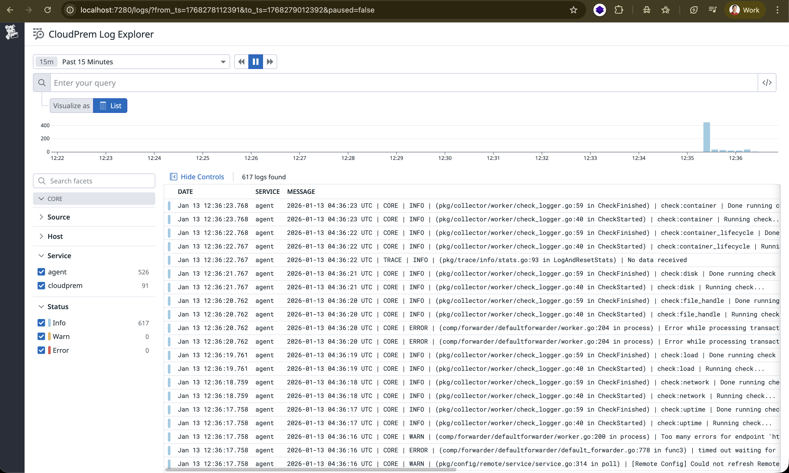
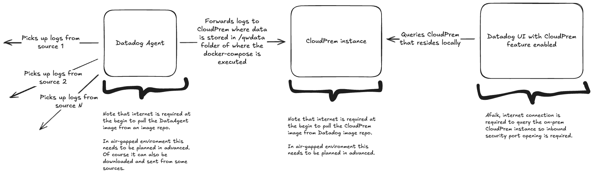

# My CloudPrem rendition 2

This follows the Datadog public doc https://docs.datadoghq.com/cloudprem/install/docker/?tab=dockercomposesetup





## Configure Environment

```bash
# Copy the environment template
cp .env.example .env
```

```bash
docker compose up -d
```

```bash
curl http://localhost:7280/api/v1/version
```

## Reverse Connection
The reverse connection option for Datadog SaaS connectivity to avoid setting up a public ingress. Reverse connection allows CloudPrem to initiate a secured connection with Datadog region and keep it open to allow bidirectional data exchange.