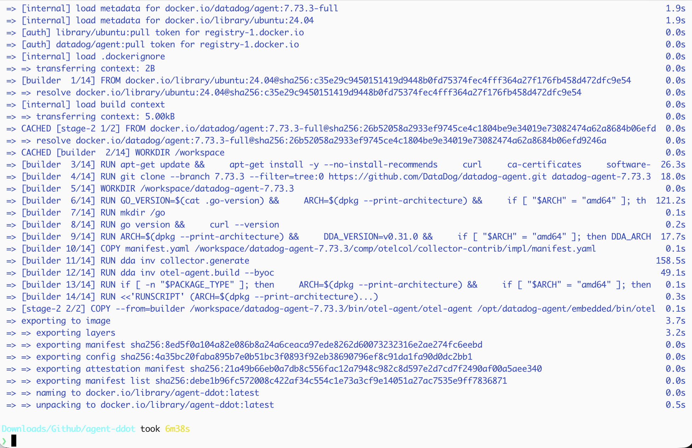
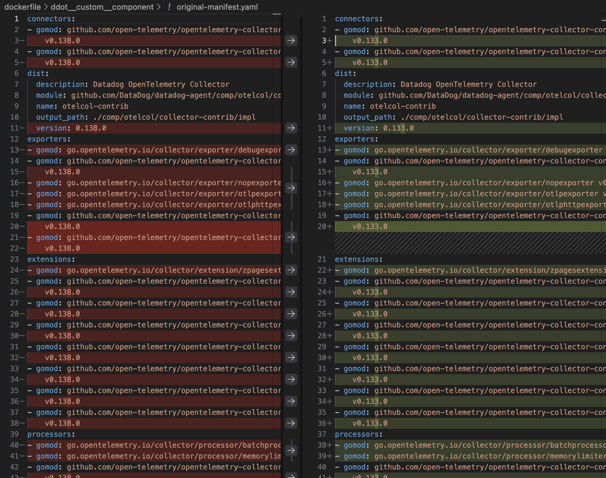

The original file I downloaded need to make modification for the Dockerfile and manifast to work on my local machine. I documented the original and modified files.

Here is the instructions https://docs.datadoghq.com/opentelemetry/setup/ddot_collector/custom_components/ 

The modified files are called Dockerfile and manifest.yaml
The original files downloaded by following Datadog instructions above are original-Dockerfile and original-manifest.yaml

 bump the version