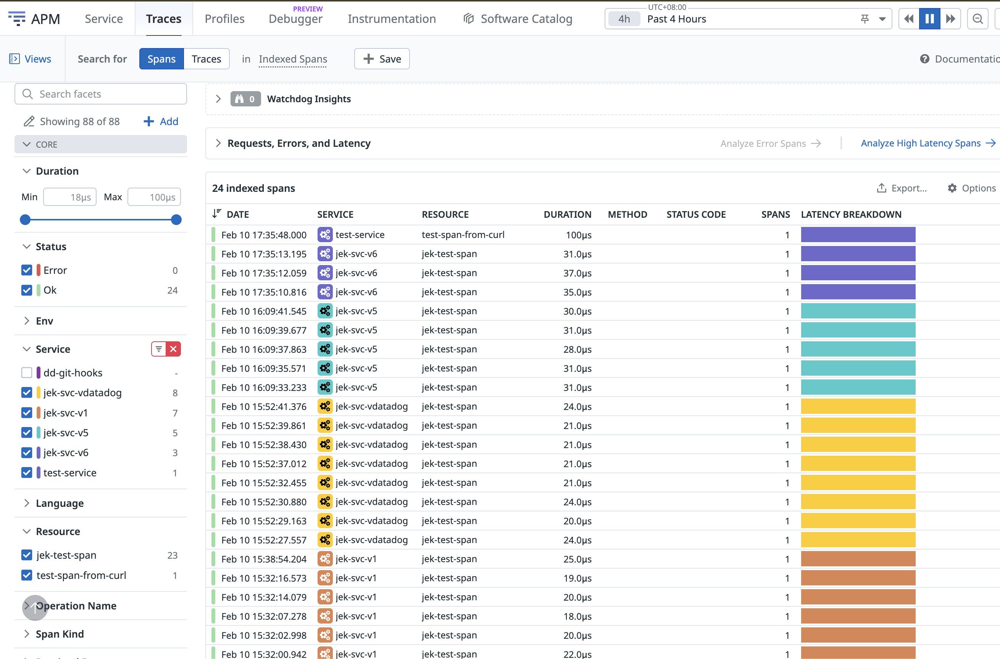

# Send direct OTLP traces to Datadog or via OTel Col with OTLP to Datadog


```bash
# Start the container in the background
docker-compose up -d

# Check if the container is running
docker-compose ps
```

# Test
https://github.com/open-telemetry/opentelemetry-proto/tree/main/examples 

## Test Logs
```bash
curl -O https://raw.githubusercontent.com/open-telemetry/opentelemetry-proto/refs/heads/main/examples/logs.json

curl -X POST -H "Content-Type: application/json" -d @logs.json -i localhost:4318/v1/logs
```

## Test Events
```bash
curl -O https://raw.githubusercontent.com/open-telemetry/opentelemetry-proto/refs/heads/main/examples/events.json

curl -X POST -H "Content-Type: application/json" -d @events.json -i localhost:4318/v1/logs
```

## Test Metrics
```bash
curl -O https://raw.githubusercontent.com/open-telemetry/opentelemetry-proto/refs/heads/main/examples/metrics.json

curl -X POST -H "Content-Type: application/json" -d @metrics.json -i localhost:4318/v1/metrics
```


## Test Trace
```bash
curl -O https://raw.githubusercontent.com/open-telemetry/opentelemetry-proto/refs/heads/main/examples/trace.json

curl -X POST -H "Content-Type: application/json" -d @trace.json -i localhost:4318/v1/traces

# send protobuf trace directly from app or via OTel Col
source .env && export DD_API_KEY && uv run --with opentelemetry-sdk --with opentelemetry-exporter-otlp-proto-http send_trace.py
```


