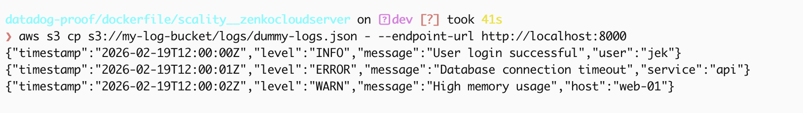

create the data and metadata folders inside your specified directory
```bash
mkdir -p ~/Downloads/Github/datadog-proof/dockerfile/scality__zenkocloudserver/data ~/Downloads/Github/datadog-proof/dockerfile/scality__zenkocloudserver/metadata
```

start the server using Docker
```bash
docker rm -f scality-s3-poc 2>/dev/null; docker run -d \
    --name scality-s3-poc \
    -p 8000:8000 \
    -e SCALITY_ACCESS_KEY_ID=myAccessKey123 \
    -e SCALITY_SECRET_ACCESS_KEY=mySuperSecretKey123 \
    -v ~/Downloads/Github/datadog-proof/dockerfile/scality__zenkocloudserver/data:/usr/src/app/localData \
    -v ~/Downloads/Github/datadog-proof/dockerfile/scality__zenkocloudserver/metadata:/usr/src/app/localMetadata \
    zenko/cloudserver
```

test the storage
```bash
  export AWS_ACCESS_KEY_ID=myAccessKey123
  export AWS_SECRET_ACCESS_KEY=mySuperSecretKey123
  export AWS_DEFAULT_REGION=ap-southeast-1
```

create bucket
```bash
aws s3 mb s3://my-log-bucket --endpoint-url http://localhost:8000
```

create dummy logs
```bash
mkdir ./tmp

echo '{"timestamp":"2026-02-19T12:00:00Z","level":"INFO","message":"User login successful","user":"jek"}
{"timestamp":"2026-02-19T12:00:01Z","level":"ERROR","message":"Database connection timeout","service":"api"}
{"timestamp":"2026-02-19T12:00:02Z","level":"WARN","message":"High memory usage","host":"web-01"}' > ./tmp/dummy-logs.json
```

upload dummy logs
```bash
aws s3 cp /tmp/dummy-logs.json s3://my-log-bucket/logs/dummy-logs.json --endpoint-url http://localhost:8000
```

verify by listing it
```bash
aws s3 ls s3://my-log-bucket/ --recursive --endpoint-url http://localhost:8000
```

verify by downloading and read back
```bash
aws s3 cp s3://my-log-bucket/logs/dummy-logs.json ./readback-dummylogs.json --endpoint-url http://localhost:8000
```



The ultimate proof: If you open Finder and navigate to ~/Downloads/Github/datadog-proof/dockerfile/scality__zenkocloudserver/data, I can see encrypted/hashed fragments of my dummy log data.

clean up by unsetting variables
```bash
unset AWS_ACCESS_KEY_ID AWS_SECRET_ACCESS_KEY AWS_DEFAULT_REGION
```