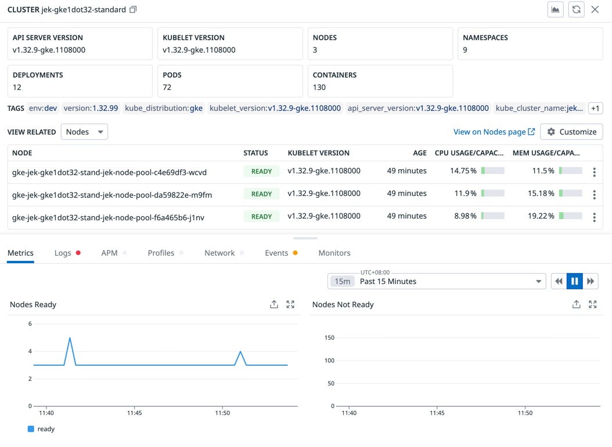

# GKE 1.32 Standard Cluster

This Terraform project creates a Google Kubernetes Engine (GKE) version 1.32 cluster in standard mode, deployed in the Asia Southeast region (Singapore).

## Overview

- **Cluster Name**: `jek-gke1dot32-standard`
- **Region**: `asia-southeast1` (Singapore)
- **Node Count**: 1 (for testing)
- **Machine Type**: `e2-medium`
- **Kubernetes Version**: 1.32
- **Mode**: Standard (not Autopilot)

## Prerequisites

1. **Google Cloud Account**: Active GCP account with billing enabled
2. **Google Cloud CLI**: [Install gcloud](https://cloud.google.com/sdk/docs/install)
3. **Terraform**: [Install Terraform](https://developer.hashicorp.com/terraform/downloads) (>= 1.0)
4. **kubectl**: [Install kubectl](https://kubernetes.io/docs/tasks/tools/)

## Authentication Setup

1. **Authenticate with Google Cloud**:
   ```bash
   gcloud auth login
   gcloud auth application-default login
   ```

2. **Set your project ID**:
   ```bash
   gcloud config set project YOUR_PROJECT_ID
   ```

3. **Enable required APIs**:
   ```bash
   gcloud services enable container.googleapis.com
   gcloud services enable compute.googleapis.com
   ```

## Quick Start

### 1. Configure Variables

Copy the example file and set your project ID:

```bash
cp terraform.tfvars.example terraform.tfvars
```

Edit `terraform.tfvars`:
```hcl
project_id = "your-actual-project-id"
region     = "asia-southeast1"
```

### 2. Deploy the Cluster

```bash
# Initialize Terraform
terraform init

# Review the deployment plan
terraform plan

# Deploy the infrastructure
terraform apply
```

Type `yes` when prompted to confirm the deployment.

### 3. Configure kubectl Access

After deployment completes, get the connection command from the output:

```bash
# Get the command from Terraform output
terraform output get_credentials_command

# Or run directly (replace with your project):
gcloud container clusters get-credentials jek-gke1dot32-standard --region=asia-southeast1
```

### 4. Verify Cluster

```bash
# Check cluster status
kubectl get nodes

# View cluster info
kubectl cluster-info
```

## Testing with Nginx

### Deploy Test Application

```bash
# Deploy Nginx test application
kubectl apply -f nginx-test.yaml

# Check deployment status
kubectl get pods,services
```

### Access the Application

```bash
# Get the external IP (may take a few minutes)
kubectl get service jek-nginx-service

# Once EXTERNAL-IP shows an IP address, test in browser:
# http://EXTERNAL-IP
```

### Clean Up Test Application

```bash
# Remove test deployment
kubectl delete -f nginx-test.yaml
```

## Architecture

The deployment creates:

1. **Custom Subnetwork**: `jek-gke-subnet` with secondary IP ranges
   - Primary CIDR: `10.0.0.0/24`
   - Pod CIDR: `10.1.0.0/16`
   - Service CIDR: `10.2.0.0/20`

2. **GKE Cluster**: Regional cluster with:
   - VPC-native networking
   - Kubernetes version 1.32
   - Standard mode (not Autopilot)

3. **Node Pool**: Single node pool with:
   - 1 x `e2-medium` instance
   - Standard configuration

## Cost Considerations

- **Estimated Cost**: ~$70-100/month for cluster management + compute
- **Node Cost**: ~$25-30/month per `e2-medium` node
- **Cluster Management**: ~$72/month (GKE standard tier)

To minimize costs:
- Use this for testing only
- Destroy when not needed
- Consider preemptible nodes for development

## Security Features

- VPC-native networking for improved security
- Network isolation with custom subnet
- Metadata server protection enabled
- Standard GKE security defaults applied

## Troubleshooting

### Common Issues

1. **Authentication Error**:
   ```bash
   gcloud auth application-default login
   ```

2. **API Not Enabled**:
   ```bash
   gcloud services enable container.googleapis.com compute.googleapis.com
   ```

3. **Quota Exceeded**:
   - Check your GCP quotas in the console
   - Request quota increases if needed

4. **kubectl Connection Issues**:
   ```bash
   gcloud container clusters get-credentials jek-gke1dot32-standard --region=asia-southeast1
   ```

### Verify Deployment

```bash
# Check Terraform state
terraform show

# Verify resources in GCP Console
gcloud container clusters list
gcloud compute networks subnets list
```

## Cleanup

### Remove Test Applications
```bash
kubectl delete -f nginx-test.yaml
```

### Destroy Infrastructure
```bash
terraform destroy
```

Type `yes` to confirm the destruction of all resources.

⚠️ **Warning**: This will permanently delete the cluster and all associated resources.

## Files Structure

```
gke1dot32__standard/
├── main.tf                 # Main Terraform configuration
├── variables.tf            # Variable definitions
├── outputs.tf             # Output values
├── terraform.tfvars.example # Example variables file
├── nginx-test.yaml        # Kubernetes test deployment
├── .gitignore            # Git ignore file
└── README.md             # This file
```

## Advanced Usage

### Scaling Nodes

Edit the node count in `main.tf`:
```hcl
resource "google_container_node_pool" "jek_primary_nodes" {
  node_count = 3  # Change from 1 to 3
}
```

Then apply:
```bash
terraform apply
```

### Different Machine Types

Available machine types:
- `e2-small`: 2 vCPU, 2GB RAM (minimum)
- `e2-medium`: 1 vCPU, 4GB RAM (recommended for testing)
- `e2-standard-2`: 2 vCPU, 8GB RAM
- `e2-standard-4`: 4 vCPU, 16GB RAM

### Enable Autoscaling

Add autoscaling to the node pool:
```hcl
resource "google_container_node_pool" "jek_primary_nodes" {
  autoscaling {
    min_node_count = 1
    max_node_count = 3
  }
}
```

## Add Datadog Helm Chart
```bash
helm repo add datadog https://helm.datadoghq.com
helm repo update
kubectl create secret generic datadog-secret --from-literal api-key=<REDACTED>
```

Update values.yaml accordingly
```bash
helm pull --untar datadog/datadog

# e.g., in datadog-values.yaml
```

Deploy the helm chart
```
helm install datadog-agent -f datadog-values.yaml datadog/datadog
```

Update the helm chart if necessary
```
helm upgrade datadog-agent datadog/datadog -f datadog-values.yaml
```


## Add Datadog Operator
Follow the instructions at Datadog UI.

```bash
kubectl get pods --all-namespaces
```

Operator = Chef
DatadogAgent Resource = Recipe
DaemonSet = The actual meal

```bash
# Check Custom Resource Definitions (CRDs) installed
kubectl get crd | grep datadog
```

```bash
# 1. List all DatadogAgent resources:
kubectl get datadogagent --all-namespaces

# 2. View the full configuration in YAML format:
kubectl get datadogagent datadog -o yaml
# This shows you exactly what configuration is stored in Kubernetes
```

```bash
# Quick view - see name, status
kubectl get datadogagent

# Full configuration - see everything you set
kubectl get datadogagent datadog -o yaml > my-current-config.yaml

# Compare with your original file
diff datadog-operator-agent.yaml my-current-config.yaml

# See your DatadogAgent and what it created
kubectl get datadogagent,daemonset,deployment | grep datadog
```


```bash
kubectl get daemonsets --all-namespaces

kubectl get pods -n default | grep -i datadog
```
