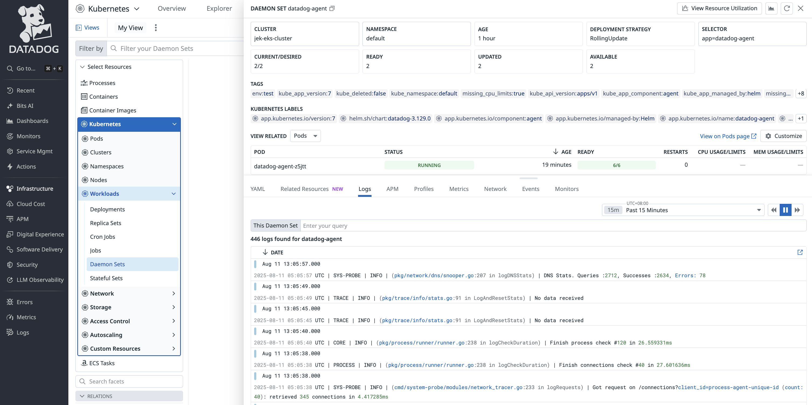

# EKS Cluster on EC2 with Terraform

This Terraform configuration creates an Amazon EKS (Elastic Kubernetes Service) cluster on EC2 instances in the ap-southeast-1 region. The setup includes a complete VPC infrastructure, security groups, IAM roles, and a managed node group with 2 worker nodes.

## Architecture Overview

- **EKS Cluster**: `jek-eks-cluster` with Kubernetes v1.30
- **Worker Nodes**: 2 x t3.medium EC2 instances in a managed node group
- **Networking**: VPC with 2 public subnets across 2 availability zones (ap-southeast-1a & ap-southeast-1b)
- **Access**: SSH access restricted to your IP, kubectl access via public endpoint
- **Security**: Proper IAM roles and security groups for cluster communication

## Prerequisites

Before deploying this EKS cluster, ensure you have:

1. **AWS CLI** installed and configured with valid credentials
   ```bash
   aws configure
   # Enter your Access Key ID, Secret Access Key, region (ap-southeast-1), and output format
   ```

2. **Terraform** >= 1.0 installed
   ```bash
   # macOS (using Homebrew)
   brew install terraform
   
   # Verify installation
   terraform version
   ```

3. **kubectl** installed for cluster management
   ```bash
   # macOS (using Homebrew)
   brew install kubectl
   
   # Verify installation
   kubectl version --client
   ```

4. **SSH Key Pair** named `jek-macbook-pro-key` must exist in AWS ap-southeast-1 region
   - If not exists, create it in AWS Console: EC2 → Key Pairs → Create Key Pair

## Deployment Steps

### Step 1: Initialize Terraform
```bash
terraform init
```

### Step 2: Review the Plan
```bash
terraform plan -out=tfplan
```
Review the output to understand what resources will be created. Expected resources:
- 1 VPC with internet gateway and 2 public subnets (across 2 AZs)
- 2 security groups (cluster and nodes)
- 2 IAM roles with policy attachments
- 1 EKS cluster and 1 node group spanning both subnets

### Step 3: Deploy the Infrastructure
```bash
terraform apply tfplan
```
**Note**: EKS cluster creation takes approximately 10-15 minutes. Please be patient.

### Step 4: Configure kubectl
After successful deployment, configure kubectl to access your cluster:
```bash
aws eks update-kubeconfig --region ap-southeast-1 --name jek-eks-cluster
```

## Verification

### Check Cluster Status
```bash
# Verify cluster is active
aws eks describe-cluster --name jek-eks-cluster --region ap-southeast-1 --query 'cluster.status'

# Should return: "ACTIVE"
```

### Verify Node Connectivity
```bash
# Check nodes are ready
kubectl get nodes

# Expected output: 2 nodes in Ready status
# NAME                                               STATUS   ROLES    AGE   VERSION
# ip-10-0-1-xxx.ap-southeast-1.compute.internal     Ready    <none>   5m    v1.30.x
# ip-10-0-1-yyy.ap-southeast-1.compute.internal     Ready    <none>   5m    v1.30.x
```

### Test Basic Functionality
```bash
# Deploy a test application
kubectl create deployment nginx --image=nginx
kubectl expose deployment nginx --type=LoadBalancer --port=80

# Check deployment
kubectl get pods
kubectl get services

# Clean up test resources
kubectl delete service nginx
kubectl delete deployment nginx
```

### SSH Access to Worker Nodes
```bash
# Get worker node public IPs
aws ec2 describe-instances --region ap-southeast-1 \
  --filters "Name=tag:kubernetes.io/cluster/jek-eks-cluster,Values=owned" \
  --query 'Reservations[].Instances[].PublicIpAddress' --output table

# SSH to a worker node (replace with actual IP)
ssh -i ~/.ssh/id_ed25519 ec2-user@<node-public-ip>
```

## Install Datadog Helm
```bash
# Add the Datadog repository
helm repo add datadog https://helm.datadoghq.com

# Fetch the latest information from all repositories
helm repo update

# Create secret
kubectl create secret generic datadog-secret --from-literal api-key=XXXXXXXXXXXXXXXXXXXXXXXXXXXXXXXX

# helm pull <repository>/<chart-name> --version <chart-version>
helm pull datadog/datadog --version 3.129.0
# or
helm pull datadog/datadog --version 3.129.0 --untar

# Install
helm install datadog-agent -f datadog-values-helm.yaml datadog/datadog
```

## Uninstall Datadog Helm
```bash
# Uninstall
helm uninstall datadog-agent
```

## Install Datadog Operator
```bash
helm repo add datadog https://helm.datadoghq.com
helm install datadog-operator datadog/datadog-operator

# Create secret
kubectl create secret generic datadog-secret --from-literal api-key=XXXXXXXXXXXXXXXXXXXXXXXXXXXXXXXX

helm pull datadog/datadog-operator --untar
```

Follow the steps here https://docs.datadoghq.com/getting_started/containers/datadog_operator/


## Uninstall Datadog Operator
```bash
# Uninstall
helm uninstall datadog-agent
```


## Teardown Instructions

### Standard Teardown
```bash
# Plan destruction (optional but recommended)
terraform plan -destroy

# Destroy all resources
terraform destroy

# Type 'yes' when prompted to confirm
```

### Emergency Cleanup
If `terraform destroy` fails, use AWS CLI:

```bash
# Delete node group first
aws eks delete-nodegroup --cluster-name jek-eks-cluster --nodegroup-name jek-eks-nodes --region ap-southeast-1

# Wait for node group deletion (check status)
aws eks describe-nodegroup --cluster-name jek-eks-cluster --nodegroup-name jek-eks-nodes --region ap-southeast-1

# Delete cluster after node group is deleted
aws eks delete-cluster --name jek-eks-cluster --region ap-southeast-1

# Clean up remaining resources manually via AWS Console if needed
```

## Troubleshooting

### Common Issues

1. **AWS Credentials Error**
   ```
   Error: validating provider credentials
   ```
   **Solution**: Ensure AWS CLI is configured with valid credentials:
   ```bash
   aws configure
   aws sts get-caller-identity
   ```

2. **SSH Key Not Found**
   ```
   Error: InvalidKeyPair.NotFound
   ```
   **Solution**: Create the SSH key pair in AWS Console:
   - Go to EC2 → Key Pairs → Create Key Pair
   - Name: `jek-macbook-pro-key`
   - Region: ap-southeast-1

3. **Cluster Creation Timeout**
   ```
   Error: timeout while waiting for cluster to become active
   ```
   **Solution**: EKS clusters can take 10-15 minutes. If it fails, check AWS CloudTrail logs or try again.

4. **EKS Multi-AZ Requirement Error**
   ```
   Error: Subnets specified must be in at least two different AZs
   ```
   **Solution**: This configuration now uses 2 subnets across different AZs (ap-southeast-1a & ap-southeast-1b). Error is already resolved.

5. **CIDR Block Conflict Error**
   ```
   Error: InvalidSubnet.Conflict: The CIDR '10.0.x.0/24' conflicts with another subnet
   ```
   **Solution**: This configuration uses non-overlapping CIDR blocks (10.0.3.0/24 and 10.0.4.0/24). Error is already resolved.

6. **Node Group Creation Failed**
   ```
   Error: node group creation failed
   ```
   **Solution**: Check that the instance type `t3.medium` is available in both AZs, or modify the variable.

### Debugging Commands

```bash
# Check Terraform state
terraform show

# List all resources
terraform state list

# Get detailed resource information
terraform state show aws_eks_cluster.main

# View Terraform logs
export TF_LOG=DEBUG
terraform plan

# Check AWS resource status
aws eks list-clusters --region ap-southeast-1
aws eks describe-cluster --name jek-eks-cluster --region ap-southeast-1
```

## Kubernetes DaemonSet Scheduling Troubleshooting

### Problem: DaemonSet Pods Failing to Schedule

**Error Message**: `0/2 nodes are available: 1 Too many pods, 1 node(s) didn't satisfy plugin(s) [NodeAffinity]. preemption: 0/2 nodes are available: 1 No preemption victims found for incoming pod, 1 Preemption is not helpful for scheduling.`

### Systematic Troubleshooting Methodology

#### Step 1: Identify the Problem
```bash
# Check daemonset status - look for DESIRED vs READY mismatch
kubectl get ds -A

# Example output showing issue:
# NAMESPACE     NAME            DESIRED   CURRENT   READY   UP-TO-DATE   AVAILABLE   NODE SELECTOR            AGE
# default       datadog-agent   2         2         1       2            1           kubernetes.io/os=linux   58m
```

#### Step 2: Examine Recent Events
```bash
# Check recent scheduling events for specific error details
kubectl get events --sort-by=.metadata.creationTimestamp -A | tail -20

# Look for messages like:
# - "Too many pods"
# - "didn't satisfy plugin(s) [NodeAffinity]"
# - "No preemption victims found"
```

#### Step 3: Investigate Node Capacity vs Usage
```bash
# Check pod capacity limits per node
kubectl get nodes -o custom-columns=NAME:.metadata.name,PODS_CAPACITY:.status.capacity.pods,PODS_ALLOCATABLE:.status.allocatable.pods

# Count actual pods running per node
for node in $(kubectl get nodes --no-headers | awk '{print $1}'); do
  echo "=== $node ==="
  kubectl describe node $node | grep -E "Capacity:|Allocatable:" | grep pods
  echo "Current pods:"
  kubectl get pods -A --field-selector spec.nodeName=$node --no-headers | wc -l
  echo
done
```

**Key Discovery**: Node `ip-10-0-3-243.ap-southeast-1.compute.internal` was at exactly 17/17 pods (capacity limit reached)

#### Step 4: Check DaemonSet Configuration
```bash
# Examine node affinity and selector constraints
kubectl get daemonset <DAEMONSET_NAME> -n <NAMESPACE> -o yaml | grep -A 20 -B 5 affinity
kubectl get daemonset <DAEMONSET_NAME> -n <NAMESPACE> -o yaml | grep -A 10 nodeSelector

# Check for tolerations
kubectl get daemonset <DAEMONSET_NAME> -n <NAMESPACE> -o yaml | grep -A 10 -B 5 tolerations
```

#### Step 5: Investigate Node Constraints
```bash
# Check node labels and taints
kubectl get nodes --show-labels
kubectl describe nodes | grep -A 5 -B 5 Taints
```

### Solution Applied

#### Primary Fix: Remove Scheduling Constraints
```bash
# Remove all scheduling constraints from the daemonset
kubectl patch daemonset datadog-agent -n default --type='merge' -p='{
  "spec": {
    "template": {
      "spec": {
        "affinity": null,
        "nodeSelector": null,
        "tolerations": [
          {
            "operator": "Exists"
          }
        ]
      }
    }
  }
}'
```

#### Secondary Fix: Free Up Pod Capacity
```bash
# Scale down non-essential deployments to free pod slots
kubectl scale deployment grafana --replicas=0 -n default

# Alternative: Delete completed/failed pods
kubectl delete pods --field-selector=status.phase=Succeeded -A
kubectl delete pods --field-selector=status.phase=Failed -A
```

### Root Cause Analysis

1. **Primary Issue**: Node capacity exhaustion (17/17 pods on first node)
2. **Secondary Issue**: NodeAffinity constraints preventing scheduling on available nodes
3. **Contributing Factor**: No pod eviction possible due to all pods being essential

### Prevention Strategies

1. **Monitor Pod Capacity**:
   ```bash
   # Regular capacity monitoring
   kubectl top nodes
   kubectl describe nodes | grep -E "Allocated resources|pods"
   ```

2. **Configure Proper Resource Limits**:
   - Set appropriate CPU/memory requests and limits
   - Use Pod Disruption Budgets for critical workloads

3. **Implement Node Auto-scaling**:
   - Configure cluster autoscaler for dynamic node provisioning
   - Set appropriate max pod limits per node based on workload

4. **DaemonSet Best Practices**:
   - Use universal tolerations: `operator: Exists`
   - Avoid restrictive node selectors unless necessary
   - Test scheduling constraints in development first

### Quick Resolution Commands

```bash
# Emergency fix for "Too many pods" error:
# 1. Check which daemonset is failing
kubectl get ds -A

# 2. Remove all scheduling constraints
kubectl patch daemonset <DS_NAME> -n <NAMESPACE> --type='merge' -p='{
  "spec": {
    "template": {
      "spec": {
        "affinity": null,
        "nodeSelector": null,
        "tolerations": [{"operator": "Exists"}]
      }
    }
  }
}'

# 3. Free up pod slots if needed
kubectl scale deployment <non-essential-app> --replicas=0
```

## Security Considerations

- SSH access is restricted to your current public IP
- EKS cluster endpoint is public but secured with AWS IAM
- Worker nodes are in public subnets across 2 AZs for high availability (not recommended for production)
- Security groups follow principle of least privilege
- IAM roles use AWS managed policies
