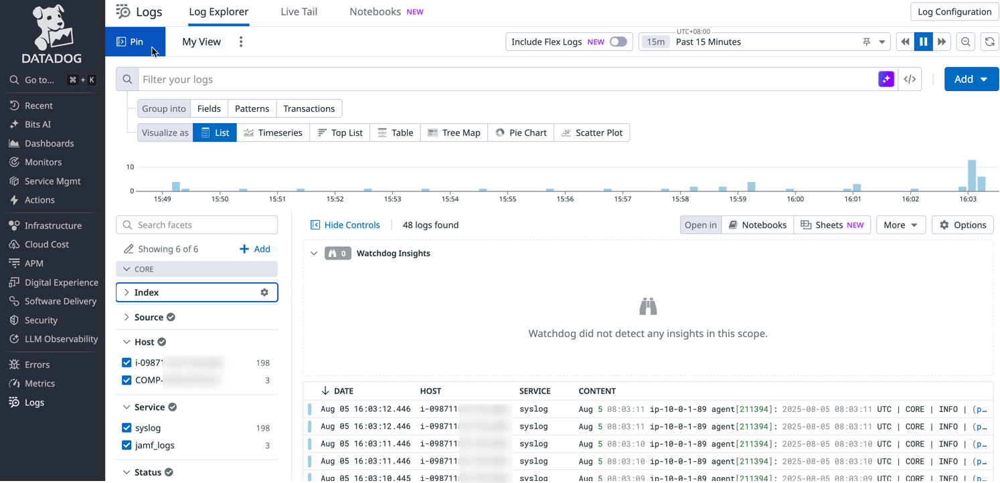

Syslog


# EC2 Ubuntu 22.04 Terraform Script

This Terraform script creates an Amazon EC2 instance running Ubuntu 24.04 LTS in the ap-southeast-1 region with a complete networking setup.

## Architecture

The script creates the following AWS resources:
- **VPC** - Isolated network environment (10.0.0.0/16)
- **Internet Gateway** - Provides internet access
- **Public Subnet** - Network segment for the EC2 instance (10.0.1.0/24)
- **Route Table** - Routes traffic to the internet gateway
- **Security Group** - Firewall allowing SSH access from your IP only
- **Key Pair** - SSH key for secure access
- **EC2 Instance** - Ubuntu 24.04 LTS t3.large instance with 50GB storage

## Prerequisites

### 1. AWS Account
- Active AWS account with appropriate permissions
- IAM user with EC2, VPC, and key management permissions

### 2. Terraform Installation (macOS)
```bash
# Install using Homebrew
brew install terraform

# Verify installation
terraform version
```

### 3. AWS CLI Configuration
```bash
# Install AWS CLI
brew install awscli

# Configure AWS credentials
code ~/.aws

aws configure list

aws sts get-caller-identity
```
Enter your AWS Access Key ID, Secret Access Key, default region (ap-southeast-1), and output format (json).

## Deployment Steps

### 1. Navigate to Project Directory
```bash
cd ec2-ubuntu-v24
```

### 2. Initialize Terraform
```bash
terraform init
```
This downloads the AWS provider and initializes the working directory.

### 3. Review the Plan
```bash
terraform plan
```
This shows what resources will be created without actually creating them.

### 4. Apply the Configuration
```bash
terraform apply
```
Type `yes` when prompted to create the resources.

### 5. Connect to Your Instance
After successful deployment, use the SSH command from the output:
```bash
ssh -i ~/.ssh/id_ed25519 ubuntu@<PUBLIC_IP>
```

## Configuration

### Variables
You can customize the deployment by modifying `terraform.tfvars`:

```hcl
region            = "ap-southeast-1"      # AWS region
availability_zone = "ap-southeast-1a"     # Availability zone
instance_type     = "t3.large"            # EC2 instance type
key_name          = "jek-macbook-pro-key" # AWS key pair name
storage_size      = 50                    # Root volume size (GB)
name_prefix       = "jek"                 # Resource name prefix
owner_tag         = "jek"  # Owner tag
env_tag           = "test"                # Environment tag
```

### Available Instance Types
- `t3.micro` - 1 vCPU, 1GB RAM (free tier eligible)
- `t3.small` - 1 vCPU, 2GB RAM
- `t3.medium` - 2 vCPU, 4GB RAM
- `t3.large` - 2 vCPU, 8GB RAM (default)
- `t3.xlarge` - 4 vCPU, 16GB RAM

## Install Datadog agent

```bash
DD_API_KEY=XXXXXXXXXXXXXXXXXXXXXX \
DD_SITE="datadoghq.com" \
bash -c "$(curl -L https://install.datadoghq.com/scripts/install_script_agent7.sh)"


sudo systemctl datadog-agent status

sudo journalctl -u datadog-agent -p err

sudo journalctl -u datadog-agent -p err -n 50

sudo journalctl -u datadog-agent | grep -i "error"

# Grep the log file for errors
sudo grep -i "error" /var/log/datadog/agent.log

# Tail the log file live and filter for errors
sudo tail -f /var/log/datadog/agent.log | grep -i "error"

sudo datadog-agent status

# Find the "Logs Agent" section and show the 25 lines after it
sudo datadog-agent status | grep -A 25 "Logs Agent"
```

To enable log collection, change logs_enabled: false to logs_enabled: true in your Agent’s main configuration file (datadog.yaml). 

Create `/etc/datadog-agent/conf.d/syslog.d/conf.yaml` if doesn't exist.

```
logs:
  - type: file
    path: /var/log/syslog
    service: syslog
    source: ubuntu
```

Restart datadog agent

## Teardown

### Destroy Resources
```bash
terraform destroy
```
Type `yes` when prompted to destroy all resources.

### Verify Cleanup
```bash
# Check if resources are destroyed
aws ec2 describe-instances --region ap-southeast-1 --filters "Name=tag:Name,Values=jek-*"
aws ec2 describe-vpcs --region ap-southeast-1 --filters "Name=tag:Name,Values=jek-*"
```