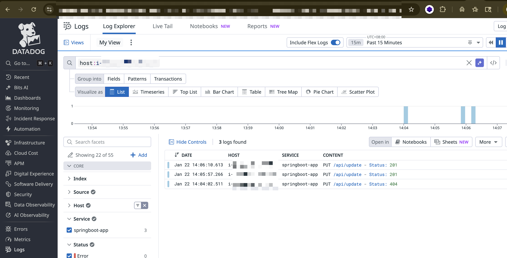
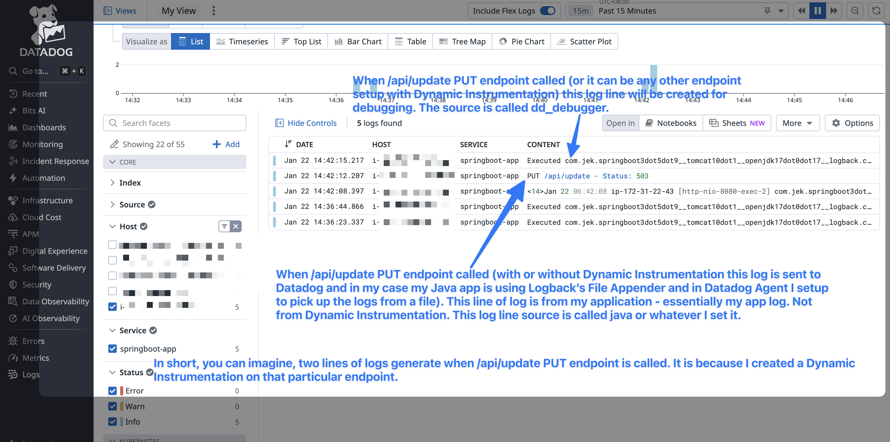
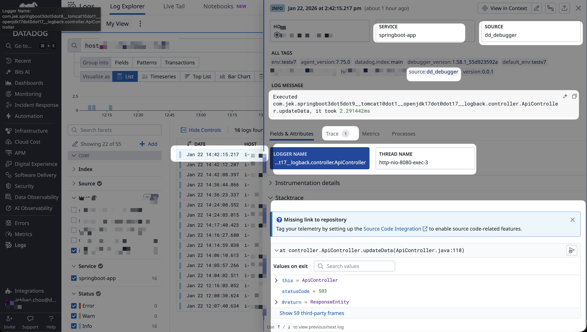
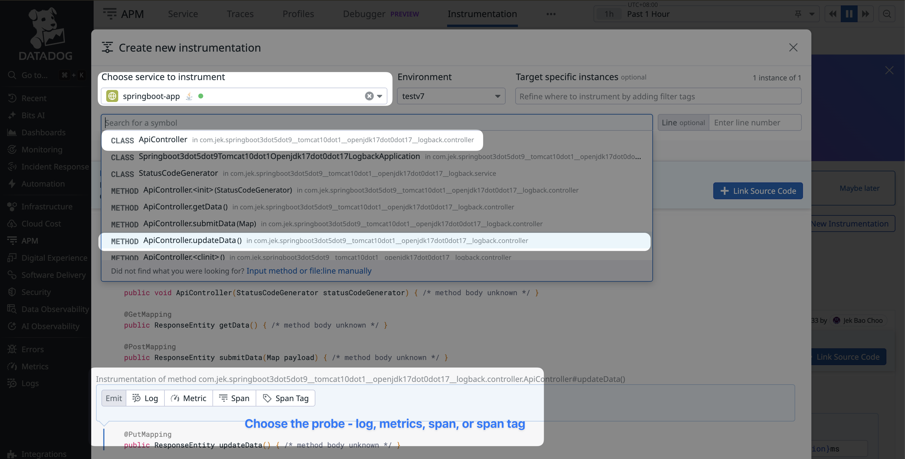
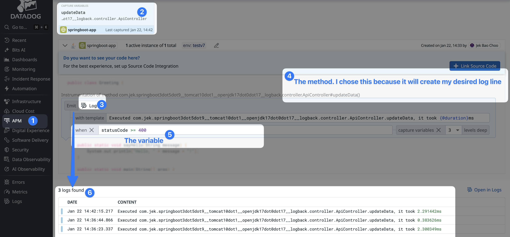
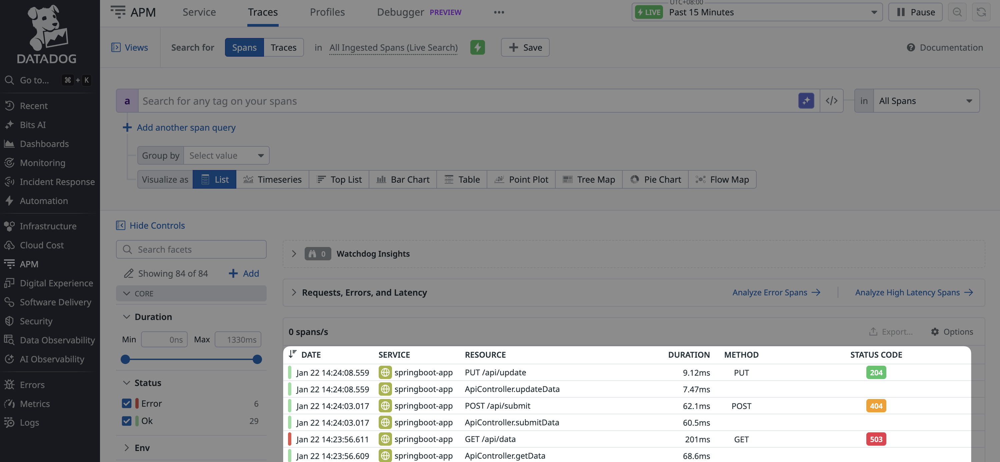

# Spring Boot 3.5.9 REST API with Random Status Codes

### On Dynamic Instrumentation Log Probe


Sending of logs (FileAppender).


With dynamic instrumentation for logs


Here is the result of how the logs look like from dynamic instrumentation log probe. 


Here is what if looks like when I am setting it up.


Here is what it looks like after I set it up to do log probe.

---

### On Dynamic Instrumentation Span Probe


Spans are in.


A demonstration Java web application built with Spring Boot 3.5.9, featuring REST API endpoints that return random HTTP status codes with configurable probability distribution and JSON logging using multiple Logback appenders.

## Overview

This application provides three REST API endpoints, each configured with different logging destinations:
- **GET /api/data**: Returns JSON data with lorem ipsum text and random number, logs to **Console**
- **POST /api/submit**: Accepts JSON payload, logs to **Syslog**
- **PUT /api/update**: Returns status code only, logs to **File** (logs/app.log)

All endpoints randomly return HTTP status codes based on probability:
- **30% chance**: 2XX codes (200, 201, 204)
- **40% chance**: 4XX codes (400, 404, 409)
- **30% chance**: 5XX codes (500, 503)

## Tech Stack

- **Spring Boot**: 3.5.9
- **Java**: OpenJDK 17.0.17
- **Embedded Server**: Apache Tomcat 10.1.50 (included in Spring Boot)
- **Build Tool**: Maven (with wrapper)
- **Logging**: SLF4J + Logback with JSON formatting (logstash-logback-encoder)
- **Testing**: JUnit 5 + Playwright Java

## Prerequisites

- **Java 17** or higher (OpenJDK 17.0.17 recommended)
- **Maven 3.6.3+** (Maven wrapper included, so local Maven installation optional)
- **Operating System**: macOS, Linux, or Windows

Verify Java installation:
```bash
java -version
```
Should show: openjdk version "17.0.17" or higher

## Project Structure

```
springboot3dot5dot9__tomcat10dot1__openjdk17dot0dot17__logback/
├── src/
│   ├── main/
│   │   ├── java/com/jek/.../
│   │   │   ├── controller/
│   │   │   │   └── ApiController.java          # REST API endpoints
│   │   │   ├── service/
│   │   │   │   └── StatusCodeGenerator.java    # Random status code logic
│   │   │   └── ...Application.java              # Spring Boot main class
│   │   └── resources/
│   │       ├── application.properties           # App configuration
│   │       └── logback-spring.xml               # Logging configuration
│   └── test/
│       └── java/com/jek/.../
│           └── ApiEndpointTest.java             # Playwright integration tests
├── logs/
│   └── app.log                                  # PUT endpoint logs (JSON)
├── target/
│   └── *.jar                                    # Compiled JAR file
├── pom.xml                                      # Maven dependencies
├── mvnw                                         # Maven wrapper (Unix)
├── mvnw.cmd                                     # Maven wrapper (Windows)
└── README.md                                    # This file
```

## Setup Instructions

### 1. Clone or Navigate to Project

```bash
cd /path/to/springboot3dot5dot9__tomcat10dot1__openjdk17dot0dot17__logback
```

### 2. Verify Prerequisites

```bash
# Check Java version
java -version

# Check Maven wrapper
./mvnw -version
```

### 3. Build the Project

```bash
# Clean and build
./mvnw clean package

# Build output will be in target/ directory
ls -lh target/*.jar
```

## Running the Application

### Option 1: Using Maven Wrapper (Development)

```bash
./mvnw spring-boot:run
```

The application will start on **http://localhost:8080**

You should see output like:
```
Started Springboot3dot5dot9...Application in X.XXX seconds
```

### Option 2: Running the JAR File (Production)

```bash
# Build the JAR first
./mvnw clean package

# Run the JAR
java -jar target/springboot3dot5dot9__tomcat10dot1__openjdk17dot0dot17__logback-0.0.1-SNAPSHOT.jar
```

### Stopping the Application

- **If running in foreground**: Press `Ctrl+C`
- **If running in background**: `pkill -f spring-boot` or `pkill -f springboot3dot5dot9`

## API Endpoints

### 1. GET /api/data

Returns JSON data with lorem ipsum text and a 5-digit random number.

**Request:**
```bash
curl http://localhost:8080/api/data
```

**Response Example (Status 201):**
```json
{
  "randomNumber": 45678,
  "loremIpsum": "Lorem ipsum dolor sit amet, consectetur adipiscing elit...",
  "statusCode": 201,
  "timestamp": 1768928098146
}
```

**Logging**: Console (JSON format)

---

### 2. POST /api/submit

Accepts JSON payload and returns acknowledgment.

**Request:**
```bash
curl -X POST http://localhost:8080/api/submit \
  -H "Content-Type: application/json" \
  -d '{"test": "data", "user": "john"}'
```

**Response Example (Status 400):**
```json
{
  "status": "received",
  "message": "Data submitted successfully",
  "receivedPayload": {
    "test": "data",
    "user": "john"
  },
  "statusCode": 400,
  "timestamp": 1768928110896
}
```

**Logging**: Syslog (JSON format)

---

### 3. PUT /api/update

Returns only HTTP status code with no response body.

**Request:**
```bash
curl -X PUT http://localhost:8080/api/update -v
```

**Response:**
- Status code only (e.g., `HTTP/1.1 503`)
- No response body

**Logging**: File at `logs/app.log` (JSON format)

---

## curl Testing Examples

### Test All Endpoints

```bash
# Test GET endpoint
curl -v http://localhost:8080/api/data

# Test POST endpoint
curl -v -X POST http://localhost:8080/api/submit \
  -H "Content-Type: application/json" \
  -d '{"name": "test", "value": 123}'

# Test PUT endpoint
curl -v -X PUT http://localhost:8080/api/update
```

### Test Multiple Times (Verify Random Status Codes)

```bash
# Test GET endpoint 10 times
for i in {1..10}; do
  echo "Request $i:"
  curl -s http://localhost:8080/api/data | grep statusCode
  echo ""
done
```

### Pretty Print JSON Responses

```bash
# Using Python (macOS/Linux)
curl -s http://localhost:8080/api/data | python3 -m json.tool

# Using jq (if installed)
curl -s http://localhost:8080/api/data | jq
```

## Logging Configuration

The application uses **Logback** with **JSON formatting** via `logstash-logback-encoder`. The logback file is at `/src/main/resources/logback-spring.xml`.

### Three Logging Destinations

1. **Console Appender** (GET endpoint)
   - Format: JSON
   - Output: Standard output (console)

2. **Syslog Appender** (POST endpoint)
   - Format: JSON
   - Output: Local syslog (localhost:514)
   - Note: Requires syslog daemon running

3. **File Appender** (PUT endpoint)
   - Format: JSON
   - Output: `logs/app.log`

### View Logs

```bash
# View console logs (GET endpoint)
# Logs appear in terminal where app is running

# View file logs (PUT endpoint)
cat logs/app.log

# Tail file logs in real-time
tail -f logs/app.log

# View syslog (macOS)
log show --predicate 'process == "java"' --last 10m

# View syslog (Linux)
tail -f /var/log/syslog | grep java
```

### Example Log Entry (JSON Format)

```json
{
  "@timestamp": "2026-01-21T00:54:58.146656+08:00",
  "@version": "1",
  "message": "GET /api/data - Status: 201 - RandomNumber: 99958",
  "logger_name": "com.jek...controller.GetEndpoint",
  "thread_name": "http-nio-8080-exec-1",
  "level": "INFO",
  "level_value": 20000
}
```

## Running Tests

The project includes Playwright integration tests for all endpoints.

### Run All Tests

```bash
./mvnw test
```

### Expected Output

```
[INFO] Tests run: 6, Failures: 0, Errors: 0, Skipped: 0
[INFO] BUILD SUCCESS
```

### Tests Included

1. **testGetEndpoint**: Verifies GET /api/data returns valid status code
2. **testPostEndpoint**: Verifies POST /api/submit accepts JSON payload
3. **testPutEndpoint**: Verifies PUT /api/update returns status code
4. **testStatusCodeVariation**: Verifies different status codes across 20 requests
5. **testStatusCodeProbability**: Verifies ~30-40-30 distribution across 100 requests

### Run Specific Test

```bash
./mvnw test -Dtest=ApiEndpointTest#testGetEndpoint
```

## Ubuntu Linux Deployment

### Step 1: Install Java on Ubuntu

```bash
# Update package list
sudo apt update

# Install OpenJDK 17
sudo apt install openjdk-17-jdk

# Verify installation
java -version
```

### Step 2: Transfer JAR to Ubuntu Server

**Option A: Using scp (preferred)**
```bash
# From your local machine
scp -i "~/.ssh/<key file name>" target/springboot3dot5dot9__tomcat10dot1__openjdk17dot0dot17__logback-0.0.1-SNAPSHOT.jar \ 
  ubuntu@xxxxxx.com:/home/ubuntu/
```

**Option B: Using rsync**
```bash
# From your local machine
rsync -avz target/*.jar user@ubuntu-server:/home/user/app/
```

### Step 3: Run Application on Ubuntu

```bash
# SSH into Ubuntu server
ssh user@ubuntu-server

# Navigate to app directory
cd /home/user/app

# Run the JAR file
java -jar springboot3dot5dot9__tomcat10dot1__openjdk17dot0dot17__logback-0.0.1-SNAPSHOT.jar
```

### Step 4: Run as Background Process

```bash
# Run in background with nohup
nohup java -jar springboot3dot5dot9__tomcat10dot1__openjdk17dot0dot17__logback-0.0.1-SNAPSHOT.jar \
  > output.log 2>&1 &

# Get process ID
echo $!
```

### Step 5: Verify Application is Running

```bash
# Check Java process
ps aux | grep java

# Check port 8080
netstat -tlnp | grep 8080
# or
ss -tlnp | grep 8080

# Test endpoint
curl http://localhost:8080/api/data
```

### Step 6: Stop Application

```bash
# Find process ID
ps aux | grep springboot3dot5dot9

# Kill process
kill <PID>

# Or force kill
pkill -f springboot3dot5dot9
```

## Running as systemd Service (Ubuntu)

For production deployments, running as a systemd service is recommended.

### Create Service File

```bash
sudo nano /etc/systemd/system/springboot-app.service
```

### Service File Content

```ini
[Unit]
Description=Spring Boot Application
After=network.target

[Service]
Type=simple
User=ubuntu
WorkingDirectory=/home/ubuntu/app
ExecStart=/usr/bin/java -jar /home/ubuntu/app/springboot3dot5dot9__tomcat10dot1__openjdk17dot0dot17__logback-0.0.1-SNAPSHOT.jar
Restart=on-failure
RestartSec=10
StandardOutput=journal
StandardError=journal
SyslogIdentifier=springboot-app

[Install]
WantedBy=multi-user.target
```

### Manage Service

```bash
# Reload systemd
sudo systemctl daemon-reload

# Enable service (start on boot)
sudo systemctl enable springboot-app

# Start service
sudo systemctl start springboot-app

# Check status
sudo systemctl status springboot-app

# View logs
sudo journalctl -u springboot-app -f

# Stop service
sudo systemctl stop springboot-app

# Restart service
sudo systemctl restart springboot-app

# Disable service
sudo systemctl disable springboot-app
```

## Troubleshooting

### Port 8080 Already in Use

```bash
# Find process using port 8080
lsof -i :8080

# Kill the process
kill -9 <PID>

# Or change port in application.properties
echo "server.port=8081" >> src/main/resources/application.properties
```

### Java Version Issues

```bash
# Check Java version
java -version

# On macOS with SDKMAN
sdk list java
sdk use java 17.0.17-tem

# On Ubuntu
sudo update-alternatives --config java
```

### Build Failures

```bash
# Clean Maven cache
./mvnw clean

# Delete target directory
rm -rf target/

# Rebuild
./mvnw clean package
```

### Logs Not Appearing in File

```bash
# Check logs directory exists
ls -la logs/

# Create logs directory if missing
mkdir -p logs

# Check file permissions
chmod 755 logs
```

### Syslog Not Receiving Logs

On macOS, syslog configuration may require additional setup. For testing, you can:
1. Check Console.app for log entries
2. Or modify `logback-spring.xml` to use file appender instead

On Linux:
```bash
# Ensure rsyslog is running
sudo systemctl status rsyslog

# Check syslog file
tail -f /var/log/syslog
```

## Project Cleanup

```bash
# Remove build artifacts
./mvnw clean

# Remove log files
rm -rf logs/

# Remove all generated files
rm -rf target/ logs/
```

## Status Code Probabilities

The application uses weighted random generation:

| Status Code | Description | Probability | Implementation |
|------------|-------------|-------------|----------------|
| 200 | OK | ~10% | Part of 30% 2XX |
| 201 | Created | ~10% | Part of 30% 2XX |
| 204 | No Content | ~10% | Part of 30% 2XX |
| 400 | Bad Request | ~13% | Part of 40% 4XX |
| 404 | Not Found | ~13% | Part of 40% 4XX |
| 409 | Conflict | ~13% | Part of 40% 4XX |
| 500 | Internal Error | ~15% | Part of 30% 5XX |
| 503 | Service Unavailable | ~15% | Part of 30% 5XX |

**Note**: Actual distribution in small sample sizes may vary. Test with 100+ requests for accurate probability verification.

## Additional Notes

- **No Authentication**: This is a demo application without authentication
- **No Database**: All data is generated in-memory
- **Thread-Safe**: Uses ThreadLocalRandom for concurrent requests
- **Production Ready**: Includes proper logging, testing, and packaging
- **Docker**: Can be containerized using standard Spring Boot Docker practices

## License

This is a demonstration project for educational purposes.

## Version Information

- Application Version: 0.0.1-SNAPSHOT
- Spring Boot: 3.5.9
- Java: 17.0.17
- Tomcat: 10.1.50 (embedded)
- Last Updated: 2026-01-21

---

# Datadog dd-trace-java Instrumentation

## Datadog Prerequisites

To use Datadog APM and Dynamic Instrumentation with this application:

- **Datadog Agent**: Version 7.49.0 or higher running on your system
- **dd-trace-java**: Latest version (compatible with Java 8+, including Java 17)
- **Remote Configuration**: Enabled in Datadog Agent for Dynamic Instrumentation


## Installing Datadog Agent (Ubuntu)

```bash
# Install Datadog Agent
DD_API_KEY=<YOUR_API_KEY> \
DD_SITE="datadoghq.com" \
DD_ENV=testv7 \
bash -c "$(curl -L https://install.datadoghq.com/scripts/install_script_agent7.sh)"

# Verify installation
sudo systemctl status datadog-agent

# Enable log collection
sudo sed -i 's/# logs_enabled: false/logs_enabled: true/' /etc/datadog-agent/datadog.yaml

# Restart agent
sudo systemctl restart datadog-agent
```

Replace `<YOUR_API_KEY>` with your Datadog API key from [app.datadoghq.com](https://app.datadoghq.com/organization-settings/api-keys).

### Agent Picks Up File Appender Logs

The PUT endpoint logs to `logs/app.log`. Configure the Datadog Agent to tail this file:

**1. Create Agent configuration file:**
```bash
sudo mkdir -p /etc/datadog-agent/conf.d/springboot-app.d
sudo vim /etc/datadog-agent/conf.d/springboot-app.d/conf.yaml
```

**2. Add this configuration** (update `path` to match your deployment location):
```yaml
logs:
  # Add this section for file appender logs
  - type: file
    path: /home/ubuntu/logs/app.log
    service: springboot-app
    source: java
    tags:
      - env:testv7
      - version:0.0.2
      - endpoint:put
  # Console logs (stdout/stderr) from systemd service
  # WORKS ONLY IF THE SPRINGBOOT-APP IS RUNNING AS A SYSTEMD SERVICE
  - type: journald
    service: springboot-app
    source: java
    tags:
      - env:testv7
      - endpoint:get
```

**3. Enable log collection and restart Agent:**
```bash
sudo sed -i 's/# logs_enabled: false/logs_enabled: true/' /etc/datadog-agent/datadog.yaml
sudo systemctl restart datadog-agent
```

**4. VERY IMPORTANT - Set file permissions:**
```bash
# Give dd-agent group read access to the logs directory
sudo chmod 755 /home/ubuntu
sudo chmod 755 /home/ubuntu/logs
sudo chmod 644 /home/ubuntu/logs/app.log

# Verify dd-agent can now read it
sudo -u dd-agent cat ~/logs/app.log | head -5

# Restart
sudo systemctl restart datadog-agent

```

**5. Verify:**
```bash
# Wait 30 seconds, then check status
sleep 30
sudo datadog-agent status | grep -A 10 "Logs Agent"

# Test with PUT request
curl -X PUT http://localhost:8080/api/update
```

Logs appear in [Datadog Logs Explorer](https://app.datadoghq.com/logs) filtered by `service:springboot-app`. Trace IDs (`dd.trace_id`) automatically link logs to APM traces.


### Agent Picks Up Syslog Appender Logs
Create a dedicated syslog configuration file:

`sudo mkdir -p /etc/datadog-agent/conf.d/syslog.d`

`sudo nano /etc/datadog-agent/conf.d/syslog.d/conf.yaml`

```yaml
logs:
  - type: udp
    port: 514
    service: springboot-app
    source: syslog
    tags:
      - env:testv7
      - endpoint:post
```

`sudo systemctl restart datadog-agent`

2. Verify the Agent is listening on port 514:

```bash
sudo netstat -tulpn | grep 514
# Or
sudo ss -tulpn | grep 514
```

```bash
# Test POST endpoint
curl -v -X POST http://localhost:8080/api/submit \
  -H "Content-Type: application/json" \
  -d '{"name": "test", "value": 123}'

sudo datadog-agent status | grep -A 10 "Logs Agent"
```

### Agent Level Filtering (Prioritize ERROR/CRITICAL Logs)

Configure the Datadog Agent to filter logs and prioritize high-severity messages.

**Configuration File**: `/etc/datadog-agent/datadog.yaml` (Ubuntu) or `/opt/datadog-agent/etc/datadog.yaml` (macOS)

**Include Only ERROR/CRITICAL Logs**:
```yaml
logs_enabled: true
logs_config:
  processing_rules:
    - type: include_at_match
      name: include_errors_critical
      pattern: '"level":"ERROR"|"level":"WARN"|"level":"FATAL"'
```

**Exclude INFO/DEBUG Logs** (alternative approach):
```yaml
logs_config:
  processing_rules:
    - type: exclude_at_match
      name: exclude_low_severity
      pattern: '"level":"INFO"|"level":"DEBUG"'
```

**Apply Changes**:
```bash
# Validate configuration
sudo datadog-agent configcheck

# Restart agent
sudo systemctl restart datadog-agent

# Verify agent status
sudo systemctl status datadog-agent
```

**Dynamic Adjustment**: Comment/uncomment filtering rules during incidents to temporarily increase log volume.


## Installing dd-trace-java

Download the Datadog Java tracer agent:

```bash
curl -Lo dd-java-agent.jar 'https://dtdg.co/latest-java-tracer'
```

Verify the download:

```bash
ls -lh dd-java-agent.jar
```

Place the JAR in your project directory (or a standard location like `/opt/datadog/`).

## Running with Datadog (Ubuntu)

Run your application with the Datadog Java tracer:

```bash
# Run with dd-trace-java agent using system properties
java -javaagent:dd-java-agent.jar \
  -Ddd.service=springboot-app \
  -Ddd.env=production \
  -Ddd.version=0.0.1 \
  -Ddd.agent.host=localhost \
  -jar target/springboot3dot5dot9__tomcat10dot1__openjdk17dot0dot17__logback-0.0.1-SNAPSHOT.jar
```

**Key Configuration**:
- `-javaagent:dd-java-agent.jar` - Must come before `-jar`
- `dd.service` - Your service name in Datadog
- `dd.env` - Environment (production, staging, dev)
- `dd.version` - Application version
- Agent connects to `localhost:8126` by default

## Running with Datadog (macOS)

Same commands as Ubuntu:

```bash
# Run with dd-trace-java agent using system properties
java -javaagent:dd-java-agent.jar \
  -Ddd.service=springboot-app \
  -Ddd.env=production \
  -Ddd.version=0.0.1 \
  -Ddd.agent.host=localhost \
  -jar target/springboot3dot5dot9__tomcat10dot1__openjdk17dot0dot17__logback-0.0.1-SNAPSHOT.jar
```

Datadog Agent on macOS typically runs at `localhost:8126`.

## Log Correlation (Trace ID & Span ID)

### What It Does

Automatically links logs to traces by injecting trace IDs into your logs, enabling the "Related Logs" view in Datadog APM.

### How It Works

When running with dd-trace-java (enabled by default via `dd.logs.injection=true`):

1. **dd-trace-java** adds trace context (`dd.trace_id`, `dd.span_id`) to SLF4J's MDC (Mapped Diagnostic Context)
2. **Logback** includes MDC values in JSON output via `<includeMdc>true</includeMdc>`
3. **Datadog** automatically correlates logs with traces using these IDs

### Configuration Verification

Your `logback-spring.xml` must have `<includeMdc>true</includeMdc>`:

```xml
<encoder class="net.logstash.logback.encoder.LogstashEncoder">
    <includeMdc>true</includeMdc>
</encoder>
```

This project already has this configured for CONSOLE_JSON and FILE_JSON appenders.

### Example Output

With dd-trace-java running, logs include trace context:

```json
{
  "@timestamp": "2026-01-21T10:30:00.000+08:00",
  "message": "PUT /api/update - Status: 500",
  "level": "INFO",
  "dd.trace_id": "1234567890123456789",
  "dd.span_id": "9876543210987654321"
}
```

Click trace IDs in Datadog Logs to view related traces.

### Test All Endpoints

```bash
# Check before state of Logs processed and sent
sudo datadog-agent status | grep -A 10 "Logs Agent"

# Test GET endpoint
curl -v http://localhost:8080/api/data

# Test POST endpoint
curl -v -X POST http://localhost:8080/api/submit \
  -H "Content-Type: application/json" \
  -d '{"name": "test", "value": 123}'

# Test PUT endpoint
curl -v -X PUT http://localhost:8080/api/update

# Check if Logs are processed and sent
sudo datadog-agent status | grep -A 10 "Logs Agent"
```


## Dynamic Instrumentation

### What is Dynamic Instrumentation

Dynamic Instrumentation adds logging, metrics, and tracing to your running application without restarting or modifying code. It works by injecting "probes" at runtime.

**Key Capabilities**:
- Add log statements to running code
- Capture variable values during execution
- Set conditions to trigger only during errors
- No application restart required
- Changes take effect within seconds

### Enabling Dynamic Instrumentation

Add the configuration flag when starting your application:

**JVM Argument**
```bash
java -javaagent:dd-java-agent.jar \
  -Ddd.service=springboot-app \
  -Ddd.env=testv7 \
  -Ddd.version=0.0.1 \
  -Ddd.agent.host=localhost \
  -Ddd.dynamic.instrumentation.enabled=true \
  -jar springboot3dot5dot9__tomcat10dot1__openjdk17dot0dot17__logback-0.0.1-SNAPSHOT.jar
```

Requires Datadog Agent 7.49.0+ with Remote Configuration enabled.

### Creating Log Probes

Create probes in the Datadog UI at **APM > Dynamic Instrumentation**.

**Steps**:
1. Click **"Create Probe"** → Select **"Log"**
2. Specify location:
   - **Class**: `com.jek.springboot3dot5dot9__tomcat10dot1__openjdk17dot0dot17__logback.controller.ApiController`
   - **Method**: `updateData()` of the PUT endpoint
   - **Line Number**: Optional for precise placement
3. Define message template:
   ```
   Error 4XX or 5XX detected - Status: {statusCode}
   ```
4. Add condition (optional):
   ```
   statusCode >= 400
   ```
5. Click **"Create"**

**Example Probe: Trigger on 5XX Errors**

- **Location**: `ApiController.updateData()` method
- **Condition**: `statusCode >= 400`
- **Message**: `4XX or 5XX Error - Status: {statusCode}, Thread: {Thread.currentThread().getName()}`

Test it
```bash
# Test PUT endpoint
curl -v -X PUT http://localhost:8080/api/update
```

**Result**: Probe logs appear in Datadog with tag `source:dd_debugger` only when statusCode >= 400.

**Rate Limiting**: Probes execute up to 5,000 times/second per instance to prevent performance impact.


Here is the result of how the logs look like from dynamic instrumentation log probe. 


### Dynamic Expression Examples

Probe expressions can access variables, method arguments, object properties, and return values:

**Accessing Local Variables**:
```
Message: "Status: {statusCode}, RandomNumber: {randomNumber}"
```

**Accessing Method Arguments**:
For method `processOrder(String orderId, int quantity)`:
```
Message: "Processing order {orderId} with quantity {quantity}"
```

**Accessing Object Properties**:
```
Message: "Request from {request.remoteAddr} to {request.requestURI}"
Condition: request.method == "PUT"
```

**Accessing Return Values** (place probe at method exit):
```
Message: "Method returned: {@return.statusCode}"
```

**Complex Conditions**:
```
Condition: statusCode >= 500 && randomNumber < 10000
Message: "Critical: High status {statusCode} with low number {randomNumber}"
```

**Null Safety**:
```
Condition: exception != null
Message: "Exception occurred: {exception.message}"
```

### Architecture

Dynamic Instrumentation architecture showing how probes work:

```
┌─────────────────────────────────────────────────────────┐
│                    Datadog Backend                      │
│  (APM UI, Remote Configuration, Log Storage)            │
└────────────────────┬────────────────────────────────────┘
                     │ Remote Config
                     │ (Probe Definitions)
                     ↓
┌─────────────────────────────────────────────────────────┐
│              Datadog Agent (localhost:8126)             │
│  - Receives traces & logs                               │
│  - Distributes probe configurations                     │
│  - Filters logs (ERROR/CRITICAL prioritization)         │
└────────────────────┬────────────────────────────────────┘
                     │ Traces, Logs, Probe Config
                     ↓
┌─────────────────────────────────────────────────────────┐
│              Java Application (JVM)                     │
│                                                         │
│  ┌───────────────────────────────────────────────────┐  │
│  │         dd-java-agent.jar (-javaagent)            │  │
│  │  - Automatic Instrumentation                      │  │
│  │  - Log Injection (trace_id, span_id)              │  │
│  │  - Dynamic Instrumentation Engine                 │  │
│  │  - Bytecode Manipulation (ASM library)            │  │
│  └────────────┬──────────────────────────────────────┘  │
│               │                                         │
│               ↓                                         │
│  ┌───────────────────────────────────────────────────┐  │
│  │         Application Code                          │  │
│  │  - Controllers, Services, DAOs                    │  │
│  │  - SLF4J + Logback (JSON Logging)                 │  │
│  │  - Log Probes Injected at Runtime                 │  │
│  └───────────────────────────────────────────────────┘  │
└─────────────────────────────────────────────────────────┘
```

### How Log Probes Work (Step-by-Step)

1. **Probe Creation**: Developer creates Log Probe in Datadog UI (APM > Dynamic Instrumentation)
2. **Remote Config Delivery**: Datadog Backend sends probe definition to Agent via Remote Configuration
3. **Agent Distribution**: Agent pushes probe configuration to running Java application
4. **Bytecode Injection**: dd-java-agent modifies JVM bytecode at runtime using ASM library
5. **Conditional Execution**: Probe evaluates condition (e.g., `statusCode >= 500`)
6. **Log Emission**: If condition is true, probe emits log with `source:dd_debugger` tag
7. **Log Collection**: Agent collects logs and sends to Datadog Backend
8. **Trace Correlation**: Logs are linked to traces via `dd.trace_id` and `dd.span_id`

**Key Technologies**:
- **ASM Library**: Bytecode manipulation framework
- **Remote Configuration**: Real-time probe deployment
- **Expression Language**: Dynamic runtime context evaluation
- **Non-Invasive**: Probes don't modify source code or persist after restart

## Automatic Error Trace Prioritization

### How Datadog Prioritizes Error Logs

Datadog APM automatically captures error traces even when normal trace sampling is low, ensuring no errors are missed.

**Error Sampler**:
- Catches traces containing error spans not captured by head-based sampling
- Default rate: **10 error traces per second per Agent**
- Works automatically with no configuration required

**How It Works**:
1. **Head-Based Sampling**: Agent samples traces (e.g., 10% of all traffic)
2. **Error Detection**: Error trace occurs but wasn't sampled
3. **Error Sampler Activation**: Automatically captures error trace (up to 10 TPS)
4. **Log Correlation**: All logs with matching `dd.trace_id` are prioritized and linked

**Configuration** (optional, in `/etc/datadog-agent/datadog.yaml`):
```yaml
apm_config:
  error_traces_per_second: 10  # Default: 10
```

**Result**: Error traces and their related logs always appear in Datadog APM, regardless of sampling rate.

## Testing Datadog Integration

### Test 1: Verify dd-trace-java Installation

**Steps**:
1. Start application with dd-trace-java agent
2. Navigate to [Datadog APM > Services](https://app.datadoghq.com/apm/services)
3. Look for service name `springboot-app`

**Expected**: Service appears in list with traces flowing

### Test 2: Verify Log Correlation

**Steps**:
1. Make API requests: `curl http://localhost:8080/api/data`
2. Check console logs for `dd.trace_id` and `dd.span_id` fields
3. Navigate to Datadog APM > Traces > Select a trace > "Related Logs" tab

**Expected**: Logs contain trace IDs and link to traces in UI

### Test 3: Verify Dynamic Instrumentation

**Steps**:
1. Enable Dynamic Instrumentation (`-Ddd.dynamic.instrumentation.enabled=true`)
2. Create Log Probe in Datadog UI:
   - Class: `ApiController`
   - Method: `putUpdate`
   - Condition: `statusCode >= 500`
   - Message: `5XX Error: {statusCode}`
3. Trigger PUT requests until 5XX occurs: `curl -X PUT http://localhost:8080/api/update`
4. Check Datadog Logs for entries with `source:dd_debugger`

**Expected**: Probe logs appear only when statusCode >= 500

### Test 4: Verify Agent Filtering

**Steps**:
1. Configure `/etc/datadog-agent/datadog.yaml` with ERROR filter (see Agent Level Filtering section)
2. Restart Agent: `sudo systemctl restart datadog-agent`
3. Generate INFO and ERROR logs (trigger various status codes)
4. Check Datadog Logs Explorer

**Expected**: Only ERROR/WARN logs appear, INFO logs excluded

### Test 5: Verify Error Trace Prioritization

**Steps**:
1. Generate 10 requests including errors:
   ```bash
   for i in {1..10}; do curl http://localhost:8080/api/data; done
   ```
2. Check Datadog APM > Traces
3. Look for error traces (red indicators)

**Expected**: Error traces always captured, even if sampling rate is low

### Test 6: End-to-End Verification

**Steps**:
1. Run app with all features enabled
2. Create probe for 5XX errors
3. Trigger 5XX error: `curl -X PUT http://localhost:8080/api/update` (repeat until 500/503 appears)
4. Check:
   - Console logs for `dd.trace_id`
   - Datadog APM for error trace
   - Datadog Logs for probe entry (`source:dd_debugger`)
   - Related logs linked to trace

**Expected**: Error logged locally, trace in APM, probe triggered, logs correlated

## Configuration Summary

Key Datadog configurations for this application:

| Configuration | Default | Purpose | Set Via |
|--------------|---------|---------|---------|
| `dd.service` | - | Service name in Datadog | JVM arg / env var |
| `dd.env` | - | Environment (prod/staging) | JVM arg / env var |
| `dd.version` | - | Application version | JVM arg / env var |
| `dd.logs.injection` | `true` | Inject trace IDs into logs | JVM arg / env var |
| `dd.trace.enabled` | `true` | Enable tracing | JVM arg / env var |
| `dd.dynamic.instrumentation.enabled` | `false` | Enable log probes | JVM arg / env var |
| `dd.agent.host` | `localhost` | Datadog Agent host | JVM arg / env var |
| `dd.agent.port` | `8126` | Datadog Agent port | JVM arg / env var |
| `logs_enabled` | `false` | Enable log collection | `datadog.yaml` |
| `error_traces_per_second` | `10` | Error trace capture rate | `datadog.yaml` |

**JVM Argument Format**: `-Ddd.service=value`
**Environment Variable Format**: `DD_SERVICE=value` (uppercase, underscores)

## Datadog Troubleshooting

### Traces Not Appearing in Datadog

**Check Agent Connection**:
```bash
# Ubuntu
sudo systemctl status datadog-agent

# View agent logs
sudo tail -f /var/log/datadog/agent.log
```

**Verify** `dd.service`, `dd.env`, `dd.version` are set correctly and Agent is reachable at `localhost:8126`.

### No Trace IDs in Logs

**Verify Logback Configuration**:
- Ensure `<includeMdc>true</includeMdc>` in `logback-spring.xml`
- Confirm `dd.logs.injection=true` (enabled by default)
- Restart application

### Probes Not Working

**Check Dynamic Instrumentation**:
- Verify `-Ddd.dynamic.instrumentation.enabled=true` is set
- Ensure Datadog Agent has Remote Configuration enabled
- Check probe status in Datadog UI (APM > Dynamic Instrumentation)
- Verify probe class/method names match exactly

### Agent Not Collecting Logs

**Enable Log Collection**:
```bash
# Check datadog.yaml
grep logs_enabled /etc/datadog-agent/datadog.yaml

# Should show: logs_enabled: true
# If not, edit and restart agent
sudo systemctl restart datadog-agent
```

## Datadog Additional Notes

- **No Code Changes Required**: All instrumentation is automatic via dd-trace-java agent
- **Automatic Trace Correlation**: Logs automatically linked to traces when `dd.logs.injection=true`
- **Dynamic Probes**: Add/remove logging at runtime without restarting application
- **Error Prioritization**: Error traces always captured (10 TPS) regardless of sampling rate
- **Performance Impact**: Minimal overhead (<1% for tracing, probes rate-limited to 5000 exec/sec)
- **Production Ready**: All features tested and recommended for production use


