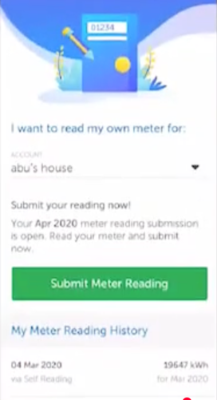
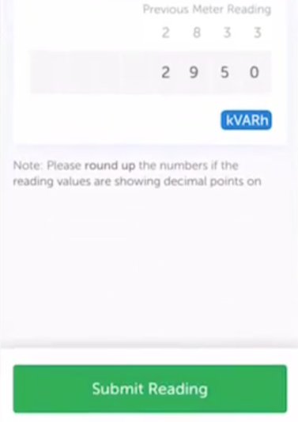

## TASK:
* Background: The vanilla__vite7dot2__submitmeterreading project is a vanilla JS version where the dependencies used are in package.json
* Update the project vanilla__vite7dot2__submitmeterreading with the following requirements:
    * This project is a PoC for Submitting Meter Reading of a Utility company.
    * The web app project will be used by a mobile app as a WebView. This is not required for now. This is just extra information.
    * The web app project is a mobile-responsive page.
    * The landing page looks like 
        * The landing page will have a "Submit Meter Reading" button as seen in the image. Clicking that button will bring us to the next page with proper url routing for Entering Meter.
    * The second page of the web app project will look like  for Entering Meter
        * The second page will have a "Submit Reading" button and clicking that button will bring us to the next page with proper url routing to Reading Submitted page. 
        * The button "Submit Reading" is used to send the the data to a mock backend.
            * Upon clicking the send button, it will trigger a REST HTTP POST to a temporary mock endpoint until I setup a proper backend app with another project. This project will not setup a backend app. The mock endpoint will randomly return text in the HTTP request body with lorem ipsum and a HTTP 2XX success status. The end goal is to interact with OpenAI API endpoint or Claude API endpoint.
    * The third page of the web app project will look like 
    * The colour theme of this web app will have utility & electricity grid company's feel.

## USE CONTEXT7
- use library id /websites/vite_dev for best practices reference when using Vite for development
- use library id /websites/vite_dev_guide for best practices reference when using Vite for development
<!-- - use library id /reactjs/react.dev?tokens=5000 to reference -->
<!-- - use library id /websites/vuejs_guide for best practices reference -->
<!-- - use library id /vitejs/vite?tokens=3000 for best practices reference -->
<!-- - use library id /vercel/next-learn for best practices reference
- use library id /vercel/next.js for best practices reference -->
<!-- - use library id /skolaczk/next-starter for best practices reference -->
<!-- - use library id /nextjs.org/docs for best practices reference -->
<!-- - use library id /microsoft/playwright the Playwright MCP to automate end-to-end testing through Claude Code browser interaction capabilities -->
<!-- - use library id /microsoft/playwright-mcp the Playwright MCP to automate end-to-end testing through Claude Code browser interaction capabilities -->
<!-- - use library id /shadcn-ui/ui -->
<!-- - use library id /tailwindlabs/tailwindcss.com -->

## Implementation should consider:
- **Documentation**: Include setup, deployment, verification, and cleanup steps in README.md
- **Git Ignore**: Create a .gitignore to avoid committing common Javascript files or output to Git repo if .gitignore doesn't exist
- **PII and Sensitive Data**: Do be mindful that I will be committing the Javascript project to a public Github repo so do NOT commit private key or secrets.
- **Simplicity**: Keep the Javascript project really simple

## OTHER CONSIDERATIONS:
- My computer is a Macbook
- Explain the steps you would take in clear, beginner-friendly language
- Write the research on performing the task
- Save the research to `2-RESEARCH.md`