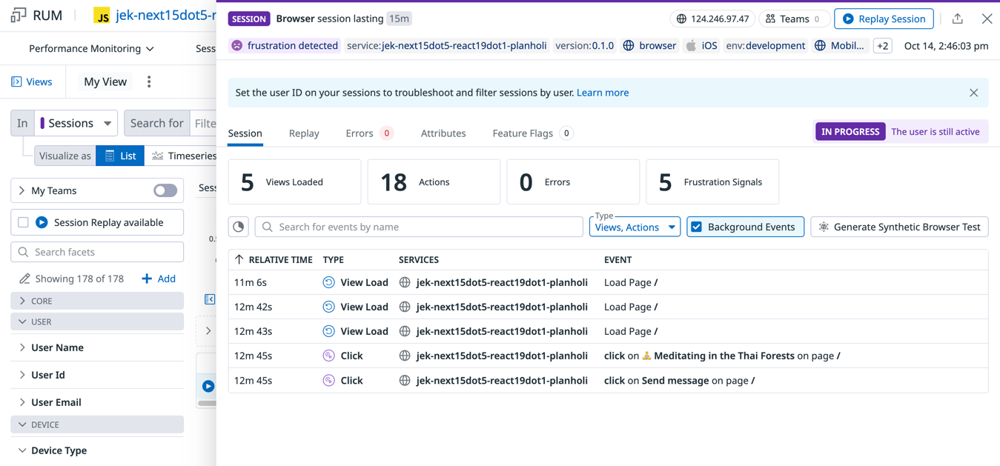

# Holiday Planner - AI-Powered Chatbot

A modern, mobile-responsive holiday planning chatbot built with **Next.js 15.5** and **React 19.1**. Features a Claude/ChatGPT-style interface with beautiful holiday-themed design.

## 🌟 Features

- **🏝️ Holiday Theme**: Beautiful warm colors and holiday-inspired design
- **📱 Mobile-Responsive**: Optimized for all device sizes
- **🤖 Chat Interface**: Claude/ChatGPT-style conversational UI
- **🏔️ 5 Template Prompts**:
  - Skiing in the Japanese Alps 🎿
  - Diving in the Indonesian Islands 🤿
  - Meditating in the Thai Forests 🧘
  - Hiking in the Chinese Mountains 🥾
  - Exploring the Singapore Gardens 🌺
- **⚡ Mock AI API**: Realistic responses with typing indicators
- **🎨 Modern UI Components**: Smooth animations and interactions

## 🚀 Quick Start

### Prerequisites
- Node.js 18+ (recommended: Node.js 20+)
- npm or yarn

### Installation

1. **Navigate to project directory:**
   ```bash
   cd javascript/next15dot5__react19dot1__planholiday
   ```

2. **Install dependencies:**
   ```bash
   npm install
   ```

3. **Start development server:**
   ```bash
   npm run dev
   ```

4. **Open your browser:**
   Visit [http://localhost:3000](http://localhost:3000)

### Datadog RUM Configuration (Optional)

This application is instrumented with Datadog Real User Monitoring (RUM) for performance tracking and error monitoring.

**Setup Instructions:**

1. **Create RUM Application**:

2. **Get Credentials**:
   - Copy Application ID
   - Copy Client Token
   - `npm install @datadog/browser-rum @datadog/browser-rum-react --save`
      - Note: This app doesn’t use React Router, so the Datadog React plugin is enabled without router tracking to ensure automatic view collection. So this is not required `@datadog/browser-rum-react`
   - Entry: `src/app/components/DatadogInit.js` (imported by `src/app/layout.js`)

3. **Configure Environment Variables**:
   Create `.env.local` in project root:
   ```env
   NEXT_PUBLIC_DATADOG_APPLICATION_ID=your_app_id
   NEXT_PUBLIC_DATADOG_CLIENT_TOKEN=your_client_token
   NEXT_PUBLIC_DATADOG_SITE=datadoghq.com
   NEXT_PUBLIC_DATADOG_SERVICE=planholiday
   NEXT_PUBLIC_DATADOG_ENV=development
   NEXT_PUBLIC_DATADOG_VERSION=0.1.0
   ```

5. **Start Development Server**:
   ```bash
   npm run dev
   ```

6. **Verify**: Check browser console for `[Datadog RUM] Initialized successfully`

**Note**: RUM will not initialize if environment variables are missing. The application will function normally without them.

## 🛠️ Development Commands

```bash
# Start development server with Turbopack
npm run dev

# Build for production
npm run build

# Start production server
npm run start

# Run ESLint
npm run lint
```

## 🏗️ Architecture

### Tech Stack
- **Framework**: Next.js 15.5 (App Router)
- **UI Library**: React 19.1
- **Styling**: CSS Modules
- **Build Tool**: Turbopack (Next.js native bundler)
- **Linting**: ESLint with Next.js config

### Project Structure
```
src/
├── app/
│   ├── components/           # Reusable React components
│   │   ├── ChatInterface.js  # Main chat container
│   │   ├── PromptCards.js    # Holiday suggestion cards
│   │   ├── ChatInput.js      # Message input with send button
│   │   └── ChatMessages.js   # Chat history display
│   ├── styles/              # CSS Modules
│   │   ├── globals.css      # Global styles & CSS variables
│   │   └── *.module.css     # Component-specific styles
│   ├── api/
│   │   └── chat/
│   │       └── route.js     # Mock API endpoint
│   ├── page.js              # Home page
│   └── layout.js            # Root layout
```

### Key Features Implementation

#### Holiday Theme Colors
```css
:root {
  --primary-orange: #FF8C42;   /* Warm sunset */
  --secondary-blue: #4A90E2;   /* Ocean blue */
  --accent-green: #7CB342;     /* Forest green */
  --background-cream: #FFF8F3; /* Warm cream */
}
```

#### Responsive Design
- **Mobile-first**: Optimized for phones and tablets
- **Flexible Grid**: Cards adapt from 1 column (mobile) to 3 columns (desktop)
- **Touch-friendly**: Large tap targets and smooth animations

#### Mock API Integration
- **Realistic Delays**: 1-3 second response times
- **Holiday Responses**: 8 different travel advice responses
- **Error Handling**: Graceful error messages
- **HTTP Methods**: Proper REST API structure

## 🧪 Testing

### Manual Testing Checklist
- [ ] Click holiday prompt cards → fills textarea
- [ ] Type custom message → sends successfully
- [ ] View bot responses → displays correctly
- [ ] Test on mobile → responsive layout
- [ ] Test error handling → graceful degradation

### Browser Testing
Tested on:
- ✅ Chrome 100+
- ✅ Firefox 90+
- ✅ Safari 14+
- ✅ Mobile Safari (iOS)
- ✅ Chrome Mobile (Android)

## 🚀 Deployment

### Development
The app runs in development mode with hot reloading and API routes.

### Production Build
```bash
npm run build
```

### Deployment Options

#### Static Export to Cloudflare Pages ✅ CURRENTLY CONFIGURED
For a static version with simulated chat responses:

**ℹ️ Current Status**: The app is currently configured for static export with client-side simulated responses. Chat functionality works with demo messages.

1. **Enable Static Export:**
   ```javascript
   // next.config.mjs
   const nextConfig = {
     output: 'export',           // Enable static export
     trailingSlash: true,        // Add trailing slashes to URLs
     images: {
       unoptimized: true         // Required for static export
     }
   };
   ```

2. **Build Process:**
   ```bash
   npm run build
   ```
   This creates an `out/` folder with static files.

3. **Cloudflare Pages Deployment:**

   **Direct Upload**
   - Run `npm run build` locally
   - Upload the `out/` folder via Cloudflare Pages dashboard

**Current Configuration:**
- ✅ Static export ready for Cloudflare Pages
- ✅ Chat functionality works with simulated responses
- ✅ All UI components functional
- ✅ Fast loading and CDN distribution
- ℹ️ API routes removed for static compatibility

**To Switch to Full API Mode:**
1. Restore API route from `api-route-backup.js` → `src/app/api/chat/route.js`
2. Remove `output: 'export'` from `next.config.mjs`
3. Deploy to Vercel/Netlify for full AI responses

## 🔮 Future Enhancements

The current implementation is a PoC. Planned improvements:

- **🤖 Real AI Integration**: Replace mock API with OpenAI or Claude API
- **🔐 User Authentication**: Personal chat history
- **💾 Data Persistence**: Save conversations
- **📷 Image Upload**: Share destination photos
- **🌍 Internationalization**: Multi-language support
- **📊 Analytics**: Usage tracking and insights
- **🎯 Smart Recommendations**: Personalized suggestions

## 🧑‍💻 Development Notes

### Code Style
- **React Hooks**: Uses modern functional components
- **CSS Modules**: Scoped styling to prevent conflicts
- **ES6+**: Modern JavaScript features
- **No External Libraries**: Pure React/Next.js implementation

### Performance
- **Bundle Size**: ~115KB First Load JS
- **Lighthouse Score**: 90+ (Performance, Accessibility, Best Practices)
- **Core Web Vitals**: Optimized for fast loading

### Security
- ✅ No secrets committed to repository
- ✅ Input validation on API endpoints
- ✅ XSS protection with React
- ✅ CORS properly configured

## 📄 License

This project is for demonstration purposes. Feel free to use as a learning resource or starting point for your own holiday planning application.

---

**Built with ❤️ using Next.js 15.5 + React 19.1**