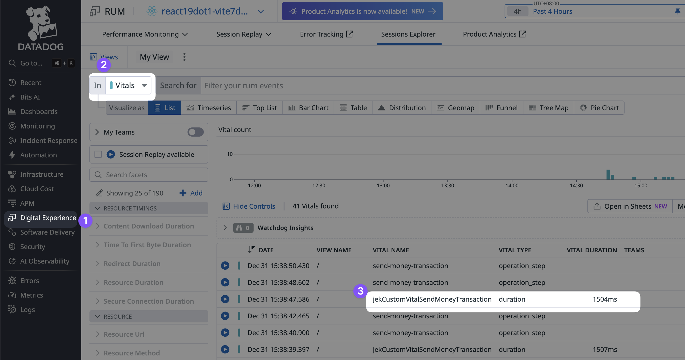

# Datadog Custom Performance Telemetry (Custom Vitals)



## Overview
This guide shows how to measure transaction performance from "Send Money" button click to result page display using Datadog's Custom Vital API.

**Vital Name**: `jekCustomVitalSendMoneyTransaction`
**Query in Datadog**: `@vital.name:jekCustomVitalSendMoneyTransaction`

---

## What Was Added

### 1. Start Point - SendMoneyForm.jsx

Measures when the transaction processing begins (after form validation).

**Before**:
```javascript
// Process the actual transaction
const processTransaction = async () => {
  setIsLoading(true)

  try {
    // Call the onSubmit prop with form data
    await onSubmit(formData.phone, formData.amount)
  } catch (error) {
    console.error('Form submission error:', error)
  } finally {
    setIsLoading(false)
  }
}
```

**After**:
```javascript
// Process the actual transaction
const processTransaction = async () => {
  // Custom Vital: Start measuring transaction duration
  // This tracks time from button click to result page display
  window.DD_RUM.startDurationVital('jekCustomVitalSendMoneyTransaction', {
    context: {
      phone: formData.phone,
      amount: formData.amount,
      startTime: new Date().toISOString()
    }
  })
  console.log('Custom Vital Started: jekCustomVitalSendMoneyTransaction')

  setIsLoading(true)

  try {
    // Call the onSubmit prop with form data
    await onSubmit(formData.phone, formData.amount)
  } catch (error) {
    console.error('Form submission error:', error)
  } finally {
    setIsLoading(false)
  }
}
```

**What Changed**:
- Added `window.DD_RUM.startDurationVital()` call at the beginning
- Included context data: phone number, amount, and start timestamp
- Added console log for debugging

---

### 2. Stop Point - ResultPage.jsx

Measures when the result page renders (transaction complete).

**Before**:
```javascript
function ResultPage({ status, transactionId, onReturnHome }) {
  const isSuccess = status === 200

  return (
    <div className={`result-page ${isSuccess ? 'success' : 'failure'}`}>
      <div className="result-container">
        {/* Result page content */}
      </div>
    </div>
  )
}

export default ResultPage
```

**After**:
```javascript
import { useEffect } from 'react'

function ResultPage({ status, transactionId, onReturnHome }) {
  const isSuccess = status === 200

  // Custom Vital: Stop measuring transaction duration when result page renders
  useEffect(() => {
    window.DD_RUM.stopDurationVital('jekCustomVitalSendMoneyTransaction', {
      context: {
        status: status,
        transactionId: transactionId,
        isSuccess: isSuccess,
        endTime: new Date().toISOString()
      }
    })
    console.log('Custom Vital Stopped: jekCustomVitalSendMoneyTransaction', {
      status,
      transactionId
    })
  }, [status, transactionId, isSuccess])

  return (
    <div className={`result-page ${isSuccess ? 'success' : 'failure'}`}>
      <div className="result-container">
        {/* Result page content */}
      </div>
    </div>
  )
}

export default ResultPage
```

**What Changed**:
- Imported `useEffect` from React
- Added `useEffect` hook that runs when component mounts
- Called `window.DD_RUM.stopDurationVital()` to end measurement
- Included context data: status, transaction ID, success flag, and end timestamp
- Added console log for debugging

---

## How It Works

### Measurement Flow

1. **User fills form** and clicks "Send Money" button
2. **Form validates** (phone number and amount checks)
3. **If blacklisted number**: Scam alert modal appears
   - If user rejects: **No vital is started**, transaction abandoned
   - If user accepts: Continue to step 4
4. **Custom Vital starts** (`startDurationVital`)
5. **API call processes** transaction (mock API with 1.5s delay)
6. **Result page renders** (success or failure)
7. **Custom Vital stops** (`stopDurationVital`)

### Context Data Captured

**At Start**:
- `phone`: Phone number entered
- `amount`: Transaction amount
- `startTime`: ISO timestamp when vital started

**At Stop**:
- `status`: HTTP status code (200 = success, 400/402/404/429 = failure)
- `transactionId`: Unique transaction ID
- `isSuccess`: Boolean flag (true/false)
- `endTime`: ISO timestamp when vital stopped

---

## Testing

### Test in Browser Console

1. Start the app:
   ```bash
   npm run dev
   ```

2. Open browser DevTools (F12) → Console tab

3. Test scenarios:

   **Successful Transaction**:
   - Phone: `12345678`
   - Amount: `100`
   - Click "Send Money"
   - Look for console logs:
     - ✓ "Custom Vital Started: jekCustomVitalSendMoneyTransaction"
     - ✓ "Custom Vital Stopped: jekCustomVitalSendMoneyTransaction" (status: 200)

   **Failed Transaction**:
   - Phone: `99999999`
   - Amount: `100`
   - Click "Send Money"
   - Look for console logs:
     - ✓ "Custom Vital Started: jekCustomVitalSendMoneyTransaction"
     - ✓ "Custom Vital Stopped: jekCustomVitalSendMoneyTransaction" (status: 400/402/404/429)

   **Scam Alert (Accept)**:
   - Phone: `88888888` (blacklisted)
   - Amount: `100`
   - Click "Send Money"
   - Modal appears → Click "Accept"
   - Look for console logs:
     - ✓ "Custom Vital Started" appears AFTER accepting (not before)
     - ✓ "Custom Vital Stopped" appears after result page

   **Scam Alert (Reject)**:
   - Phone: `88888888` (blacklisted)
   - Amount: `100`
   - Click "Send Money"
   - Modal appears → Click "Reject"
   - Look for console logs:
     - ✓ NO "Custom Vital Started" message (transaction abandoned)
     - ✓ User stays on landing page

---

## Querying in Datadog

### Access Datadog RUM Explorer

1. Login to Datadog: https://datadoghq.com/
2. Navigate to: **RUM** → **Explorer**
3. Wait 2-5 minutes after testing for data to appear

### Search Queries

**Find all custom vitals**:
```
@vital.name:jekCustomVitalSendMoneyTransaction
```

**Filter by duration** (transactions over 1 second):
```
@vital.name:jekCustomVitalSendMoneyTransaction @vital.duration:>1000
```

**Filter by success** (status 200):
```
@vital.name:jekCustomVitalSendMoneyTransaction @vital.context.status:200
```

**Filter by failure** (status not 200):
```
@vital.name:jekCustomVitalSendMoneyTransaction -@vital.context.status:200
```

### Useful Metrics

**Average Duration**:
```
avg(@vital.duration)
```

**95th Percentile** (slow transactions):
```
p95(@vital.duration)
```

**Count by Status**:
```
Group by: @vital.context.status
```

**Success Rate**:
```
(Count where status=200) / (Total count)
```

---

## Files Modified

1. `src/components/SendMoneyForm.jsx` - Added `startDurationVital`
2. `src/components/ResultPage.jsx` - Added `stopDurationVital` with `useEffect`

