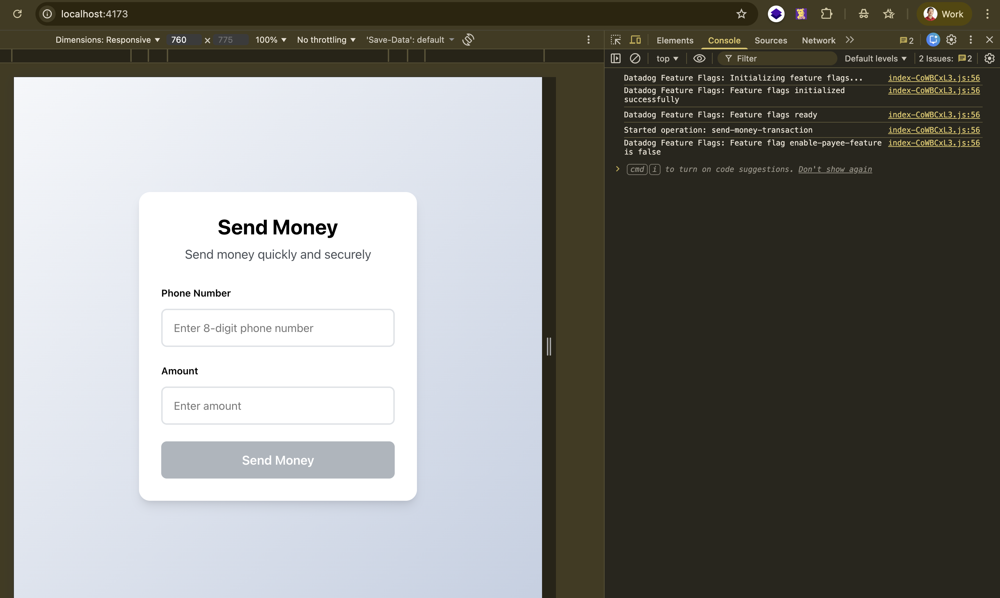
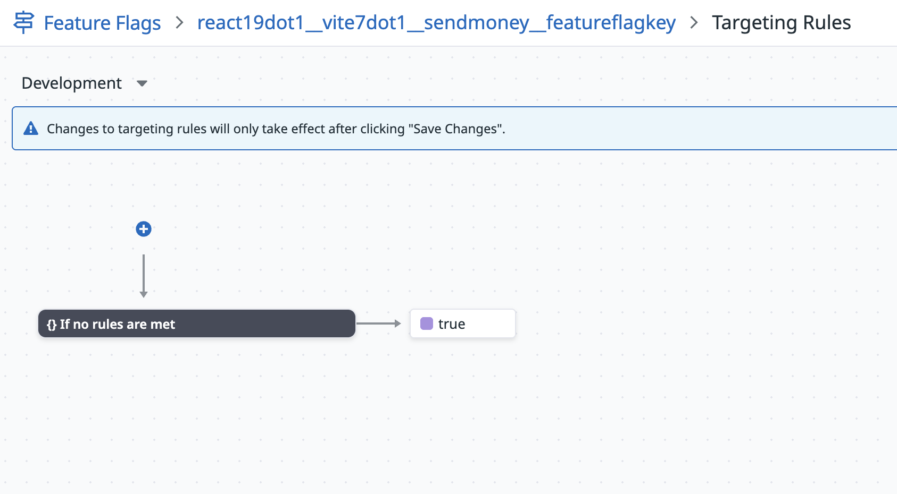
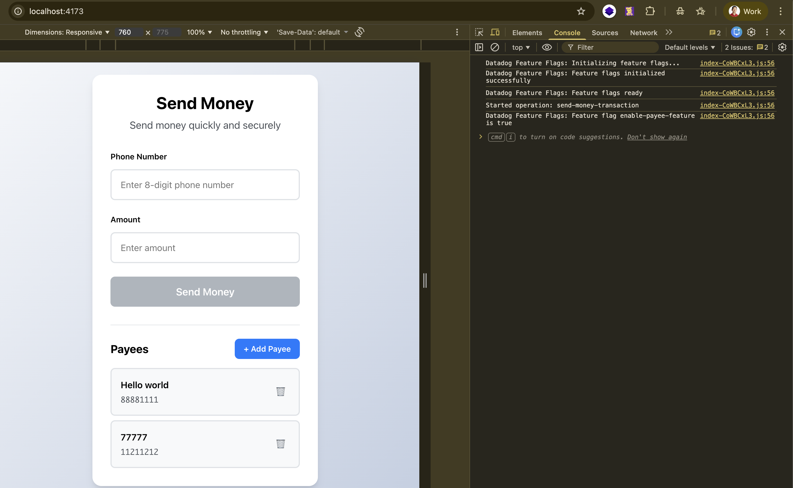

# My Datadog Feature Flags Proof





## Benefits of Feature Flag:
- **Safe Rollouts**: Test features with specific users before full release
- **Quick Rollback**: Instantly disable problematic features
- **No Deployment**: Toggle features on/off without code changes
- **Targeted Testing**: Show features to specific user groups
- **A/B Testing**: Compare different feature versions

**When Flag is ON:**
- Users can see the Payees section
- Users can add new payees
- Users can select payees to auto-fill phone numbers
- Users can delete payees

**When Flag is OFF:**
- Entire Payee section is hidden
- Users can still send money by manually entering phone numbers
- All other app functionality works normally

---

## Package Installation

### Packages Installed

Three npm packages were added to support Datadog Feature Flags:

```bash
npm install @datadog/openfeature-browser @openfeature/web-sdk @openfeature/core
```

**Package Details:**
- `@datadog/openfeature-browser` (v0.2.0): Connects to Datadog's feature flag service
- `@openfeature/web-sdk` (v1.7.1): Standard SDK for web feature flags
- `@openfeature/core` (v1.9.1): Core functionality for OpenFeature

### Verification

Check `package.json` to confirm these packages are listed in the dependencies section.

---

## Configuration Setup

### File Structure

Two new files were created and three existing files were modified:

```
src/
├── datadog-feature-flags.js    (New - Feature flag configuration)
├── datadog-rum.js              (Modified - Added setUser() call)
├── hooks/
│   └── useFeatureFlag.js       (New - Custom React hook)
├── main.jsx                    (Modified - Initialize flags)
└── App.jsx                     (Modified - Use flags)
```

### 1. Feature Flag Configuration (`src/datadog-feature-flags.js`)

This file configures the connection to Datadog's feature flag service.

**Key Components:**

```javascript
// DatadogProvider configuration
const provider = new DatadogProvider({
  clientToken: 'pub20a017f260010c0da83a1c19c16e43d6',
  applicationId: 'fe7cf0b0-6e91-4317-a068-17e870e0cc20',
  enableExposureLogging: true,  // Logs flag checks to RUM
  site: 'datadoghq.com',
  env: 'test',
  service: 'jek-sendmoney-app',
  version: '1.0.2'
})
```

**Exported Functions:**
- `initializeFeatureFlags()`: Sets up the feature flag provider
- `getFeatureFlagClient()`: Returns the OpenFeature client for checking flags
- `setFeatureFlagContext(userId)`: Sets user context for targeted feature flags

**Important Notes:**
- IT IS IMPORTANT --> Uses same credentials as existing Datadog RUM setup. 
- `enableExposureLogging: true` sends flag evaluations to RUM (can impact costs)
- All code is prefixed with `// Datadog Feature Flags:` comments

### 2. RUM User Identification (`src/datadog-rum.js`)

This file was modified to add user identification for proper feature flag targeting.

**Key Addition:**

```javascript
// Set user information for RUM tracking
// IMPORTANT: This user.id must match the targetingKey in feature flags
// IT IS IMPORTANT TO SET THIS UP FOR EXPERIMENT
datadogRum.setUser({
  id: 'user-12345',
  name: 'John Doe',
  email: 'user-12345@example.com',
  plan: 'premium',
  userRole: 'beta-tester'
})
```

**Important Notes:**
- Added immediately after `datadogRum.init()` call
- The `id` property MUST match `targetingKey` in feature flags (see section: User Identification Setup)
- Custom properties (plan, userRole) can be used in Datadog targeting rules
- In production, replace with actual authenticated user data

### 3. Custom React Hook (`src/hooks/useFeatureFlag.js`)

A reusable React hook that makes it easy to check feature flags in components.

**Usage:**
```javascript
const { isEnabled, isLoading } = useFeatureFlag('flag-name', defaultValue)
```

**Returns:**
- `isEnabled`: Boolean indicating if the flag is on/off
- `isLoading`: Boolean indicating if the flag is still being checked

**Features:**
- Async flag checking with proper error handling
- Loading state management
- Falls back to default value on error
- Memoized to prevent unnecessary re-checks

### 4. Initialization (`src/main.jsx`)

Feature flags are initialized before the React app renders.

**Key Changes:**
```javascript
;(async () => {
  // Datadog Feature Flags: Initialize the OpenFeature provider and set context
  await initializeFeatureFlags()

  console.log('Datadog Feature Flags: Feature flags ready')

  // Render the app after feature flags are initialized
  createRoot(document.getElementById('root')).render(
    <StrictMode>
      <App />
    </StrictMode>,
  )
})()
```

**Why?** This ensures feature flags are ready when components mount, preventing race conditions.

### 5. App Integration (`src/App.jsx`)

The main App component uses the feature flag to conditionally render the Payee section.

**Key Changes:**

```javascript
// Check if Payee feature is enabled
const { isEnabled: isPayeeFeatureEnabled, isLoading: isPayeeFlagLoading } =
  useFeatureFlag('enable-payee-feature', false)

// Show loading state (optional)
{isPayeeFlagLoading && (
  <div style={{ padding: '20px', textAlign: 'center', color: '#999' }}>
    Loading features...
  </div>
)}

// Conditionally render PayeesList
{isPayeeFeatureEnabled && (
  <PayeesList
    payees={payees}
    onAddPayee={handleAddPayee}
    onSelectPayee={handleSelectPayee}
    onDeletePayee={handleDeletePayee}
  />
)}
```

**Default Behavior:** Flag defaults to `false`, so the Payee feature is hidden by default.

---

## User Identification Setup

### Why User Identification Matters

For Experiments to work, you need to identify users consistently across both:
1. **Datadog RUM** (for tracking user behavior and events)
2. **Feature Flags** (for evaluating targeting rules)

### Setting User Information in RUM

**File:** `src/datadog-rum.js`

After initializing Datadog RUM, we set user information using `datadogRum.setUser()`:

```javascript
// Set user information for RUM tracking
// IMPORTANT: This user.id must match the targetingKey in feature flags
datadogRum.setUser({
  id: 'user-12345',
  name: 'John Doe',
  email: 'user-12345@example.com',
  plan: 'premium',
  userRole: 'beta-tester'
})
```

**What this does:**
- Associates all RUM events (page views, clicks, errors) with this user
- Allows you to filter sessions by user in Datadog UI
- Enables user-specific analytics and debugging

### Matching with Feature Flag Context

**File:** `src/datadog-feature-flags.js`

The `targetingKey` in the feature flag evaluation context MUST match the user ID set in RUM:

```javascript
const evaluationContext = {
  targetingKey: 'user-12345',  // ← MUST match datadogRum.setUser({ id: 'user-12345' })
  userId: 'user-12345',
  userRole: 'beta-tester',
  email: 'user-12345@example.com'
}
```

**Why they must match:**
- Ensures feature flag decisions and RUM events are linked to the same user
- Allows you to see which users saw which feature flag variants
- Enables proper A/B testing and rollout analysis

### Example: Targeted Feature Flag Rollout

With matching user identification, you can create targeting rules in Datadog like:

**Rule 1:** Enable for specific users
```
If targetingKey is "user-12345" → Return true
```

**Rule 2:** Enable for user role
```
If userRole is "beta-tester" → Return true
```

**Rule 3:** Enable for premium users
```
If plan is "premium" → Return true
```

### Important Notes

1. **Keep IDs in sync:** If you change the user ID in one place, update it in the other
2. **Production setup:** Replace `'user-12345'` with actual authenticated user IDs
3. **Privacy:** Avoid sending PII directly; use hashed IDs or UUIDs
4. **Anonymous users:** For non-authenticated users, generate a unique ID and store in localStorage

### Quick Reference

| File | Purpose | Key Property |
|------|---------|--------------|
| `src/datadog-rum.js` | RUM user tracking | `datadogRum.setUser({ id: 'user-12345' })` |
| `src/datadog-feature-flags.js` | Feature flag targeting | `targetingKey: 'user-12345'` |

**Golden Rule:** `datadogRum.setUser({ id })` MUST equal `evaluationContext.targetingKey`

---

## Cleanup / Removal

If you need to remove the feature flag implementation:

### Step 1: Code Rollback

**Remove conditional rendering in App.jsx:**
```javascript
// Remove this line:
const { isEnabled: isPayeeFeatureEnabled, isLoading: isPayeeFlagLoading } =
  useFeatureFlag('enable-payee-feature', false)

// Remove the conditional wrapper:
{isPayeeFeatureEnabled && (
  <PayeesList ... />
)}

// Replace with:
<PayeesList ... />
```

**Revert main.jsx:**
```javascript
// Remove the async IIFE wrapper
// Remove the initialization calls
// Return to simple createRoot().render()
```

### Step 2: Remove Files

```bash
rm src/datadog-feature-flags.js
rm src/hooks/useFeatureFlag.js
```

### Step 3: Uninstall Packages

```bash
npm uninstall @datadog/openfeature-browser @openfeature/web-sdk @openfeature/core
```

### Step 4: Disable Flag in Datadog

1. Go to Datadog Feature Flags dashboard
2. Find `enable-payee-feature`
3. Toggle to "Disabled" in all environments
4. Optionally delete the flag entirely

---

## Best Practices

### 1. Naming Conventions
- Use descriptive flag names: `enable-payee-feature` not `flag1`

### 2. Default Values
- Always set safe default values (usually `false` for new features)
- Consider impact if Datadog is unreachable
- Document what happens with default value


---

## Technical Details

### Flag Check Flow

```
User Loads Page
     ↓
main.jsx runs
     ↓
initializeFeatureFlags() connects to Datadog
     ↓
setFeatureFlagContext() sets user ID
     ↓
React App renders
     ↓
App component mounts
     ↓
useFeatureFlag('enable-payee-feature') calls
     ↓
OpenFeature client checks flag value
     ↓
Value returned (true/false)
     ↓
React renders/hides PayeesList based on value
```

### Caching Behavior

- Flag values are cached by OpenFeature SDK
- Cache refreshes periodically (default: 60 seconds)
- Changes in Datadog take effect on next cache refresh
- Hard refresh browser to force immediate update

### How OpenFeature Checks Flag Values

When the line "OpenFeature client checks flag value" runs in the flow above, here's what actually happens:

#### Communication Protocol

**Protocol:** HTTPS REST API (not WebSockets, not push notifications)

**Method:** Polling with client-side evaluation

#### Detailed Process

**1. Initial Connection (During `initializeFeatureFlags()`)**
```
Browser --> HTTPS Request --> Datadog Feature Flag API
                              (https://api.datadoghq.com/api/v2/feature_flags)
Browser <-- HTTPS Response <-- Flag configurations downloaded as JSON
```

What gets downloaded:
- All feature flag definitions for your application
- Targeting rules and conditions
- Default values and variations
- Evaluation logic

**2. Local Storage (In Browser Memory)**
- The Datadog provider stores all flag configurations in browser memory
- No database or localStorage used (fresh download on each page load)
- Contains ALL flags for your app, not just the ones you're using

**3. Flag Evaluation (When `useFeatureFlag` is called)**
```javascript
// When your component calls:
const { isEnabled } = useFeatureFlag('enable-payee-feature', false)
```

**4. Exposure Logging (When `enableExposureLogging: true`)**
```
Flag evaluated (e.g., returns "true")
     ↓
Browser --> HTTPS Request --> Datadog RUM API
                              (logs which flag, which value, which user)
```

This is a **separate** request that:
- Sends analytics about flag usage
- Helps track which users saw which variants
- Counts as RUM event (may impact costs)

## FAQ

**Q: Do I need to redeploy when I change a flag?**
A: No! That's the whole point of feature flags. Change in Datadog UI takes effect immediately (after cache refresh).

**Q: What happens if Datadog is down?**
A: The app uses the default value specified in the code (`false` in our case). The app continues to work, just without the Payee feature.

**Q: Can I target specific users?**
A: Yes! Make sure to:
1. Set the user ID in RUM: `datadogRum.setUser({ id: 'actual-user-id' })`
2. Match it in feature flags: `targetingKey: 'actual-user-id'`
3. Configure targeting rules in Datadog UI based on user properties (userRole, plan, etc.)

**Q: Why do I need to set both datadogRum.setUser() and targetingKey?**
A: They serve different purposes but must match:
- `datadogRum.setUser()` identifies the user for all RUM events (tracking)
- `targetingKey` identifies the user for feature flag evaluation (targeting)
Matching them ensures your analytics and feature rollouts are linked to the same user.

**Q: How do I add more feature flags?**
A: Use the same `useFeatureFlag` hook with a different flag name. Create the new flag in Datadog UI first.

**Q: Is there a performance impact?**
A: Minimal. Flag checks are fast (< 10ms) and cached. The async initialization adds ~100-200ms to app startup but happens before rendering.

**Q: Does OpenFeature use polling or push for flag updates?**
A: OpenFeature with Datadog provider uses **polling** (pull-based). The browser requests flag updates from Datadog every 60 seconds. It does NOT use WebSockets or push notifications. Flag evaluations happen locally in the browser (no network request per check), making them extremely fast.

**Q: How long should feature flags live?**
A: Temporary flags (rollouts) should be removed 3-6 months after full deployment. Permanent flags (kill switches) can stay longer but should be reviewed regularly.

**Q: What if I have hundreds of feature flags?**
A: Consider a feature flag management strategy: namespacing, lifecycle policies, regular audits, and automated cleanup of old flags.

**Remember:** Feature flags are powerful but should be used thoughtfully. Clean up old flags after full rollout to keep your codebase maintainable.
