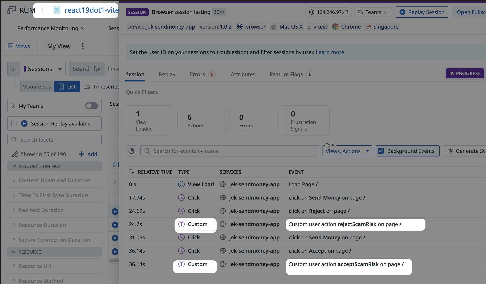
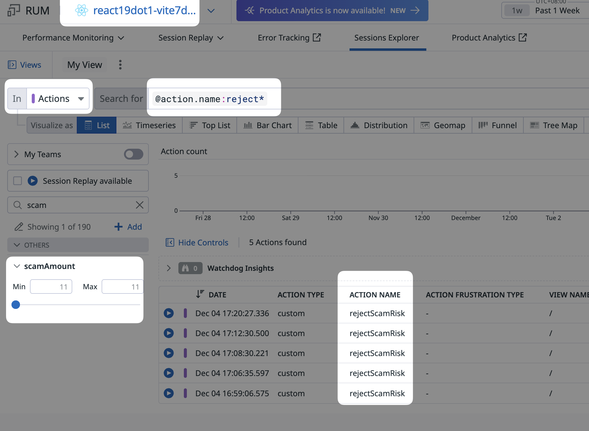

# Send Money App 💰

A modern, mobile-responsive React 19.1 application for sending money transactions, built with Vite 7.1. This is a proof-of-concept (PoC) application demonstrating a simple payment flow with mock API integration.

## 🚀 Features

- **Mobile-First Design**: Fully responsive design optimized for mobile devices
- **Modern React 19.1**: Built with the latest React features and hooks
- **Vite 7.1 Development**: Lightning-fast development server with HMR
- **Mock API Integration**: Realistic payment flow with random success/failure responses
- **Form Validation**: Client-side validation for phone numbers and amounts
- **Loading States**: Visual feedback during transaction processing
- **Transaction Results**: Success and failure pages with transaction IDs
- **Accessibility**: Proper ARIA labels and keyboard navigation support

## 📦 Project Structure

```
react19dot1__vite7dot1__sendmoney/
├── public/
│   ├── vite.svg
│   └── index.html
├── src/
│   ├── components/
│   │   ├── SendMoneyForm.jsx    # Main form component
│   │   ├── ResultPage.jsx       # Success/failure results
│   │   └── Button.jsx           # Reusable button component
│   ├── services/
│   │   └── mockApi.js          # Mock payment API
│   ├── App.jsx                 # Main application component
│   ├── App.css                 # Application styles
│   ├── index.css               # Global styles and design system
│   └── main.jsx                # React application entry point
├── package.json
├── vite.config.js
├── eslint.config.js
└── README.md
```

## 🚦 Getting Started

### Prerequisites

- **Node.js**: Version 18 or higher
- **npm**: Version 8 or higher
- **Modern Browser**: Chrome, Firefox, Safari, or Edge

### Installation

1. **Clone or navigate to the project directory**:
   ```bash
   cd react19dot1__vite7dot1__sendmoney
   ```

2. **Install dependencies**:
   ```bash
   npm install
   ```

3. **Start the development server**:
   ```bash
   npm run dev
   ```

4. **Open your browser** and navigate to the displayed URL (usually `http://localhost:5173/`)

### Available Scripts

- `npm run dev` - Start development server with hot reloading
- `npm run build` - Build for production
- `npm run preview` - Preview the production build locally
- `npm run lint` - Run ESLint to check code quality

## 🎯 How to Use

### 1. Landing Page
- Enter a **phone number** (exactly 8 digits)
- Enter an **amount** (1-4 digits, greater than 0)
- Click **"Send Money"** to initiate the transaction

### 2. Transaction Processing
- Loading spinner appears during API call (1.5 seconds)
- Form is disabled during processing
- "Processing payment..." message is displayed

### 3. Result Page
- **Success**: Green checkmark, success message, and transaction ID
- **Failure**: Red cross, failure message, and transaction ID
- **"Return to Home"** button to start a new transaction

## 📱 Mobile Testing

### On Your Computer
1. Open browser developer tools (F12)
2. Toggle device toolbar (Ctrl+Shift+M / Cmd+Shift+M)
3. Select a mobile device preset or custom dimensions

### On Your Mobile Device
1. Start the development server: `npm run dev`
2. Note the Network URL displayed (e.g., `http://192.168.1.100:5173/`)
3. Open this URL on your mobile device (must be on the same WiFi network)

## 🔧 Configuration

### Vite Configuration
The app is configured for optimal development and mobile testing:
- Network access enabled for mobile device testing
- Auto-import React for JSX
- Fast refresh for development

### Mobile Optimizations
- Viewport meta tag for proper mobile scaling
- Touch-friendly button sizes (minimum 44px)
- Proper input types for mobile keyboards
- Responsive design with CSS custom properties

## 📈 Observability (Add Datadog RUM SDK)

Real User Monitoring is initialized before the app mounts.

- `npm install @datadog/browser-rum @datadog/browser-rum-react --save`
- Entry: `src/datadog-rum.js` (imported by `src/main.jsx`)
- Configuration is in-code with public values; no env vars required.

Note: This app doesn’t use React Router, so the Datadog React plugin is enabled without router tracking to ensure automatic view collection. So this is not required `@datadog/browser-rum-react`

## 🚀 Deployment

### Production Build
```bash
# Build for production
npm run build

# Preview the production build locally (optional)
npm run preview
```

The production files will be in the `dist/` directory.

### Build Metrics
- **Bundle Size**: ~192KB (gzipped: ~61KB)
- **CSS Size**: ~7.4KB (gzipped: ~2KB)
- **Build Time**: <500ms

### Performance Features
- Tree shaking for optimal bundle size
- CSS custom properties for efficient styling
- Lazy loading ready architecture
- Minimal external dependencies


## Datadog Custom Actions




Datadog RUM Custom Actions --> https://docs.datadoghq.com/real_user_monitoring/guide/send-rum-custom-actions

```js
  // Handle Accept button in modal
  const handleAcceptRisk = async () => {
    // Track Accept action in Datadog RUM as Custom Action in Datadog RUM
    datadogRum.addAction('acceptScamRisk', {
      phoneNumber: formData.phone,
      scamAmount: parseFloat(formData.amount),
      scamBlacklistedNumber: true
    })

    // Close modal
    setShowScamAlert(false)
    // Proceed with transaction even though number is blacklisted
    await processTransaction()
  }

  // Handle Reject button in modal
  const handleRejectRisk = () => {
    // Track Reject action in Datadog RUM as Custom Action in Datadog RUM
    datadogRum.addAction('rejectScamRisk', {
      phoneNumber: formData.phone,
      scamAmount: parseFloat(formData.amount),
      scamBlacklistedNumber: true
    })

    // Close modal and do nothing
    setShowScamAlert(false)
  }
```
