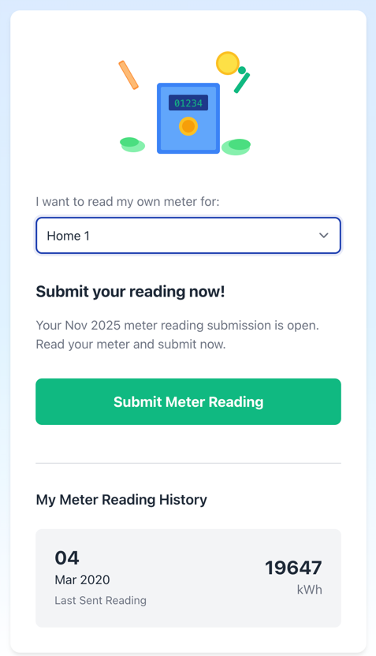
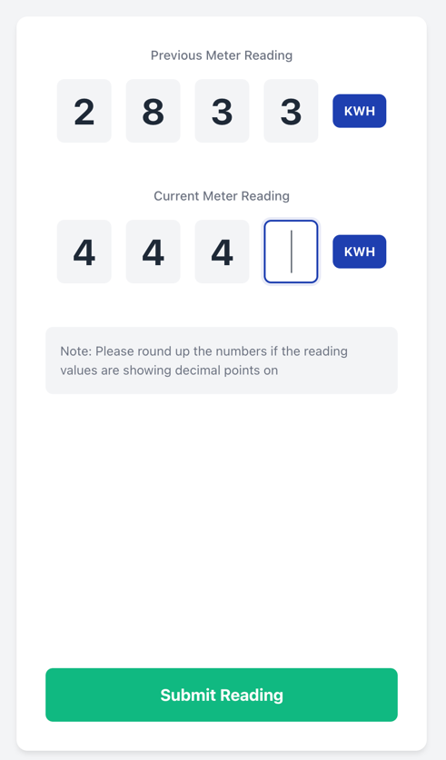
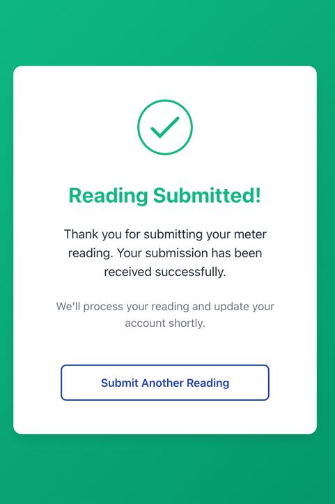

# Meter Reading Submission App

A mobile-responsive web application for submitting utility meter readings, built with Vite 7.2.2 and vanilla JavaScript.

## Features

- **3-Page Flow**: Landing page → Enter meter reading → Confirmation
- **Client-Side Routing**: Smooth navigation without page reloads using the History API
- **Form Validation**: HTML5 and JavaScript validation for meter data
- **API Integration**: Submits readings to a mock backend endpoint (JSONPlaceholder)
- **Utility Theme**: Professional color scheme (electric blue, energy yellow, success green)
- **Mobile-First Design**: Fully responsive from 320px to desktop widths
- **Touch-Friendly**: All interactive elements meet 44px minimum touch target size
- **Animated Success**: Checkmark animation on successful submission

## Technology Stack

- **Build Tool**: Vite 7.2.2
- **Language**: Vanilla JavaScript (ES6+)
- **Styling**: Plain CSS with custom properties
- **Routing**: History API (no framework)
- **API Calls**: Native Fetch API
- **No Dependencies**: Pure vanilla implementation

## Prerequisites

- Node.js (v18 or higher recommended)
- npm (comes with Node.js)

## Getting Started

### Installation

1. Clone or navigate to the project directory:
```bash
cd vanilla__vite7dot2__submitmeterreading
```

2. Install dependencies:
```bash
npm install
```

3. **Set up environment variables:**

   The app requires an API endpoint URL to function. This URL is kept in a `.env` file that is **not committed to the repository** for security reasons.

   ```bash
   # Copy the example environment file
   cp .env.example .env
   ```

   Then open `.env` and replace the placeholder URL with your actual API endpoint:

   ```bash
   # .env file
   VITE_API_URL=https://your-actual-api-endpoint.execute-api.region.amazonaws.com
   ```

   **Important Notes:**
   - The `.env` file is ignored by Git and will not be committed to the repository
   - Never commit real API endpoints to public repositories
   - All team members need to create their own `.env` file locally
   - Environment variables must be prefixed with `VITE_` to be accessible in Vite apps

### Development

Start the development server with hot module replacement:

```bash
npm run dev
```

The app will be available at `http://localhost:5173/`

### Build for Production

Create an optimized production build:

```bash
npm run build
```

The build output will be in the `dist/` folder.

### Preview Production Build

Test the production build locally:

```bash
npm run preview
```

## Project Structure

```
vanilla__vite7dot2__submitmeterreading/
├── index.html              # Main HTML entry point
├── src/
│   ├── main.js             # App initialization & router setup
│   ├── router.js           # Client-side routing logic
│   ├── style.css           # Global styles & utility theme
│   ├── views/
│   │   ├── landing.js      # Landing page view
│   │   ├── enterMeter.js   # Enter meter form view
│   │   └── confirmation.js # Success confirmation view
│   └── utils/
│       └── api.js          # API service for submissions
├── package.json
└── README.md
```

## Application Flow

1. **Landing Page** (`/`)
   - Displays app title and description
   - "Submit Meter Reading" button navigates to form

2. **Enter Meter Page** (`/enter-meter`)
   - Form fields:
     - Meter Number (text, required)
     - Current Reading (number, required)
     - Reading Date (date, defaults to today, required)
   - Client-side validation
   - Submits to mock API endpoint
   - Shows loading state during submission
   - Error handling with user-friendly messages

3. **Confirmation Page** (`/reading-submitted`)
   - Success message with animated checkmark
   - "Submit Another Reading" button returns to landing page

## Browser Support

Modern browsers with ES6+ support:
- Chrome/Edge (latest)
- Firefox (latest)
- Safari (latest)

## Design Notes

### Color Theme
- **Primary Blue**: `#1e40af` (trust, reliability)
- **Secondary Yellow**: `#fbbf24` (energy, warmth)
- **Success Green**: `#10b981` (confirmation)
- **Background**: White and light gray

### Responsive Breakpoints
- **Mobile**: 320px - 767px (base styles)
- **Tablet**: 768px - 1023px
- **Desktop**: 1024px and above

### Accessibility
- Touch-friendly button sizes (min 44px height)
- High contrast text for readability
- Semantic HTML structure
- Focus states for keyboard navigation

## API Details

The app connects to an AWS Lambda API backend:

### Endpoints

**GET `/api/meter-readings`**
- Retrieves all meter readings
- Returns JSON array: `[{"ReadingValue": 1332, "Timestamp": "2025-11-12T04:37:28.738425Z"}]`

**POST `/api/meter-readings`**
- Submits a new meter reading
- Request body: `{"readingValue": 12345}` (number)
- Success response: HTTP 200 with JSON data
- Error response: HTTP 4XX or 5XX with error message in JSON format
- **No authentication required**

### Configuration

The base API URL is configured via environment variable `VITE_API_URL` in the `.env` file.

## Development Commands

| Command | Description |
|---------|-------------|
| `npm install` | Install dependencies |
| `npm run dev` | Start dev server with HMR |
| `npm run build` | Build for production |
| `npm run preview` | Preview production build |

## Deployment

This section provides step-by-step instructions for deploying the Meter Reading app to cloud hosting platforms.

### Repository Structure

**Important:** This app is part of a monorepo structure:
```
your-repo/
├── javascript/
│   ├── vanilla__vite7dot2__submitmeterreading/  ← This app
│   ├── other-app-1/
│   ├── other-app-2/
│   └── ...
└── other-folders/
```

Each app in the `/javascript` folder is deployed **separately** to its own hosting instance. When configuring deployment, you'll need to specify the app location as `/javascript/vanilla__vite7dot2__submitmeterreading`.

---

### Option 1: Deploy to AWS Amplify Hosting

AWS Amplify Hosting provides a fully managed hosting service for static websites with continuous deployment from Git repositories.

#### Prerequisites
- AWS Account ([Sign up here](https://aws.amazon.com/))
- Git repository (GitHub, GitLab, or Bitbucket)
- Code committed to your repository

#### Step 1: Ensure your code is pushed to Git

Since this app is in a monorepo, your Git repository already contains the parent folder structure:

```bash
# From the repository root, commit any changes
git add javascript/vanilla__vite7dot2__submitmeterreading/
git commit -m "Update Meter Reading App"
git push origin main
```

#### Step 2: Deploy via AWS Amplify Console

1. **Log in to AWS Console**
   - Go to [AWS Amplify Console](https://console.aws.amazon.com/amplify/)
   - Click **"Get Started"** under "Amplify Hosting"

2. **Connect your repository**
   - Select your Git provider (GitHub, GitLab, or Bitbucket)
   - Authorize AWS Amplify to access your repositories
   - Select your repository and branch (typically `main`)
   - Click **"Next"**

3. **Configure build settings**

   You have **two options** for configuring the build:

   **Option A: Configure in Amplify Console (Recommended for beginners)**

   - **IMPORTANT**: Update the "App root directory" to: `/javascript/vanilla__vite7dot2__submitmeterreading`
   - In the Amplify Console build settings editor, paste this YAML configuration:
     ```yaml
     version: 1
     frontend:
       phases:
         preBuild:
           commands:
             - 'cd javascript/vanilla__vite7dot2__submitmeterreading'
             - 'npm install'
         build:
           commands:
             - 'npm run build'
       artifacts:
         baseDirectory: 'javascript/vanilla__vite7dot2__submitmeterreading/dist'
         files:
           - '**/*'
       cache:
         paths:
           - 'javascript/vanilla__vite7dot2__submitmeterreading/node_modules/**/*'
     ```
   - This configuration is entered directly in the web interface
   - Click **"Next"**

   **Option B: Create an `amplify.yml` file (Recommended for version control)**

   - Create a file named `amplify.yml` in your app directory
   - Location: `/javascript/vanilla__vite7dot2__submitmeterreading/amplify.yml`
   - See [Creating the amplify.yml file](#creating-the-amplifyyml-file) section below for detailed instructions
   - Amplify will automatically detect and use this file
   - Benefit: Build configuration is tracked in Git with your code

4. **Review and deploy**
   - Review your settings
   - Click **"Save and deploy"**
   - Amplify will build and deploy your app (takes 3-5 minutes)

5. **Access your deployed app**
   - Once deployment completes, you'll see a URL like: `https://main.d1234abcd.amplifyapp.com`
   - Click the URL to view your live app
   - Every push to your branch will automatically trigger a new deployment

#### Step 3: (Optional) Add custom domain

1. In Amplify Console, go to **"Domain management"**
2. Click **"Add domain"**
3. Enter your domain name and follow DNS configuration steps

---

### Creating the amplify.yml File

If you chose **Option B** in Step 2 (using an `amplify.yml` file instead of console configuration), follow these steps:

#### Why use amplify.yml?

**Benefits:**
- ✅ Build configuration is version controlled with your code
- ✅ Easy to replicate across multiple environments
- ✅ Changes are tracked in Git history
- ✅ No need to manually configure in Amplify Console UI

**When to use console configuration instead:**
- Quick testing or prototyping
- One-time deployments
- When you prefer GUI configuration

#### Step 1: Create the file

In your app directory, create a new file named `amplify.yml`:

```bash
# Navigate to your app directory
cd javascript/vanilla__vite7dot2__submitmeterreading/

# Create the amplify.yml file
touch amplify.yml
```

#### Step 2: Add the build configuration

Open `amplify.yml` and paste this configuration:

```yaml
version: 1
frontend:
  phases:
    preBuild:
      commands:
        - npm install
    build:
      commands:
        - npm run build
  artifacts:
    baseDirectory: dist
    files:
      - '**/*'
  cache:
    paths:
      - node_modules/**/*
```

**Important Notes:**
- ⚠️ **Use relative paths** in `amplify.yml` because Amplify runs commands from the app root directory
- The `baseDirectory: dist` is relative to the app directory (not the repo root)
- No `cd` command needed - Amplify automatically navigates to the app root directory you specified

#### Step 3: Commit and push the file

```bash
# Add the file to git
git add amplify.yml

# Commit
git commit -m "Add Amplify build configuration"

# Push to repository
git push origin main
```

#### Step 4: Deploy

When you create the Amplify app (Step 2 above):
- Set "App root directory" to: `/javascript/vanilla__vite7dot2__submitmeterreading`
- Amplify will **automatically detect** the `amplify.yml` file
- You'll see "Using amplify.yml from repository" in the build logs
- The console UI will show the configuration from your file

#### File Location Diagram

```
your-repo/
├── javascript/
│   ├── vanilla__vite7dot2__submitmeterreading/
│   │   ├── amplify.yml              ← Create file here
│   │   ├── package.json
│   │   ├── index.html
│   │   ├── src/
│   │   └── dist/                    ← Build output (baseDirectory)
│   └── other-apps/
└── other-folders/
```

#### Updating the Configuration

To change build settings:

1. Edit `amplify.yml` in your local repository
2. Commit and push changes
3. Amplify automatically uses the new configuration on next deployment
4. No need to update console settings

#### Example Configurations

**For different output directories:**
```yaml
artifacts:
  baseDirectory: build  # If your app uses 'build' instead of 'dist'
  files:
    - '**/*'
```

**Adding environment variables in build:**
```yaml
frontend:
  phases:
    preBuild:
      commands:
        - npm install
    build:
      commands:
        - npm run build
  artifacts:
    baseDirectory: dist
    files:
      - '**/*'
```

**Running tests before build:**
```yaml
frontend:
  phases:
    preBuild:
      commands:
        - npm install
        - npm run test          # Run tests
    build:
      commands:
        - npm run build
  artifacts:
    baseDirectory: dist
    files:
      - '**/*'
```

---

### Option 2: Deploy to Azure Static Web Apps

Azure Static Web Apps provides global distribution with automated builds from GitHub repositories.

#### Prerequisites
- Azure Account ([Sign up here](https://azure.microsoft.com/free/))
- GitHub account with your code pushed to a repository
- Code committed to GitHub

#### Step 1: Ensure your code is pushed to GitHub

Since this app is in a monorepo, your Git repository already contains the parent folder structure:

```bash
# From the repository root, commit any changes
git add javascript/vanilla__vite7dot2__submitmeterreading/
git commit -m "Update Meter Reading App"
git push origin main
```

#### Step 2: Create Static Web App via Azure Portal

1. **Log in to Azure Portal**
   - Go to [Azure Portal](https://portal.azure.com)
   - Click **"Create a resource"**
   - Search for **"Static Web App"**
   - Click **"Create"**

2. **Configure basics**
   - **Subscription**: Select your Azure subscription
   - **Resource Group**: Create new or select existing
   - **Name**: Enter a name (e.g., `meter-reading-app`)
   - **Plan type**: Select "Free" for development
   - **Region**: Choose closest to your users (e.g., `East US 2`)
   - **Source**: Select **"GitHub"**
   - Click **"Sign in with GitHub"** and authorize

3. **Configure deployment**
   - **Organization**: Select your GitHub username
   - **Repository**: Select your repository
   - **Branch**: Select `main` (or your branch name)

4. **Build configuration**
   - **Build Presets**: Select **"Custom"**
   - **App location**: `/javascript/vanilla__vite7dot2__submitmeterreading` ⚠️ **Important: Specify the nested path**
   - **Api location**: Leave empty (or leave blank)
   - **Output location**: `dist`
   - Click **"Review + create"**

5. **Deploy**
   - Review settings
   - Click **"Create"**
   - Azure will create the resource and add a GitHub Action to your repository
   - The GitHub Action will automatically build and deploy your app (takes 2-3 minutes)

6. **Access your deployed app**
   - Go to your resource in Azure Portal
   - Click **"URL"** to view your live app (e.g., `https://gentle-forest-0a1b2c3d.azurestaticapps.net`)
   - Every push to your branch will trigger automatic deployment

#### Step 3: (Optional) Add custom domain

1. In Azure Portal, go to your Static Web App resource
2. Click **"Custom domains"** in the left menu
3. Click **"+ Add"** and follow the domain verification steps

---

### Option 3: Manual Deployment (Any Static Host)

For platforms like Netlify, Vercel, or GitHub Pages:

#### Step 1: Build the production bundle

```bash
npm run build
```

This creates an optimized production build in the `dist/` folder.

#### Step 2: Deploy the dist folder

The `dist/` folder contains all the static files needed:
- `index.html` - Main HTML file
- `assets/` - JavaScript and CSS bundles
- `vite.svg` - Favicon

**Upload options:**
- **Netlify**: Drag and drop the `dist/` folder to [netlify.com/drop](https://app.netlify.com/drop)
- **Vercel**: Use `vercel --prod` CLI or connect your GitHub repo
- **GitHub Pages**: Copy `dist/` contents to `gh-pages` branch
- **FTP/SFTP**: Upload `dist/` contents to your web server

---

### Deployment Verification

After deployment, test these features:
1. Navigate to your live URL
2. Test all three pages (Landing → Enter Meter → Confirmation)
3. Submit a test meter reading
4. Verify browser back/forward buttons work
5. Test on mobile device or use browser DevTools device emulation

### Continuous Deployment

Both AWS Amplify and Azure Static Web Apps provide automatic deployments:
- Push code to your repository
- Deployment automatically triggers
- New version goes live in 2-5 minutes
- No manual intervention required

**Monorepo Note:** Since multiple apps share the same repository:
- Each app deployment is **independent**
- Changes in `/javascript/vanilla__vite7dot2__submitmeterreading` only trigger **this app's** deployment
- Other apps in `/javascript` folder have their own separate deployments
- You can deploy as many apps as needed from the same repository

### Environment Variables

**⚠️ CRITICAL:** This app **requires** the `VITE_API_URL` environment variable to function. Without it, the app will fail to load data.

#### Why Environment Variables Are Needed

The `.env` file containing your API endpoint URL is **not committed to Git** for security reasons. This means your deployment platform (AWS Amplify, Azure, Netlify, etc.) doesn't have access to the API URL during the build process.

You **must** manually configure the environment variable in your deployment platform's settings.

#### Configuration Steps by Platform

**AWS Amplify:**
1. Log in to [AWS Amplify Console](https://console.aws.amazon.com/amplify/)
2. Select your deployed app
3. In the left sidebar: **App settings** → **Environment variables**
4. Click **Manage variables**
5. Click **Add variable**
6. Configure:
   - **Variable name**: `VITE_API_URL`
   - **Value**: Your backend API base URL (without the `/api/meter-readings` path)
   - **Example**: `https://xxxxx.execute-api.region.amazonaws.com`
7. Click **Save**
8. **Important**: Redeploy your app to apply the changes
   - Go to main dashboard and click **Redeploy this version**
   - Or push a new commit to trigger automatic rebuild

**Azure Static Web Apps:**
1. Go to [Azure Portal](https://portal.azure.com)
2. Navigate to your Static Web App resource
3. In the left menu: **Configuration**
4. Click **Add** under Application settings
5. Configure:
   - **Name**: `VITE_API_URL`
   - **Value**: Your backend API base URL
6. Click **OK** and **Save**
7. Redeploy to apply changes

**Netlify:**
1. Go to your site in Netlify dashboard
2. **Site settings** → **Environment variables**
3. Click **Add a variable**
4. Configure:
   - **Key**: `VITE_API_URL`
   - **Value**: Your backend API base URL
5. Click **Create variable**
6. Redeploy your site

**Vercel:**
1. Go to your project in Vercel dashboard
2. **Settings** → **Environment Variables**
3. Add new variable:
   - **Name**: `VITE_API_URL`
   - **Value**: Your backend API base URL
4. Select environments (Production, Preview, Development)
5. Click **Save**
6. Redeploy your project

#### Important Notes

- ⚠️ The variable **must** be named `VITE_API_URL` (prefixed with `VITE_`)
- ⚠️ Vite only exposes environment variables prefixed with `VITE_` to the browser
- ⚠️ **Always redeploy** after adding/changing environment variables
- 🔒 Never commit the actual API URL to your public repository
- 📝 The value should be the **base URL only**, not including `/api/meter-readings`
  - ✅ Correct: `https://xxxxx.execute-api.region.amazonaws.com`
  - ❌ Wrong: `https://xxxxx.execute-api.region.amazonaws.com/api/meter-readings`

### Troubleshooting

**API errors - "Failed to fetch" or URL shows `/undefined/api/meter-readings`:**

This is the **most common deployment issue** and happens when the `VITE_API_URL` environment variable is missing.

**Symptoms:**
- Console shows errors like: `GET https://your-site.com/undefined/api/meter-readings 404 (Not Found)`
- "Unable to load reading history" message appears
- "Failed to submit meter reading" on form submission
- Browser Network tab shows requests to `/undefined/...`

**Cause:**
- The `.env` file is not committed to Git (by design for security)
- Your deployment platform doesn't have the `VITE_API_URL` environment variable configured
- Without this variable, `import.meta.env.VITE_API_URL` returns `undefined`

**Solution:**
1. Go to your deployment platform (AWS Amplify, Azure, Netlify, etc.)
2. Add environment variable `VITE_API_URL` with your API base URL
3. **Important**: Redeploy your app after adding the variable
4. Verify the variable is set correctly (check platform's environment variable dashboard)
5. Clear browser cache and reload

**Verification:**
- Open browser console (F12) → Network tab
- Look at the API request URLs
- They should show your real API domain, not `/undefined/`
- Example of correct URL: `https://xxxxx.execute-api.region.amazonaws.com/api/meter-readings`

---

**404 errors on page refresh:**
- AWS Amplify: Add rewrite rule in Amplify Console
- Azure: Add `staticwebapp.config.json` with navigation fallback
- This ensures client-side routing works correctly

**Build failures:**
- Check Node.js version (requires v18+)
- Verify `npm install` completes successfully
- Review build logs in platform console

**Monorepo-specific issues:**

1. **"App location not found" error:**
   - Verify the app location path is correct: `/javascript/vanilla__vite7dot2__submitmeterreading`
   - Ensure path starts with `/` (not `./`)
   - Check for typos in folder names

2. **Build can't find package.json:**
   - AWS Amplify: Make sure the `cd` command in preBuild phase is correct
   - Azure: Verify "App location" field points to the correct nested directory
   - The platform needs to be in the app directory to find `package.json`

3. **Other apps triggering this deployment:**
   - Each app should have its own separate deployment instance
   - Use different Amplify/Azure apps for each project in `/javascript` folder
   - Ensure the app location is specific to avoid conflicts

4. **Wrong files being deployed:**
   - Check the `baseDirectory` in build settings
   - For AWS Amplify: Should be `javascript/vanilla__vite7dot2__submitmeterreading/dist`
   - For Azure: The output location combines with app location automatically

### Deploying Multiple Apps from Monorepo

To deploy other apps from the `/javascript` folder:

1. **Create separate deployment instances** for each app
2. **Use the same repository** but different app locations
3. **Example for another app:**
   - App location: `/javascript/other-app-name`
   - Base directory: `javascript/other-app-name/dist`
4. **Each app gets its own unique URL**
5. **Independent deployments** - changes in one app don't affect others

## License

This is a demonstration project for educational purposes.
