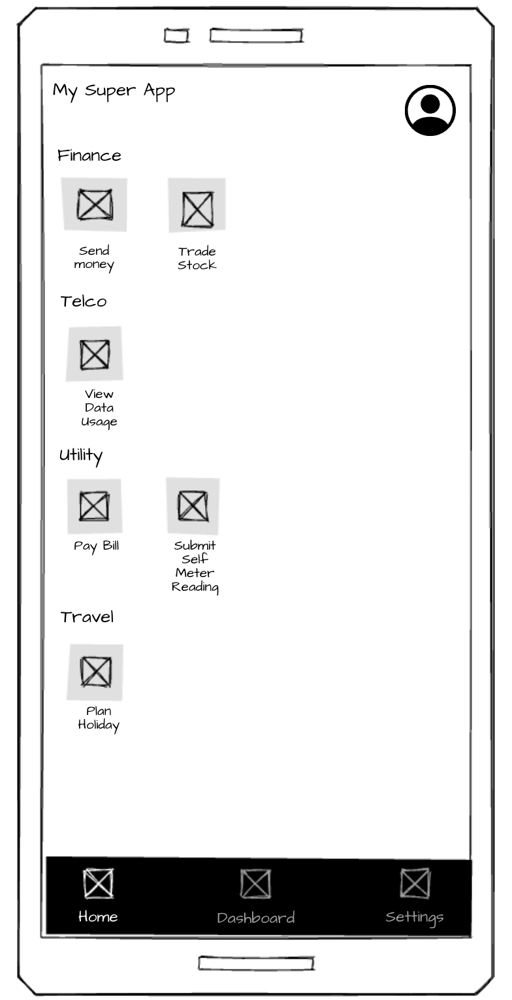

## TASK:
* Created a kotlin android app in android8__api26__superapp folder
* Make the kotline android app look like the mockup .
    * Each of the icon in the mockup is a clickable button.
    * Each of the icon would then link to a webview app. I will provide the webview app. For now the webview app would be a placeholder.
* Suggest something if you think it can be improved.

## OTHER CONSIDERATION:
1. **WebView URLs**: Will point to actual websites (like example.com) - no local HTML files
2. **Service Integration**: Keep everything as simple placeholders - no real service integration
3. **Icons**: Use Material Icons (built-in Android icons)
4. **Color Scheme**: Use default Material 3 color preference
5. **Offline Support**: Not required for initial implementation

## USE CONTEXT7
* use library id /android/nowinandroid for Android design ideas and development best practices
* use library id /android/architecture-samples for different Android architectural approaches

## OTHER CONSIDERATIONS:
* Keep the solution as simple as possible
* Create or append setup, deployment, verification, and cleanup steps in README.md
* Explain the steps you would take in clear, beginner-friendly language
* Save the research to `2-RESEARCH.md`