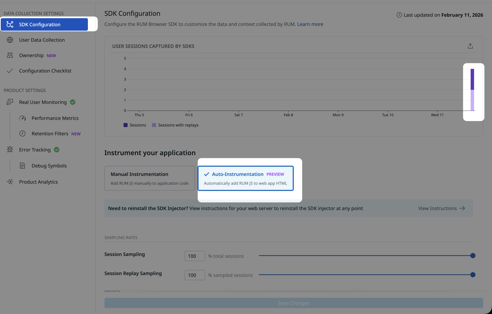
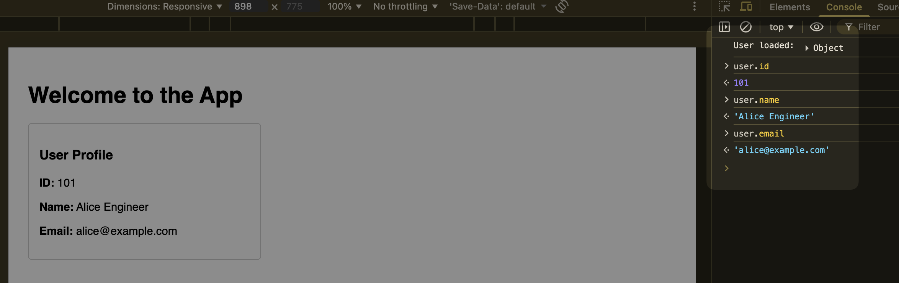
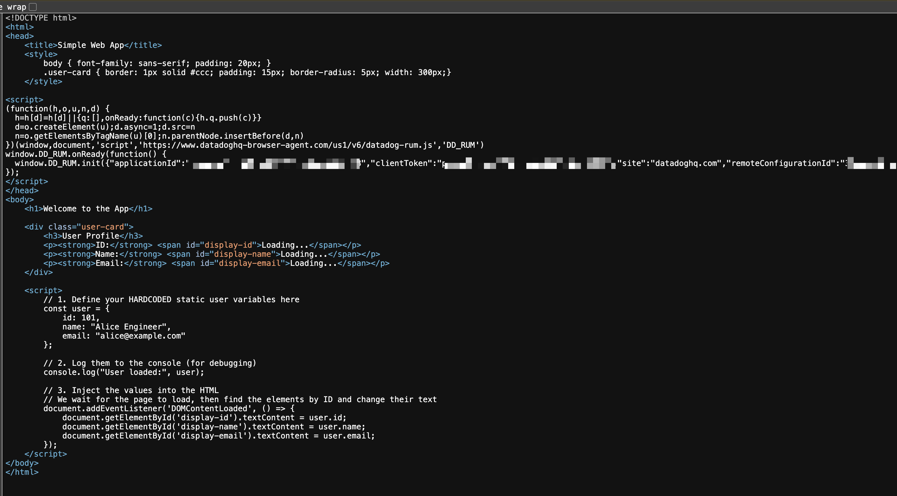
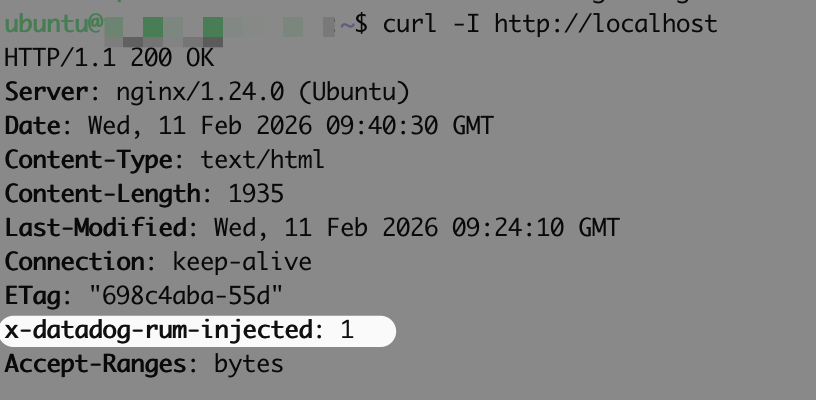
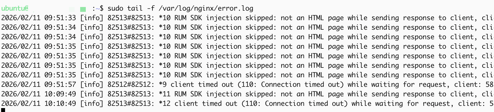

### **Phase 1: Set Up Nginx & Web App**

1. **Install Nginx:**
```bash
sudo apt update && sudo apt install -y nginx

```


2. **Create App Directory & Permissions:**
```bash
sudo mkdir -p /var/www/example.com/html
sudo chown -R $USER:$USER /var/www/example.com/html

```


3. **Create Web Page (`index.html`):**
* Create the file: `nano /var/www/example.com/html/index.html`
* Paste this content (includes the **User Identity** logic for Datadog):


```html
<!DOCTYPE html>
<html>
<head><title>My App</title></head>
<body>
    <h1>Hello World</h1>
    <script>
        // 1. Hardcoded User
        const user = { id: 101, name: "Alice Engineer", email: "alice@example.com" };

        // 2. Identify User to Datadog (Runs after SDK injects)
        window.addEventListener('DOMContentLoaded', () => {
            if (window.DD_RUM) {
                DD_RUM.setUser({
                    id: String(user.id),
                    name: user.name,
                    email: user.email
                });
                console.log("Datadog User Identified");
            }
        });
    </script>
</body>
</html>

```


4. **Configure Nginx Site:**
* Create config: `sudo nano /etc/nginx/sites-available/example.com`
* Paste content:


```nginx
server {
    listen 80;
    root /var/www/example.com/html;
    index index.html;
    server_name _;  # Listens on all names/IPs
    location / { try_files $uri $uri/ =404; }
}

```


5. **Enable & Restart:**
```bash
sudo ln -s /etc/nginx/sites-available/example.com /etc/nginx/sites-enabled/
sudo rm /etc/nginx/sites-enabled/default
sudo systemctl restart nginx

```


---

### **Phase 2: Install Datadog RUM SDK**

Run the installer with **root privileges** (sudo) to allow it to create module directories.

```bash
curl -sSL https://rum-auto-instrumentation.s3.amazonaws.com/installer/latest/install-proxy-datadog.sh | sudo sh -s -- \
    --proxyKind nginx \
    --appId <REDACTED APP ID>  \
    --site datadoghq.com \
    --clientToken <REDACTED TOKEN> \
    --remoteConfigurationId <REDACTED CONFIG ID>

```

* *Note: `sudo` is placed before `sh` to execute the script as root.*

---

### **Phase 3: Troubleshooting Guide**

#### **1. Error: "could not create nginx modules directory"**

* **Cause:** You ran the script as a standard user.
* **Fix:** Ensure you use `| sudo sh -s --` in the installation command.

#### **2. Error: "RUM SDK injection skipped: not an HTML page"**

* **Cause:** Nginx is serving the file with the wrong Content-Type.
* **Fix:** Verify headers with `curl -I http://localhost`. It must say `Content-Type: text/html`.

#### **3. Issue: No Datadog code in Browser (but Server is working)**

* **Cause:** **Gzip Compression**. Nginx compresses the HTML before the Datadog module can inject the script.
* **Fix A (Temporary):** Disable Gzip in `/etc/nginx/nginx.conf` (`gzip off;`) and restart Nginx.
* **Fix B (Permanent):** Often simply clearing the browser cache (Hard Refresh) fixes this if the module is correctly loaded.

#### **4. Verification Checklist**

Run this command to prove the server is injecting the code:

```bash
curl -I http://localhost

```