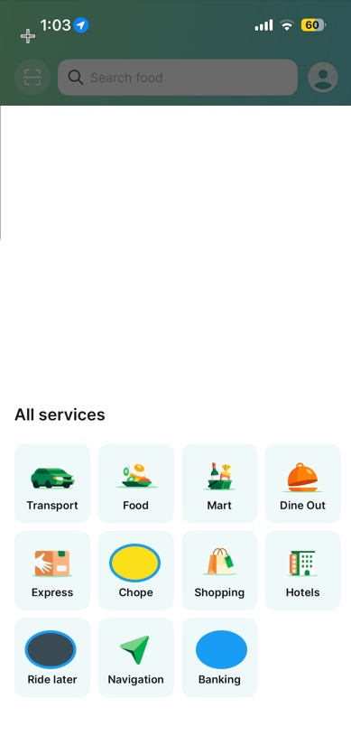

# Super App Development

## About
A super app with multiple services (Transport, Banking, Mobile Payment, etc.) that looks like the UI of Grab, Uber, or GoJek. Refer to image as mockup: .

## Architecture
- **iOS Shell**: Native app container with navigation
- **Service Web Apps**: Each service is a separate web app rendered via WebView
- **Backend**: Independent microservices for each service

## Tech Stack
- **Web Apps**: Next.js, Angular, React, or similar
- **Backend**: Java, PHP, Node.js, Go, or other frameworks
- **Infrastructure**: Docker containers or Ubuntu/AIX/IBM i systems
- Specific technologies and versions defined per user prompt

## Guidelines
- Keep everything simple (as simple as Hello World examples) - iOS app, web apps, and backends
- Run individual tests, not full test suites
- Verify functionality after code changes
- Each service should be focused and independent