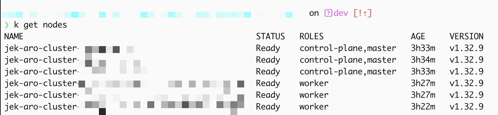

# Setting up [Azure Redhat Openshift (ARO) 4 cluster using the Azure CLI](https://learn.microsoft.com/en-us/azure/openshift) with [DDOT Collector using Datadog Operator](https://docs.datadoghq.com/opentelemetry/setup/ddot_collector/install/kubernetes_daemonset/?tab=datadogoperator) 

## Versions
Azure Redshift Openshift 4.19.20
Kubernetes 1.32.9
DDOT
Datadog Operator 1.22.0



## [Create an Azure Red Hat OpenShift 4 cluster](https://learn.microsoft.com/en-us/azure/openshift/create-cluster?pivots=aro-azure-cli)

```bash
az --version

brew update && brew install azure-cli

az login

export LOCATION=southeastasia
az vm list-usage --location $LOCATION --query "[?contains(name.value, 'standardDSv5Family')]" --output table


az account set --subscription <SUBSCRIPTION ID>

az provider list --query "[?namespace=='Microsoft.RedHatOpenShift'].registrationState" --output table

az provider register --namespace Microsoft.RedHatOpenShift --wait

az provider register --namespace Microsoft.Compute --wait

az provider register --namespace Microsoft.Storage --wait

az provider register --namespace Microsoft.Authorization --wait

export LOCATION=southeastasia                 # the location of your cluster
export RESOURCEGROUP=jek-aro-rg            # the name of the resource group where you want to create your cluster
export CLUSTER=jek-aro-cluster                 # the name of your cluster
export VIRTUALNETWORK=jek-aro-vnet         # the name of the virtual network

az group create --name $RESOURCEGROUP --location $LOCATION

az network vnet create --resource-group $RESOURCEGROUP --name $VIRTUALNETWORK --address-prefixes 10.0.0.0/22

az network vnet subnet create --resource-group $RESOURCEGROUP --vnet-name $VIRTUALNETWORK --name master-subnet --address-prefixes 10.0.0.0/23

az network vnet subnet create --resource-group $RESOURCEGROUP --vnet-name $VIRTUALNETWORK --name worker-subnet --address-prefixes 10.0.2.0/23

az aro get-versions --location $LOCATION --output table

az aro create --resource-group $RESOURCEGROUP --name $CLUSTER --vnet $VIRTUALNETWORK --master-subnet master-subnet --worker-subnet worker-subnet --version 4.19.20
```

## [Connect to an Azure Red Hat OpenShift 4 cluster](https://learn.microsoft.com/en-us/azure/openshift/connect-cluster) 

```bash
export RESOURCEGROUP=jek-aro-rg 
export CLUSTER=jek-aro-cluster

az aro list-credentials --name $CLUSTER --resource-group $RESOURCEGROUP

# Launch the cluster console URL by running the following command, and outputs a URL like https://console-openshift-console.apps.<random>.<region>.aroapp.io/ 
az aro show --name $CLUSTER --resource-group $RESOURCEGROUP --query "consoleProfile.url" --output tsv

brew install openshift-cli

export apiServer=$(az aro show --resource-group $RESOURCEGROUP --name $CLUSTER --query apiserverProfile.url --output tsv) 

export kubevar=$(az aro list-credentials --name $CLUSTER --resource-group $RESOURCEGROUP --query kubeadminPassword --output tsv)

oc login $apiServer --username kubeadmin --password $kubevar

export kubevar=""

oc get nodes

kubectl get nodes

```

## Install Datadog Operator

### Diagnosing why OLM Subscription fails (air-gapped/restricted network)

The default approach is to install via OLM Subscription referencing the `certified-operators` catalog. However, on this ARO cluster all default OperatorHub catalog sources are disabled:

```bash
oc get operatorhub cluster -o yaml
# Shows all 4 sources (certified-operators, community-operators, redhat-marketplace, redhat-operators) with disabled: true
```

Even after re-enabling the `certified-operators` catalog, the catalog pod fails with `ImagePullBackOff` because the cluster's pull secret for `registry.redhat.io` is missing/expired:

```
Failed to pull image "registry.redhat.io/redhat/certified-operator-index:v4.19": unable to retrieve auth token: invalid username/password: unauthorized
```

### Solution: Install Datadog Operator via Helm (bypasses OLM)

Since OLM catalogs require `registry.redhat.io` authentication, use Helm to install the Datadog Operator instead. The Helm chart pulls from `gcr.io/datadoghq` which the cluster can reach.

```bash
helm repo add datadog https://helm.datadoghq.com
helm repo update
```

Install Datadog Operator v1.22.0 (chart version 2.17.0):
```bash
helm install datadog-operator datadog/datadog-operator --version 2.17.0 --namespace openshift-operators
```

Verify the operator is running:
```bash
oc get pods -n openshift-operators
# datadog-operator-xxxxx   1/1   Running

oc get crd | grep datadoghq
# datadogagents.datadoghq.com, datadogmonitors.datadoghq.com, etc.
```

## Grant SCC Permissions (OpenShift-specific)

The Datadog Agent DaemonSet requires `privileged` SCC on OpenShift for host-level access (hostNetwork, hostPath volumes, runAsUser: 0):

```bash
oc adm policy add-scc-to-user privileged -z datadog-agent -n openshift-operators
oc adm policy add-scc-to-user privileged -z datadog-cluster-agent -n openshift-operators
```

## Create Datadog API Key Secret

```bash
kubectl create secret generic datadog-secret --from-literal api-key=<DATADOG_API_KEY> -n openshift-operators
```

## Deploy DatadogAgent

Create `datadog-agent.yaml`:
```yaml
kind: "DatadogAgent"
apiVersion: "datadoghq.com/v2alpha1"
metadata:
  name: "datadog"
  namespace: "openshift-operators"
spec:
  global:
    clusterName: "jek-aro-cluster"
    site: "datadoghq.com"
    credentials:
      apiSecret:
        secretName: "datadog-secret"
        keyName: "api-key"
    kubelet:
      tlsVerify: false
  features:
    clusterChecks:
      enabled: true
    orchestratorExplorer:
      enabled: true
    apm:
      hostPortConfig:
        enabled: true
      unixDomainSocketConfig:
        enabled: false
    dogstatsd:
      unixDomainSocketConfig:
        enabled: false
    logCollection:
      enabled: true
      containerCollectAll: true
  override:
    clusterAgent: {}
    nodeAgent:
      hostNetwork: true
      securityContext:
        runAsUser: 0
        seLinuxOptions:
          level: "s0"
          role: "system_r"
          type: "spc_t"
          user: "system_u"
      tolerations:
        - key: "node-role.kubernetes.io/master"
          operator: "Exists"
          effect: "NoSchedule"
        - key: "node-role.kubernetes.io/infra"
          operator: "Exists"
          effect: "NoSchedule"
```

Note: When installing via Helm (not OLM), the `datadog-agent-scc` service account is NOT created. The operator creates its own service accounts (`datadog-agent`, `datadog-cluster-agent`), so do not set `serviceAccountName` in the override — grant SCC to these auto-created SAs instead (see above).

Apply and verify:
```bash
kubectl apply -f datadog-agent.yaml

# If agent DaemonSet shows 0 pods after applying, restart to pick up SCC:
oc rollout restart daemonset datadog-agent -n openshift-operators

# Verify all pods are running:
oc get pods -n openshift-operators
# datadog-operator-xxxxx        1/1   Running
# datadog-cluster-agent-xxxxx   1/1   Running
# datadog-agent-xxxxx           2/2   Running  (one per node)

oc get daemonset -n openshift-operators
# DESIRED=6  CURRENT=6  READY=6
```

## [Delete an Azure Red Hat OpenShift 4 cluster](https://learn.microsoft.com/en-us/azure/openshift/delete-cluster)

```
# WIP
```

