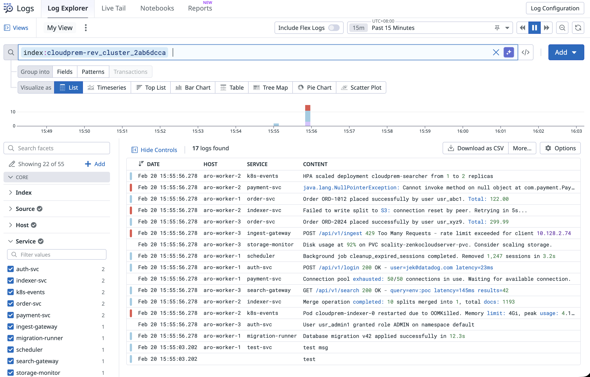
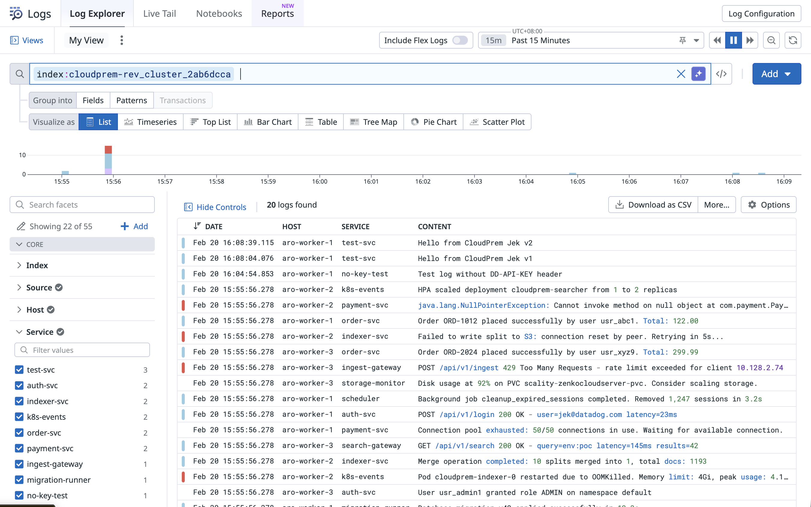

Referencing [Datadog's guide](https://docs.datadoghq.com/cloudprem/install/custom_k8s.md) on Install CloudPrem on Custom Kubernetes but adapting it to use Scality's Zenko CloudServer instead of MinIO

Tested versions
| Component | Version |
|---|---|
| CloudPrem Helm Chart | 0.1.14 |
| CloudPrem App | v0.1.16 |
| Kubernetes | v1.32.9 |
| OpenShift | 4.19.20 |

The pre-requisites steps (in order):
1. Setup Azure Redhat Openshift following this guide datadog-proof/yaml-kubernetes/aro4dot19dot20__k8s1dot32dot9__ddoperator1dot22__ddot
2. Setup Scality's Zenko CloudServer following this guide datadog-proof/yaml-kubernetes/scality__zenkocloudserver9dot3dot0__k8s
3. Setup PostgreSQL database following this guide datadog-proof/yaml-kubernetes/zalandopostgresoperator1dot15dot1__postgresql17__k8s
4. Follow through this guide at datadog-proof/yaml-kubernetes/cloudprem__scalityzenkocloudserver__postgresql__aro

## Step 1 — Verify prerequisites are running

```bash
# Scality Zenko CloudServer (default namespace)
kubectl get pods -l app=scality-zenkocloudserver
kubectl get svc scality-zenkocloudserver-svc

# PostgreSQL (zalando-cluster namespace)
kubectl get postgresql -n zalando-cluster
```

## Step 2 — Create the S3 bucket for CloudPrem indexes

```bash
kubectl run s3-bucket-create --rm -i --restart=Never --image=amazon/aws-cli:latest \
  --env="AWS_ACCESS_KEY_ID=myAccessKey" \
  --env="AWS_SECRET_ACCESS_KEY=mySuperSecretKey123" \
  --command -- sh -c '\
    aws s3api create-bucket --bucket cloudprem-indexes --endpoint-url http://scality-zenkocloudserver-svc:8000 && \
    echo "Bucket created successfully" && \
    aws s3 ls --endpoint-url http://scality-zenkocloudserver-svc:8000'
```

## Step 3 — Retrieve PostgreSQL password

The Zalando operator auto-generates passwords. Retrieve it:

```bash
PG_PASSWORD=$(kubectl get secret app-owner.acid-pg17-cluster.credentials.postgresql.acid.zalan.do \
  -n zalando-cluster -o jsonpath='{.data.password}' | base64 -d)

echo "PostgreSQL password: $PG_PASSWORD"
```

## Step 4 — Add Datadog Helm repository

```bash
helm repo add datadog https://helm.datadoghq.com
helm repo update
```

## Step 5 — Grant OpenShift SCC and create Kubernetes secrets

```bash
# Grant anyuid SCC to CloudPrem service account (OpenShift only)
oc adm policy add-scc-to-user anyuid -z cloudprem -n default

# Datadog API key
kubectl create secret generic datadog-secret \
  --from-literal api-key="<DD_API_KEY>"

# PostgreSQL connection string (replace <PASSWORD> with the password from Step 3)
kubectl create secret generic cloudprem-metastore-uri \
  --from-literal QW_METASTORE_URI="postgres://app_owner:<PASSWORD>@acid-pg17-cluster.zalando-cluster.svc:5432/myappdb"

# Scality Zenko CloudServer S3 credentials
kubectl create secret generic cloudprem-scality-credentials \
  --from-literal AWS_ACCESS_KEY_ID="myAccessKey" \
  --from-literal AWS_SECRET_ACCESS_KEY="mySuperSecretKey123"
```

## Step 6 — Deploy CloudPrem with Helm

Note: The Helm chart uses `control_plane` (snake_case), not `controlPlane` (camelCase) as shown in the Datadog guide. The S3 endpoint must use the **short service name** (`http://scality-zenkocloudserver-svc:8000`), not the FQDN, because Scality's Zenko CloudServer `restEndpoints` config only recognises the hostname set in its `ENDPOINT` env var. `AWS_REGION` is set to `us-east-1` as a dummy value — the AWS SDK inside CloudPrem requires a region to initialise S3 requests, but Scality ignores it entirely. Resource requests are sized for PoC; the default chart values (4 CPU / 16Gi) exceed a single ARO worker node.

```bash
helm upgrade --install cloudprem datadog/cloudprem \
  -f datadog-values.yaml
```

## Step 7 — Validate deployment

```bash
# Check all pods are Running
kubectl get pods -l app.kubernetes.io/instance=cloudprem

# Check logs (look for "publish-new-splits" in indexer, no connection errors)
kubectl logs -l app.kubernetes.io/component=metastore --tail=20
kubectl logs -l app.kubernetes.io/component=indexer --tail=20

# Verify data is being written to Scality S3 bucket
kubectl run s3-verify --rm -i --restart=Never --image=amazon/aws-cli:latest \
  --env="AWS_ACCESS_KEY_ID=myAccessKey" \
  --env="AWS_SECRET_ACCESS_KEY=mySuperSecretKey123" \
  --command -- sh -c 'aws s3 ls s3://cloudprem-indexes/ --recursive --endpoint-url http://scality-zenkocloudserver-svc:8000 | head -20'
```

## Step 8 — Send test logs

Logs must use the Datadog `/api/v2/logs` endpoint with Datadog's native format (`ddsource`, `ddtags`, `hostname`). The Quickwit ingest API (`/api/v1/datadog/ingest`) will reject logs with `Document was not a DatadogLogMsg`.

```bash
kubectl run log-sender --rm -i --restart=Never --image=curlimages/curl:latest \
  --command -- sh -c '
    curl -s -X POST http://cloudprem-indexer:7280/api/v2/logs \
      -H "Content-Type: application/json" \
      -d "[
        {\"ddsource\":\"test\",\"ddtags\":\"env:poc\",\"hostname\":\"aro-worker-1\",\"message\":\"Hello from CloudPrem Jek v2\",\"service\":\"test-svc\",\"status\":\"info\"}
      ]"
  '
```




Logs appear in the Datadog UI under **Logs > Explorer** with the CloudPrem index (e.g. `index:cloudprem-rev_cluster_*`) after ~30s (the commit timeout).

## Troubleshooting

**S3 `InvalidURI` error in indexer logs**
Scality's `restEndpoints` only recognises the hostname set in its `ENDPOINT` env var. Use the short service name (`http://scality-zenkocloudserver-svc:8000`), not the FQDN (`*.default.svc`).

**`A region must be set when sending requests to S3`**
The AWS SDK inside CloudPrem requires `AWS_REGION` even for non-AWS S3. Set `us-east-1` as a dummy value in `datadog-values.yaml` — Scality ignores it.

**`Document was not a DatadogLogMsg`**
The `datadog` index only accepts logs via `/api/v2/logs` in Datadog's format (`ddsource`, `ddtags`, `hostname`). The Quickwit `/api/v1/datadog/ingest` endpoint with plain JSON fields (`source`, `tags`, `host`) will be silently dropped.

**Pods stuck in Pending (Insufficient cpu/memory)**
The default chart resource requests (4 CPU / 16Gi) exceed typical PoC worker nodes. Override in `datadog-values.yaml` to fit your cluster.

**Logs not visible in Datadog UI but pods are Running**
Verify the reverse connection is active: `kubectl logs -l app.kubernetes.io/component=searcher --tail=20` should show periodic `received Aggregation request` messages from Datadog's cloud.

## Cleanup

```bash
helm uninstall cloudprem
kubectl delete secret datadog-secret cloudprem-metastore-uri cloudprem-scality-credentials
oc adm policy remove-scc-from-user anyuid -z cloudprem -n default

# Optionally remove the S3 bucket
kubectl run s3-bucket-delete --rm -i --restart=Never --image=amazon/aws-cli:latest \
  --env="AWS_ACCESS_KEY_ID=myAccessKey" \
  --env="AWS_SECRET_ACCESS_KEY=mySuperSecretKey123" \
  --command -- sh -c '\
    aws s3 rb s3://cloudprem-indexes --force --endpoint-url http://scality-zenkocloudserver-svc:8000'
```
